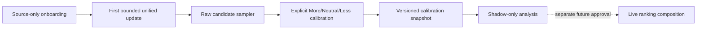

# Calibration Engine v0

> Status: **Implemented as a separate shadow-only lane**

## Purpose

Calibration verifies a source's existing recommendations against explicit user decisions. It is not a recommendation session, does not replace the timeline, and cannot change live ordering in v0.

## Lifecycle

1. The first completed or partial Unified Session supplies validated raw candidates.
2. The sampler preserves source platform order, caps each source at five entries, and interleaves sources round-robin up to ten entries.
3. Every sampled entry must receive `more_like_this`, `neutral`, `less_like_this`, or a separate capture-issue report. `neutral` means the entry should neither raise nor lower preference weight; it is not an unresolved sample.
4. Decisions may be revised with Previous before completion.
5. Completing all entries writes an immutable, versioned snapshot with `liveInfluence: false` and `activationState: shadow_only`.

## Separation rules

- Calibration labels are explicit experimental observations; ordinary timeline More/Less signals remain optional contextual feedback. Neutral lets a user advance without manufacturing directional preference.
- Presentation media and avatars remain remote HTTPS references. AkuBrowser does not persist image or video binaries.
- Capture problems (`capture_incomplete`, `wrong_source`, `duplicate`, `formatting`) are quality reports, never preference labels.
- Calibration samples come from candidate evaluation before promotion, so the experiment inspects the borrowed source prior rather than only the current engine's selected output.
- No interest taxonomy, free-form intent, provider relevance lane, exploration, comeback, or permanent block is introduced by this contract.

## Trigger policy

v0 enables only `first_run`. Manual, periodic, and random triggers remain contract-compatible future options but are disabled until the first-run experiment is evaluated.

## Activation boundary

Snapshots are available for offline replay and diagnostics only. Any use in live ranking requires a separate ranking-composition contract, measurable acceptance criteria, rollback behavior, and an explicit product decision.
