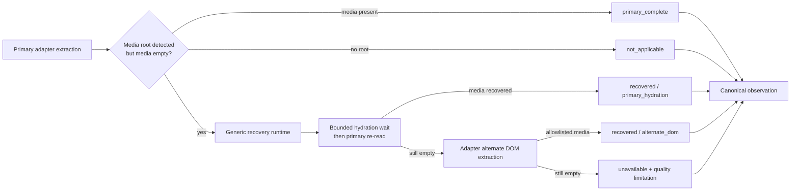

# Media Recovery v1

> Status: **Implemented**
> Date: **2026-07-15**
> Runtime baseline: **AkuBridge 0.5.42 / source-fidelity-v44; AkuSidecar 0.6.10**

## Purpose

A source post can expose a rendered media root while its primary image or video
poster URL is still absent from the first DOM extraction. Repeating the same
parser is not a sufficient fallback. This contract adds one bounded recovery
seam shared by every social source while keeping platform DOM knowledge inside
its adapter.

Media recovery does not decide relevance, fetch external pages, download
binaries, navigate to a native post, or use screenshots/OCR. Its only authority
is to inspect the same captured post container and return allowlisted rendered
source-CDN URLs.

## Architecture



### Generic ownership

`media-recovery-runtime.js` owns:

- the finite outcomes and one-attempt ceiling;
- source-independent settling, deadline enforcement, and primary re-read;
- common extraction helpers for HTTPS attributes, `srcset`, posters, video
  sources, and computed CSS backgrounds;
- allowlist normalization through the existing bounded capture policy;
- per-block audit records and observation-level aggregation; and
- the rule that recovery is observational and never clicks or navigates.

The generic runtime has no X/LinkedIn branch.

### Adapter ownership

Every adapter declares a versioned `mediaRecovery` strategy:

```js
mediaRecovery: {
  version: "source-media-recovery-v1",
  maxAttempts: 1,
  settleMs: 700,
  extractCandidates(container, genericHelpers) { /* source DOM knowledge */ },
}
```

The adapter selects only source-owned media roots and classifies them as image
or video. It does not control retry count, URL allowlists, terminal outcomes,
quality admission, persistence, or UI truthfulness.

Current strategies are `x-media-recovery-v1` and
`linkedin-media-recovery-v1`. X recognizes photo grids, video/interstitial
roots, status-photo permalink anchors, and link-card media. A status-photo
anchor remains media-expectation evidence while its image is hydrating, so it
cannot take the `not_applicable` branch. LinkedIn recognizes feed image, video,
and document presentation roots.

## Outcomes and transport

Every transported block has `mediaRecovery`:

| Outcome | Meaning |
|---|---|
| `not_applicable` | No rendered media root was detected |
| `primary_complete` | The ordinary parser returned media without recovery |
| `recovered` | Bounded hydration or alternate adapter extraction returned allowlisted media |
| `unavailable` | A media root was detected, but recovery remained empty |

`recovered` records `method` as `primary_hydration` or `alternate_dom`, a
positive `recoveredCount`, and one attempt. `unavailable` carries a bounded
limitation string and must correspond to a media quality issue. An observation
also reports aggregate `coverage.mediaRecovery`; `fallbackUsed` is true exactly
when at least one block used a recovery path successfully.

Every block also records a bounded stage trace covering primary extraction,
root detection, primary hydration, adapter alternate-DOM extraction, recovery
budget availability, and deadline exhaustion. Coverage publishes the matching
`stageCounts`. These are structural diagnostics only and contain no captured
post text or URL.

AkuSidecar rejects contradictory states such as `recovered` with empty media,
`unavailable` with a media value, aggregate count mismatch, or `fallbackUsed`
without recovered evidence. Media recovery metadata remains presentation and
diagnostic context; it is excluded from text reasoning prompts.

## User-visible failure behavior

A post with `unavailable` media remains admissible as `usable_degraded` when its
text, author, and identity are otherwise trustworthy. Source layout displays:

> Media was present at the source but unavailable in this captured view.

The notice links to the exact native post when a native URL exists. The UI does
not show an empty image shell or imply that media was successfully captured.

## Regression set

The adapter fixture set includes the recurring X shapes that motivated this
contract:

- NASA Artemis multi-photo grid;
- World of Science video poster; and
- OpenAI Build Week link-preview card.

The generic suite separately verifies primary success, recovery after
hydration, alternate DOM recovery, bounded exhaustion, summary accounting, and
no hidden second attempt.

## Live acceptance

On 2026-07-14, Supervisor validation observed
`aku-bridge-0.5.37-source-fidelity-v39` through the complete six-stage
cooperative reload audit. Unified session
`f1ebf06b-b4bc-4e25-835f-84bf5be2f3c1` then completed both source runs from a
background AkuBrowser tab:

- X run `8b480f6a-030a-45fe-9160-dc675dc935f1` transported nine blocks: two
  `primary_complete` and seven `not_applicable`;
- LinkedIn run `779c2263-d2ac-439f-8299-f17b258ac270` transported five blocks:
  three `primary_complete` and two `not_applicable`.

Every live block carried recovery metadata, both observations were admitted as
`complete`, and both reported `fallbackUsed: false`. No live post in this
sample required recovery, so `recovered` and `unavailable` remain covered by
the deterministic regression fixtures rather than claimed as live evidence.

## Adding another source

A new adapter must:

1. declare a versioned `mediaRecovery` strategy;
2. select only source-owned post media roots;
3. classify image versus video without broad page scanning;
4. return candidates through the generic helper and allowlist normalizer;
5. provide complete, recovered, and unavailable fixtures; and
6. pass Sidecar consistency and presentation tests.

Native-post navigation, binary download, screenshot/OCR, Computer Use, and
network metadata scraping remain outside this contract and require a separate
explicit product decision.
