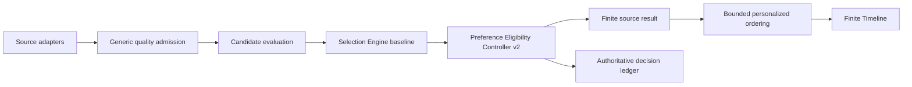

# Preference Eligibility Controller Contract v2

> Status: **Implemented with bounded live authority**
> Runtime baseline: **AkuSidecar 0.6.16**

Preference Eligibility Controller v2 is the source-neutral layer after
Selection Engine materiality admission. It uses the active local preference
snapshot without another model call. Version 2 retires the permanent shadow
branch and exposes one configurable authority mode:

- `rank_only`: eligibility remains exactly as Selection Engine decided;
- `promote_unused_budget`: the default; add at most one qualified excluded
  candidate when the source still has unused finite capacity;
- `guarded_live`: also permit at most one qualified suppression after the
  independent negative-evidence gates pass.

## Pipeline

The adapter, capture budget, reasoning prompt, and knowledge frontier never
change because of preference eligibility. Candidate source is composition
metadata, not a learned feature.

## Live promotion

An unused-budget promotion requires:

- local personalization is active and a safe snapshot exists;
- at least eight effective positive signals across both installed sources;
- preference probability at least `0.75`;
- Selection Engine score at least `0.25`;
- evidence strength at least `0.50`;
- an unused per-source result slot; and
- the candidate is the single highest bounded proposal for that run.

Promotion never displaces an already selected item. The promoted item remains
inside the same evaluated evidence set and is persisted through the normal
knowledge-continuity path.

## Guarded suppression

Suppression is disabled in the default mode. `guarded_live` additionally
requires eight effective negative preference signals, balanced accuracy of at
least `0.65`, and negative recall of at least `0.75`. A mandatory signal and
the last reliable selected item are always protected. At most one ordinary
item may be suppressed per run.

## Effective feedback

Readiness and fitting use the same latest-effective-signal pipeline. The
latest feedback for one canonical source/evidence identity is selected first;
only then is its reason-specific weight applied. An earlier generic Less may
therefore not survive after the user refines it into `already_known`,
`stale_or_superseded`, or `duplicate`.

The optional Less reasons are ordered and displayed as:

1. `not_interested` — **Not interested**, full preference evidence;
2. `already_known` — **Already knew**, continuity diagnostic;
3. `stale_or_superseded` — **Old info**, recency diagnostic;
4. `duplicate` — **Duplicate**, deduplication diagnostic.

Historical `wrong_topic` events remain readable as full preference evidence,
but new writes use `not_interested`; the old code is not part of the active UI
or schema vocabulary.

Clicking Less without a reason remains complete half-weight preference
feedback. There is no separate Skip action.

## Audit and configuration

Every evaluated candidate records its baseline and final decision, authority
mode, probability, protection flags, budget effect, gate state, bounded rank,
and whether eligibility changed. The normative record is
[`preference-eligibility-decision.schema.json`](preference-eligibility-decision.schema.json).

`preferenceEligibilityMode` is persisted by the runtime configuration API and
applies to the next run. `GET /api/preferences/eligibility` reports current
authority, readiness, live mutations, pending promotion candidates, and hard
protections. It is an audit surface, not a second competing decision system.
