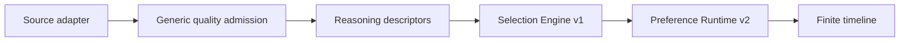

# Selection Engine Contract v1

> Status: **Implemented**

## Boundary

Selection Engine is the generic, deterministic owner of candidate eligibility.
Source adapters only capture and normalize source-specific evidence. The
ReasoningProvider describes every bounded candidate; it does not own the final
display budget and it may not encode user preference through source identity.

## Inputs and score

Every candidate has canonical `topicFacets`, `contentType`, `novelty`,
`urgency`, `actionability`, `materiality`, and `evidenceStrength`. Version 1
computes:

`0.40 materiality + 0.20 novelty + 0.15 actionability + 0.10 urgency + 0.15 evidenceStrength`

The default threshold is `0.40`. A contradiction, material update, or urgency
of at least `0.85` is mandatory within the finite budget. When all candidates
fall below the threshold, one highest-scoring candidate is retained as a
reliable fallback so uncertain assessments do not silently create an empty run.

Eligible candidates preserve platform order. Mandatory signals consume the
finite budget first; remaining slots use the earliest eligible candidates, and
the final displayed subset still follows platform order. The per-source display
budget is one to five items. Selection persists its policy, decision, reason
code, and score; Preference Runtime cannot change eligibility.

## Reason codes

- `selected_materiality`
- `selected_mandatory_signal`
- `selected_reliable_fallback`
- `below_materiality_threshold`
- `deferred_by_attention_budget`

## Feedback routing

`wrong_topic` and `wrong_priority` are preference evidence. `already_known`,
`duplicate`, `stale_or_superseded`, and `low_signal` are routed out of
preference fitting and reported respectively to the continuity, deduplication,
recency, and materiality diagnostic lanes. Those diagnostic routes do not yet
change selection automatically. Legacy Less events without a reason retain
half weight as ambiguous preference evidence.
