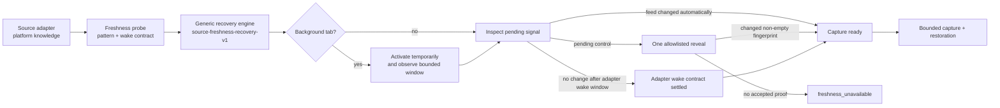

# Source Freshness Recovery v1

> Status: **Implemented**
> Date: **2026-07-14**
> Runtime baseline: **AkuBridge 0.5.36 / source-fidelity-v38; AkuSidecar 0.5.20**

## Purpose

A rendered feed can be structurally ready while still showing a stale server
snapshot. X and LinkedIn commonly defer their server refresh until a background
tab becomes active, then expose either an automatically changed feed or a
platform-owned `Show posts` / `New posts` control. This contract separates that
freshness lifecycle from DOM parsing and from ordinary feed readiness.

The acquisition states are deliberately distinct:

1. **readiness** proves that a usable rendered feed exists;
2. **freshness recovery** wakes a stale background tab and resolves pending
   server content; and
3. **capture** collects and restores the bounded visible evidence.

## Architecture



### Generic ownership

`source-freshness-recovery.js` owns:

- the finite state machine and terminal outcomes;
- background activation and bounded polling;
- one-reveal authorization and proof classification;
- failure code `freshness_unavailable` at stage `source_freshness`;
- preservation of the round-two acquisition frontier; and
- audit fields that do not contain post text or raw fingerprints.

`source-freshness-runtime.js` owns generic DOM mechanics:

- visible pending-control discovery from an adapter-supplied pattern;
- generic rejection of matching controls nested inside a feed candidate when
  the adapter enables that guard;
- visible-feed fingerprinting;
- one allowlisted control click;
- changed, non-empty fingerprint proof; and
- pre-action scroll recording.

Neither generic component contains an `if source === x/linkedin` branch.

### Adapter ownership

Every adapter must declare a `freshness` capability:

```js
freshness: {
  version: "source-freshness-v1",
  wakeWhenBackground: true,
  settledWakeIsCurrent: true,
  wakeObservationMs: 3500,
  probeIntervalMs: 250,
  revealSupported: true,
  revealObservationMs: 5000,
  rejectInsideFeedCandidate: true,
  pendingContentPattern: /source-owned allowlist/i,
}
```

These values are trusted source knowledge. A future adapter supplies its own
label pattern, false-positive guard, source-tuned reveal observation window,
and validated wake behavior; it does not reimplement activation, polling,
reveal proof, restoration, failure taxonomy, or Sidecar validation.

Current strategies are `x-freshness-v1` and `linkedin-freshness-v2`. X observes
for 3.5 seconds after wake and up to 5 seconds after reveal; LinkedIn observes
for 4 seconds after wake and up to 12 seconds after reveal because its feed
settles more slowly. Both reject exact label matches found inside a post
candidate and support one same-tab reveal in acquisition round one.

## State and proof contract

Every Gate 0B observation includes `coverage.sourceFreshness`:

| Field | Meaning |
|---|---|
| `policyVersion` | Generic engine version |
| `adapterFreshnessVersion` | Source-specific strategy version |
| `status` | `ready`; unavailable recovery fails before observation transport |
| `outcome` | Finite terminal outcome listed below |
| `verification` | How readiness for capture was established |
| `wakeAttempted`, `activated`, `documentVisibleObserved`, `probeCount`, `waitMs` | Bounded audit trail; document visibility is diagnostic because an active tab in a background Chrome window may remain `hidden` |
| `pendingContentDetected`, `pendingContentAction` | Pending-control lifecycle |
| `feedChanged`, `feedMutation` | Automatic change versus intentional reveal |

Terminal outcomes are:

- `active_feed_ready` — the source was already active and exposed no pending
  control;
- `new_tab_ready` — a newly opened managed tab completed its load and wake
  contract;
- `feed_changed_after_wake` — activation produced a different visible feed
  without a reveal click;
- `pending_content_revealed` — one allowlisted click produced accepted
  fingerprint proof;
- `adapter_wake_settled` — the adapter-declared visibility wake window completed
  without a pending signal or feed mutation; and
- `follow_up_preserved` — acquisition round two deliberately skips freshness
  mutation to retain its prior frontier.

`adapter_wake_settled` is explicitly an adapter-contract proof, not evidence
that a server response body was inspected. The distinction remains visible in
`verification: adapter_wake_contract`.

## Mutation and restoration

Activation never focuses the Chrome window. AkuBridge remembers the active tab
inside the same window and restores it after capture only if the source tab is
still active. If the user selects another tab during acquisition, restoration
does nothing rather than fighting the user.

A successful reveal intentionally replaces or reorders the rendered feed. The
pre-reveal view cannot be reconstructed. Scroll restoration therefore uses the
post-reveal top as its baseline and reports `restorationScope:
post_reveal_start`. A no-mutation capture preserves `pre_run_position`.

## Failure and no-empty-result rule

A visible pending control without reveal authority, an invalid adapter probe,
or reveal without changed-feed proof fails as
`freshness_unavailable`. AkuSidecar does not retry that failure with
`detect_only`. This prevents stale known evidence from being misreported as a
valid catchup with zero additions.

Zero additions remain valid only after a transported, admitted observation has
a ready freshness outcome and the normal knowledge-continuity layer finds no
new material evidence.

## Live acceptance evidence

The final 2026-07-14 acceptance used the cooperative Supervisor path without
browser-level restart or profile recreation:

- request `freshness-v38-20260714-2345` completed all six audit stages and
  matched `aku-bridge-0.5.36-source-fidelity-v38`;
- unified session `bc9a7487-4bbb-4297-baa5-1e64db970bf6` completed at 23:36
  Asia/Jakarta with four additions;
- X run `bc108bbc-22f7-49a5-ab31-4dcd0b8db607` reported
  `pending_content_revealed` with `feed_change` proof; and
- LinkedIn run `2fd7c6bb-49eb-4380-978c-5d6069c3cbf1` reported
  `adapter_wake_settled` after a bounded wake and no accepted pending control.

An immediately preceding v37 run failed closed because LinkedIn matched a
control but obtained no changed-feed proof. V38 added the generic
inside-feed-candidate rejection guard and a source-configurable reveal
observation window; LinkedIn enabled the guard and selected a 12-second bound.
The failed run remained an explicit `source_freshness` error rather than being
converted into a misleading empty result.

## Third-source checklist

A new social adapter must:

1. declare and version its `freshness` strategy;
2. validate its pending-control allowlist and wake semantics with fixtures;
3. pass the generic background wake, auto-change, reveal, failure, and
   follow-up tests;
4. add its adapter and freshness versions to the compatibility handshake; and
5. complete a signed-in live run proving focus restoration and one real
   reasoning invocation.

Reload, tab recreation, or managed-tab fallback is not part of v1. Those actions
require a separate lifecycle policy because they are more disruptive than
temporary activation and same-tab reveal.
