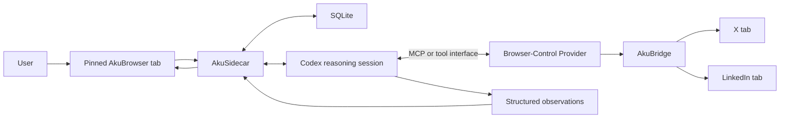
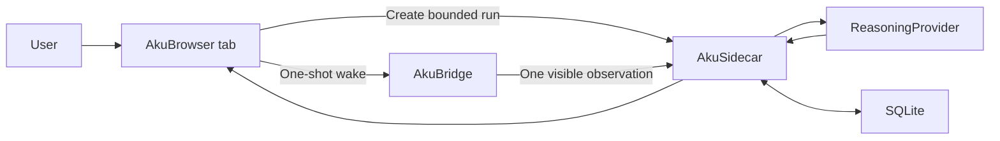

# AkuBrowser — Architecture Reference

> Status: **Active implementation baseline — Gate 0 pilot**  
> Version: **0.5**  
> Last updated: **2026-07-10**  
> Working name: **AkuBrowser**

## 1. Purpose of This Document

This document is the source of truth for the latest agreed architecture of AkuBrowser during product discovery. It records:

- decisions that are already agreed;
- the responsibility of each component;
- the intended information flow;
- the boundary of the initial version;
- capabilities deliberately deferred to future phases; and
- technical assumptions that still require feasibility testing.

Implementation is authorized. This document should be updated whenever a product, repository, contract, or architecture decision changes.

## 2. Product Premise

AkuBrowser is intended to give control of internet information consumption back to the user.

Information providers such as X and LinkedIn still determine what information they present and how it appears on their websites. AkuBrowser does not try to replace those providers or build a large general-purpose browser. Instead, it consumes what is presented to the user through the user's browser session, then helps the user evaluate, compress, prioritize, and finish consuming it.

The desired experience is:

> In a bounded amount of time, show what materially changed, why it matters, and the sources—then let the user feel finished.

The primary unit is therefore not a website or individual post. It is a meaningful **event, claim, knowledge update, or artifact** supported by source posts.

## 3. Confirmed Architecture Principles

1. **One primary surface**  
   The user interacts with a pinned local web page called the AkuBrowser tab.

2. **Result-tab-driven interaction**  
   The user selects a mode or action from the AkuBrowser tab. The default workflow does not require the user to write a prompt to Codex.

3. **Browser-presented information**  
   X and LinkedIn are consumed through the user's signed-in Chrome experience. The initial approach does not depend on undocumented platform APIs, hidden data access, or bypassing the website presentation layer.

4. **Read-only operation**  
   The initial system must not like, reply, repost, follow, unfollow, send messages, edit profiles, or perform other account mutations.

5. **Codex as reasoning engine and bridge**  
   Codex navigates or observes the source tabs through an available browser-control provider and converts observations into structured information.

6. **The sidecar owns operational state**  
   The local sidecar owns jobs, checkpoints, SQLite transactions, validation, policy execution, and communication between the AkuBrowser tab, Codex, and AkuBridge.

7. **Codex does not directly render the AkuBrowser tab**  
   Codex returns structured observations or results. The sidecar validates and stores them; the AkuBrowser tab renders them.

8. **Finite result instead of another infinite feed**  
   Catch-up results must have a defined end. The gateway must not become a new compulsive feed.

9. **Source-backed and auditable**  
   Each important result must retain source links, observation time, and enough reasoning context to explain why it appeared.

10. **Normal operation is simple, the process remains inspectable**  
    The user normally interacts only with the AkuBrowser tab. Intermediate details may stay out of the way, but coverage, sources, and reasons must be inspectable when needed.

## 4. Terminology and Component Responsibilities

The word `plugin` is ambiguous and should not be used by itself for the Chrome component.

| Component | Runtime location | Primary responsibility |
|---|---|---|
| **AkuBrowser tab** | Pinned local web page | User controls, selected mode, progress, finite results, source links, and coverage statement |
| **AkuSidecar** | Logical role; initially a local process outside Chrome | Job orchestration, state storage, checkpoints, deterministic policy, validation, and coordination |
| **Codex** | Reasoning session | Understand visible information, navigate through browser tools, identify claims/events, classify relevance, and produce structured output |
| **AkuBridge** | Inside Chrome | Browser access such as locating/opening tabs, selecting a tab, observing the presented page, scrolling, and executing approved read-only actions |
| **Browser-Control Provider** | Integration boundary | The capability Codex calls to operate Chrome; it may use an existing integration or the custom bridge fallback |
| **SQLite** | Local storage managed by sidecar | Seen-state, checkpoints, observations, results, policies, run metadata, and future knowledge history |
| **MCP** | Protocol/integration layer | One possible way to expose sidecar or browser capabilities to Codex; it is not a replacement for the sidecar or extension |

In shorthand:

- the AkuBridge is the **eyes and hands in Chrome**;
- Codex is the **reasoning engine**;
- the AkuSidecar is the **coordinator and state owner**;
- MCP can be the **communication protocol**; and
- the AkuBrowser tab is the **user-facing control and result surface**.

### Repository ownership

The implementation uses a neutral parent workspace containing three independent sibling repositories:

- `AkuBrowser` is the primary product/integration repository. It owns architecture, canonical contracts, contract-drift checks, and aggregate development commands;
- `AkuBridge` owns the Chrome extension, source-tab observation, and transport into the local bridge contract; and
- `AkuSidecar` owns the pinned AkuBrowser tab, job engine, SQLite state, reasoning providers, validation, and runtime result contract.

The parent workspace is not a repository and does not own dependencies. Each project has its own Git history, package manifest, lockfile, tests, and README. AkuBridge and AkuSidecar must not import each other's implementation source. They communicate only through the versioned HTTP/message contract so either side can later be replaced, released, or bundled independently.

## 5. Logical Architecture



The browser-control provider is intentionally an abstraction. AkuBridge is the primary initial `BrowserAdapter`: it owns source-specific DOM discovery, bounded capture, bounded scrolling, scroll restoration, and auditable coverage. Computer Use is an explicit fallback only when the native source adapter cannot complete an approved read-only action. The fallback must be reported in run coverage rather than silently becoming the default path.

Keeping these capabilities behind `BrowserAdapter` means the `ReasoningProvider` does not need to supply a proprietary Computer Use implementation. Codex and a future open-source provider can call the same bounded browser tools and receive the same observation contract.

## 6. End-to-End Runtime Flow

1. The user opens the pinned AkuBrowser tab.
2. The user selects an information-consumption mode, such as Catch Up or Manual Live.
3. The AkuBrowser tab sends a bounded job request to the AkuSidecar.
4. The sidecar creates a run, loads policy and prior checkpoints from SQLite, and starts or resumes a Codex reasoning session.
5. Codex receives built-in instructions for the selected mode. The user does not need to manually prompt it.
6. The reasoning loop calls the browser-control provider to open or locate X and LinkedIn, inspect the information presented, and scroll within the agreed bounds. AkuBridge performs those source operations natively when possible; Computer Use is only an explicit fallback.
7. Browser content is returned as untrusted observations. It is evidence, not instruction.
8. Codex turns those observations into a structured set of claims, events, deltas, sources, timestamps, confidence, and relevance signals.
9. The sidecar validates the structure and applies deterministic rules that should not depend solely on model judgment.
10. The sidecar writes the run, observations, checkpoints, and results to SQLite as a transaction.
11. The AkuBrowser tab refreshes from the sidecar and displays a finite, source-backed result.
12. The user can open a source when deeper context is needed without being required to consume the raw feed.

### 6.1 Gate 0A implementation topology

The first technical vertical slice deliberately uses a simpler topology than the full target architecture:



For Gate 0A, the sidecar defines the bounded capture command and the AkuBridge observes one already-open, rendered source tab. Codex classifies the validated observation but does not yet direct browser navigation. The source tab is not focused, scrolled, clicked, or silently opened when absent. Catch Up requires the canonical feed page (`https://x.com/home` or `https://www.linkedin.com/feed/`); Manual Live may use the currently active page for the selected source.

This isolates transport, authenticated browser-state access, provider invocation, structured output, provenance, persistence, and result rendering from the separate risk of agent-directed browser control.

Gate 0B, only after Gate 0A passes, introduces the target `ReasoningProvider -> BrowserAdapter` tool loop for bounded navigation and scrolling. Scrolling is implemented by AkuBridge source adapters first, with Computer Use reserved for observable failure recovery. The full logical architecture in Section 5 remains the target rather than a claim about the first slice.

## 7. Initial Interaction Modes

### 7.1 Catch Up — initial mode

A user-triggered, finite summary of material changes since the relevant checkpoint. It is not restricted to one or two fixed windows per day; the user may run it repeatedly during rapid development.

The output should prioritize new knowledge rather than merely recent posts.

### 7.2 Manual Live — initial mode

A user-triggered mode for repeatedly checking material changes during a fast-moving situation. It remains bounded and does not reproduce the raw infinite feed.

### 7.3 Focus — limited initial behavior

In the initial version, Focus can be stored as user intent or UI state, but it does not imply reliable background monitoring. True P0 interruptions require a later watcher or scheduler capability.

### 7.4 Situation Watch — future

Focused monitoring of a named event such as an earthquake, unrest, a product launch, or another rapidly evolving situation.

### 7.5 Explore — future

Controlled discovery outside the user's primary topics, governed by an explicit discovery budget.

## 8. Priority Lanes

| Lane | Intended behavior | Example |
|---|---|---|
| **P0 — Interrupt** | Direct notification only when delay may cause safety impact or lost opportunity | Credible emergency or genuinely time-limited action |
| **P1 — Top of Catch Up** | Appears at the top of the next user-triggered result | GPT-5.6 Sol release, upcoming bankable Codex reset announcement, materially new creative Codex use |
| **P2 — Ready Later** | Valuable but can wait | Opinions and analysis about Codex or Sol |
| **P3 — Discovery** | Controlled exposure outside the core focus | Fable, Grok, Meta AI, Google AI, and adjacent systems |
| **P4 — Collapse or Ignore** | Hidden unless relevance changes | Generic technology information with no current material value |

P0 is deliberately separate from P1. Important information is not automatically interruption-worthy.

## 9. Initial Scope Boundary

### In scope for the first implementation phase

- one local user;
- a pinned local AkuBrowser tab;
- X and LinkedIn;
- technical engineering and the user's current AI-development interests;
- read-only browser consumption;
- user-triggered Catch Up and Manual Live;
- Codex-driven observation and classification;
- a local sidecar and SQLite state;
- structured, finite, source-backed results; and
- a minimal custom AkuBridge if existing Chrome integration cannot be called from the selected Codex surface.

### Explicitly out of scope for the first implementation phase

- building a full or general-purpose browser;
- replacing Chrome's New Tab page;
- multi-user or cloud synchronization;
- account mutations on X or LinkedIn;
- access to DMs or private messaging workflows;
- automatic engagement or social participation;
- reliable background P0 monitoring and system notifications;
- broad support for YouTube, Facebook, Instagram, or arbitrary websites;
- temporal history reconstruction and supersession logic;
- a polished autonomous agent platform; and
- bypassing website presentation, permissions, or platform protections.

## 10. Future Capability: Temporal Supersession and History

### Problem

X and other feeds may show a post that is topically relevant but older than information the user has already consumed. The post may still be within 24 hours—or older—yet no longer add useful knowledge because a later update has superseded it. Repeated exposure to these informationally stale posts contributes to doom scrolling.

The relevant measure is therefore not only post age. It is whether the post advances the user's **knowledge frontier** for that event or topic.

### Desired future behavior

- Default views show only a material delta beyond the latest event state already known to the user.
- Superseded posts are collapsed under earlier context.
- An older post may still surface when it contains the original source, unique evidence, a contradiction, causal context, or another material addition.
- A deliberate History Mode can reconstruct the chronology when the user wants to understand how an event developed.

### Compatibility requirement for the initial data model

The initial system does not need to implement supersession. It should, however, avoid blocking the feature by preserving at least:

- stable source/platform identity;
- source URL or post identifier;
- `published_at` when available;
- `observed_at` and first-seen time;
- the related topic/event key when classification produces one; and
- prior observations instead of destructively overwriting them.

The exact retention policy and event-versioning algorithm remain deferred.

## 11. Trust and Security Boundaries

1. Page content is untrusted data and must never be treated as a Codex or sidecar instruction.
2. Browser actions are constrained to an allowlist of read-only capabilities and approved domains.
3. The sidecar, not page content, owns job policy and tool permissions.
4. Model output is schema-validated before it affects SQLite or the AkuBrowser tab.
5. Account-changing actions are unavailable in the initial tool surface, not merely discouraged by prompts.
6. Every result should retain provenance sufficient for the user to inspect its source.
7. Failures or incomplete scans must produce a coverage statement rather than a false sense of completeness.

## 12. Feasibility Gate 0

Implementation, when authorized, should begin with the smallest end-to-end proof:

```text
AkuBrowser tab
  -> AkuSidecar
  -> Codex
  -> one signed-in Chrome source tab
  -> one structured observation
  -> SQLite
  -> AkuBrowser tab result
```

The gate should answer these questions before the full classification system is built:

1. Can a sidecar-started Codex session call an existing Chrome integration?
2. If not, can the minimal custom AkuBridge provide the required read-only operations?
3. Can it consume the user's signed-in X or LinkedIn view without bypassing the website presentation layer?
4. Can browser content be converted into schema-valid structured observations?
5. Can the complete flow retain source identity and timestamps?
6. Does browser operation steal focus or otherwise disrupt the user's simultaneous work?
7. Can the run report bounded coverage and stop cleanly?

The accepted fallback for question 1 is the minimal custom AkuBridge. This is a resolved product decision, not a blocker.

## 13. Deliberately Unresolved Technical Decisions

These choices should be resolved by evidence from Feasibility Gate 0 rather than assumed now:

- whether the existing first-party Chrome integration is callable from the chosen Codex integration surface;
- the exact Codex integration surface, such as App Server, SDK, or another supported interface;
- the extension-to-sidecar transport, such as native messaging or a constrained local endpoint;
- whether browser observation can operate without disruptive focus changes;
- the exact frontend and sidecar implementation stack;
- the first structured observation and result schemas;
- storage limits and retention policy;
- run budgets for time, scroll depth, items observed, and model usage; and
- calibration thresholds for P0–P4 classification.

## 14. Deployment and Packaging Roadmap

### 14.1 Sidecar is a logical boundary, not permanently a separate executable

The AkuSidecar describes a set of responsibilities. In the initial architecture those responsibilities live in a separate local process with SQLite, but they do not have to stay there forever.

For user-triggered Catch Up and Manual Live, much of the sidecar can technically move into a Chrome extension:

- the pinned AkuBrowser tab can become a `chrome-extension://` page;
- an extension service worker can receive browser events and coordinate bounded jobs;
- IndexedDB can hold structured observations, checkpoints, results, and event history;
- `chrome.storage` can hold small settings and policy values; and
- content scripts and extension messaging can connect the source tabs, job engine, and AkuBrowser tab.

This extension-hosted form is called **Sidecar Lite**. It is not a complete equivalent of a native sidecar because Manifest V3 service workers are event-driven and may be terminated when idle or during long operations. Jobs must therefore be resumable from persisted state. A pinned extension page can coordinate work while it is open, but reliable long-running background monitoring should not depend on that page remaining open.

Codex is also a separate concern. A Chrome extension cannot assume it can embed or start a native Codex runtime by itself. The initial Codex App Server or SDK route remains a local-runtime integration unless it is packaged by a native installer or replaced by a remote reasoning service.

### 14.2 Packaging phases

#### Phase 0 — research architecture: three installed components

```text
AkuBridge
  + AkuSidecar
  + existing Codex installation
```

Purpose: prove the product behavior and classification contract with the least architectural guesswork. This is acceptable for the initial personal pilot but is not the intended consumer distribution model.

#### Phase 1 — extension-hosted Sidecar Lite: two components

```text
AkuBrowser Chrome Extension
  - AkuBrowser tab
  - AkuBridge
  - bounded job engine
  - IndexedDB / chrome.storage

+ local Codex installation
```

Purpose: prove that state, UI, and browser orchestration can be combined without relying on a separate sidecar process. This is suitable for user-triggered modes. Background P0 monitoring remains limited.

The current SQLite schema should first be treated as a logical data contract so it can later map to IndexedDB without changing the meaning of observations, events, checkpoints, or results.

#### Phase 2A — consumer-first single extension

```text
AkuBrowser Chrome Extension
  -> authenticated AkuBrowser service
  -> remote reasoning/model runtime
```

User installation count: **one extension**.

Advantages:

- lowest friction for ordinary users;
- no separate Codex or sidecar installation;
- centralized model and policy upgrades; and
- easier support and diagnostics.

Costs:

- requires a hosted backend, authentication, and operating cost;
- selected information leaves the local machine for reasoning;
- privacy and retention guarantees become product-critical; and
- offline operation is limited.

This is the most direct intermediate route to broad consumer adoption before building a browser.

#### Phase 2B — local-first single installer

```text
One AkuBrowser desktop installer
  - installs/registers the Chrome extension
  - bundles the native sidecar
  - bundles or provisions the reasoning runtime
  - connects them through Native Messaging or another constrained local channel
```

User installation count: **one installer**, although multiple internal processes still exist.

Advantages:

- preserves local SQLite and stronger local-first behavior;
- supports long-running jobs better than extension-only execution;
- reduces dependence on a hosted orchestration backend; and
- provides a migration path toward an embedded browser.

Costs:

- platform-specific installers, signing, updates, and support;
- Chrome extension registration and permissions remain visible;
- a larger download and more complex release pipeline; and
- bundling or provisioning Codex must follow the supported distribution and authentication model available at that time.

Phase 2A and Phase 2B are alternative packaging strategies. The product may eventually support both, but the choice should be made after the initial pilot provides evidence about privacy expectations, operating cost, and background-monitoring needs.

#### Phase 3 — ultimate browser distribution

```text
AkuBrowser installer
  - browser shell and signed-in sessions
  - native AkuBrowser tab
  - browser observation/control layer
  - local state and knowledge frontier
  - reasoning provider
  - updater and permission system
```

The user experiences one browser product and one installation. Internally, the browser will still use multiple components and processes. The ultimate goal is therefore a **single product and distribution boundary**, not a single process or a collapse of all architectural responsibilities into one module.

### 14.3 Migration seams that must remain stable

To avoid rewriting the product at every packaging phase, implementation should preserve these logical interfaces:

| Interface | Initial provider | Possible later provider |
|---|---|---|
| **BrowserAdapter** | AkuBridge | Native AkuBrowser capability |
| **StateStore** | SQLite in local sidecar | IndexedDB in extension, browser-native database, or synchronized store |
| **ReasoningProvider** | Local Codex CLI/SDK session | Hosted agent/model service, local open-source model runtime, or browser-bundled runtime |
| **JobEngine** | AkuSidecar | Extension Sidecar Lite, hosted orchestrator, or native browser service |
| **ResultContract** | Sidecar-to-AkuBrowser-tab schema | Same schema across all deployment forms |

Codex should be treated as the initial reasoning and experimentation provider, not as a permanent consumer installation requirement baked into the domain model. The product contract is with `ReasoningProvider`; Codex is its first implementation.

### 14.4 Reasoning-provider portability

AkuBrowser must remain replaceable with an open-source reasoning solution in the future. Therefore:

- domain objects and SQLite records must use AkuBrowser vocabulary, not Codex-specific thread or item types;
- the `ReasoningProvider` input is a bounded run contract plus validated browser observations;
- the `ReasoningProvider` output is the provider-neutral `ResultContract`;
- authentication, model names, prompts, SDK objects, and provider-specific errors remain inside their adapter;
- deterministic policy and schema validation remain outside the model provider;
- provider adapters are loaded independently so removing one provider does not break another; and
- bounded navigation and scrolling are exposed through the provider-neutral `BrowserAdapter`, not assumed to be built into Codex or another reasoning provider;
- Computer Use remains an optional fallback capability rather than a prerequisite for an open-source `ReasoningProvider`; and
- evaluation fixtures must be runnable against Codex and a future local/open-source provider using the same expected contract.

Potential future providers include a local OpenAI-compatible inference server, an Ollama-style local runtime, or another tool-capable open-source agent. Choosing one is deferred until the pilot produces a representative evaluation set; no open-source model is assumed equivalent before it passes that same set.

### 14.5 Current recommendation

Do not collapse the sidecar before Feasibility Gate 0. First validate the complete behavior with the three-component research architecture. During that work:

1. keep orchestration logic portable and independent of Node-, Python-, or OS-only APIs where practical;
2. keep persistence behind `StateStore` rather than allowing business rules to depend directly on SQLite queries;
3. keep Codex behind `ReasoningProvider`;
4. keep Chrome operations behind `BrowserAdapter`; and
5. make every job resumable from persisted checkpoints.

After behavioral proof, test Sidecar Lite as a packaging experiment. That sequence reduces consumer-installation complexity without allowing packaging concerns to distort the first product experiment.

## 15. Decision Log

| ID | Decision | Status |
|---|---|---|
| D-001 | Use one pinned local web page as the AkuBrowser tab | Confirmed |
| D-002 | Do not replace Chrome New Tab in the initial phase | Confirmed |
| D-003 | User selects modes from the AkuBrowser tab; prompting Codex is not the default interaction | Confirmed |
| D-004 | Use X and LinkedIn as the initial source platforms | Confirmed |
| D-005 | Keep initial browser access read-only | Confirmed |
| D-006 | Codex returns structured observations; sidecar validates/stores; AkuBrowser tab renders | Confirmed |
| D-007 | Sidecar owns SQLite, job state, checkpoints, and deterministic policy | Confirmed |
| D-008 | Accept a minimal custom AkuBridge if existing Chrome integration is unavailable | Confirmed |
| D-009 | Start with Catch Up and Manual Live; no fixed daily catch-up limit | Confirmed |
| D-010 | Reserve direct P0 notifications for emergency or opportunity-loss cases | Confirmed, future runtime capability |
| D-011 | Treat old-but-superseded information through a future knowledge-frontier/history model | Deferred, compatibility noted |
| D-012 | Do not build a large browser | Confirmed |
| D-013 | Do not begin implementation until explicitly authorized | Confirmed |
| D-014 | Treat the sidecar as a logical responsibility boundary, not permanently a separate executable | Confirmed |
| D-015 | Accept the three-component setup for the personal research phase | Confirmed |
| D-016 | Preserve a roadmap toward one consumer installation while keeping internal component boundaries | Confirmed |
| D-017 | Choose between consumer-first cloud reasoning and local-first native packaging after pilot evidence | Deferred |
| D-018 | Keep ReasoningProvider vendor-neutral and replaceable by a future open-source/local runtime | Confirmed |
| D-019 | Keep AkuBridge and AkuSidecar as separate projects within one workspace | Confirmed |
| D-020 | Use sidecar-directed, one-shot visible capture for Gate 0A; test Codex-directed browser control separately in Gate 0B | Confirmed for pilot sequencing |
| D-021 | Require a canonical source feed for Catch Up; allow the active source page for Manual Live | Confirmed after first Chrome pilot |
| D-022 | Use an Option C polyrepo workspace with AkuBrowser, AkuBridge, and AkuSidecar as sibling repositories | Confirmed |
| D-023 | Use AkuBrowser as the primary product brand; do not use Signal as the product brand | Confirmed |
| D-024 | Implement bounded scrolling natively in AkuBridge source adapters and use Computer Use only as an explicit fallback | Confirmed after Gate 0A pilot |
| D-025 | Keep browser acquisition independent of ReasoningProvider so a future open-source provider does not require proprietary Computer Use | Confirmed |
| D-026 | Preserve provenance lanes explicitly as native post, canonical source page, or external reference; never label one lane as another | Confirmed after LinkedIn Gate 0A pilot |

## 16. Change Discipline

When discussion changes an architectural assumption:

1. update the relevant section of this document;
2. add or amend an entry in the Decision Log;
3. distinguish confirmed product decisions from technical hypotheses;
4. keep deferred capabilities out of the initial scope unless explicitly promoted; and
5. increment the document version when the baseline materially changes.

## 17. Current Technical References

- [Chrome extension service-worker lifecycle](https://developer.chrome.com/docs/extensions/develop/concepts/service-workers/lifecycle)
- [Chrome extension storage and IndexedDB](https://developer.chrome.com/docs/extensions/develop/concepts/storage-and-cookies)
- [Chrome extension native messaging](https://developer.chrome.com/docs/extensions/develop/concepts/native-messaging)
- [Chrome extension message passing and trust boundaries](https://developer.chrome.com/docs/extensions/develop/concepts/messaging)
- [Codex App Server](https://developers.openai.com/codex/app-server)
- [Codex SDK](https://developers.openai.com/codex/sdk)
- [Codex MCP support](https://developers.openai.com/codex/mcp)
