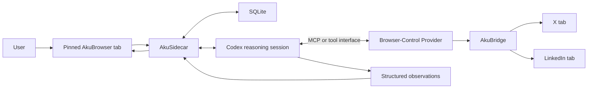
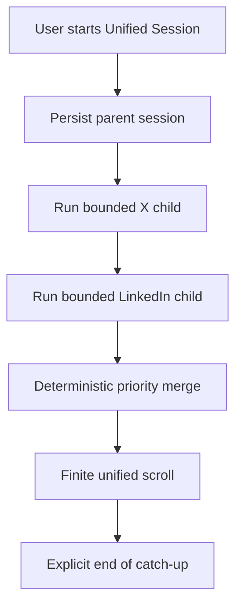
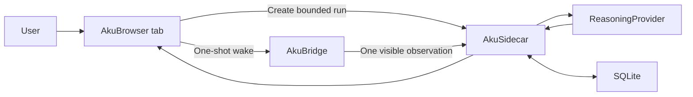

# AkuBrowser — Architecture Reference

> Status: **Offline preference pipeline implemented — calibration gates pending**
> Version: **0.14**
> Last updated: **2026-07-11**
> Working name: **AkuBrowser**

## 1. Purpose of This Document

This document is the source of truth for the latest agreed architecture of AkuBrowser during product discovery. It records:

- decisions that are already agreed;
- the responsibility of each component;
- the intended information flow;
- the boundary of the initial version;
- capabilities deliberately deferred to future phases; and
- technical assumptions that still require feasibility testing.

Implementation is authorized. This document should be updated whenever a product, repository, contract, or architecture decision changes.

## 2. Product Premise

AkuBrowser is intended to give control of internet information consumption back to the user.

Information providers such as X and LinkedIn still determine what information they present and how it appears on their websites. AkuBrowser does not try to replace those providers or build a large general-purpose browser. Instead, it consumes what is presented to the user through the user's browser session, then helps the user evaluate, compress, prioritize, and finish consuming it.

The desired experience is:

> In a bounded amount of time, show what materially changed, why it matters, and the sources—then let the user feel finished.

The primary unit is therefore not a website or individual post. It is a meaningful **event, claim, knowledge update, or artifact** supported by source posts.

## 3. Confirmed Architecture Principles

1. **One primary surface**  
   The user interacts with a pinned local web page called the AkuBrowser tab.

2. **Result-tab-driven interaction**  
   The user selects a mode or action from the AkuBrowser tab. The default workflow does not require the user to write a prompt to Codex.

3. **Browser-presented information**  
   X and LinkedIn are consumed through the user's signed-in Chrome experience. The initial approach does not depend on undocumented platform APIs, hidden data access, or bypassing the website presentation layer.

4. **Read-only operation**  
   The initial system must not like, reply, repost, follow, unfollow, send messages, edit profiles, or perform other account mutations.

5. **Codex as reasoning engine and bridge**  
   Codex navigates or observes the source tabs through an available browser-control provider and converts observations into structured information.

6. **The sidecar owns operational state**  
   The local sidecar owns jobs, checkpoints, SQLite transactions, validation, policy execution, and communication between the AkuBrowser tab, Codex, and AkuBridge.

7. **Codex does not directly render the AkuBrowser tab**  
   Codex returns structured observations or results. The sidecar validates and stores them; the AkuBrowser tab renders them.

8. **Finite result instead of another infinite feed**  
   Catch-up results must have a defined end. The gateway must not become a new compulsive feed.

9. **Source-backed and auditable**  
   Each important result must retain source links, observation time, and enough reasoning context to explain why it appeared.

10. **Normal operation is simple, the process remains inspectable**  
    The user normally interacts only with the AkuBrowser tab. Intermediate details may stay out of the way, but coverage, sources, and reasons must be inspectable when needed.

## 4. Terminology and Component Responsibilities

The word `plugin` is ambiguous and should not be used by itself for the Chrome component.

| Component | Runtime location | Primary responsibility |
|---|---|---|
| **AkuBrowser tab** | Pinned local web page | User controls, selected mode, progress, finite results, source links, and coverage statement |
| **AkuSidecar** | Logical role; initially a local process outside Chrome | Job orchestration, state storage, checkpoints, deterministic policy, validation, and coordination |
| **Codex** | Reasoning session | Understand visible information, navigate through browser tools, identify claims/events, classify relevance, and produce structured output |
| **AkuBridge** | Inside Chrome | Browser access such as locating/opening tabs, selecting a tab, observing the presented page, scrolling, and executing approved read-only actions |
| **Browser-Control Provider** | Integration boundary | The capability Codex calls to operate Chrome; it may use an existing integration or the custom bridge fallback |
| **SQLite** | Local storage managed by sidecar | Seen-state, checkpoints, observations, results, policies, run metadata, and future knowledge history |
| **MCP** | Protocol/integration layer | One possible way to expose sidecar or browser capabilities to Codex; it is not a replacement for the sidecar or extension |

In shorthand:

- the AkuBridge is the **eyes and hands in Chrome**;
- Codex is the **reasoning engine**;
- the AkuSidecar is the **coordinator and state owner**;
- MCP can be the **communication protocol**; and
- the AkuBrowser tab is the **user-facing control and result surface**.

### Repository ownership

The implementation uses a neutral parent workspace containing three independent sibling repositories:

- `AkuBrowser` is the primary product/integration repository. It owns architecture, canonical contracts, contract-drift checks, and aggregate development commands;
- `AkuBridge` owns the Chrome extension, source-tab observation, and transport into the local bridge contract; and
- `AkuSidecar` owns the pinned AkuBrowser tab, job engine, SQLite state, reasoning providers, validation, and runtime result contract.

The parent workspace is not a repository and does not own dependencies. Each project has its own Git history, package manifest, lockfile, tests, and README. AkuBridge and AkuSidecar must not import each other's implementation source. They communicate only through the versioned HTTP/message contract so either side can later be replaced, released, or bundled independently.

During local development, AkuSidecar remains one process on `127.0.0.1:47821`. Vite is mounted as frontend middleware on the existing Sidecar HTTP server rather than exposed through a second proxy port. Vite owns HMR for UI assets; Node's built-in watcher restarts the same visible process for backend-module changes. Production-style `npm start` keeps the static file path and does not require Vite at runtime.

## 5. Logical Architecture



The browser-control provider is intentionally an abstraction. AkuBridge is the primary initial `BrowserAdapter`: it owns source-specific DOM discovery, bounded capture, bounded scrolling, scroll restoration, and auditable coverage. Computer Use is an explicit fallback only when the native source adapter cannot complete an approved read-only action. The fallback must be reported in run coverage rather than silently becoming the default path.

Keeping these capabilities behind `BrowserAdapter` means the `ReasoningProvider` does not need to supply a proprietary Computer Use implementation. Codex and a future open-source provider can call the same bounded browser tools and receive the same observation contract.

## 6. End-to-End Runtime Flow

1. The user opens the pinned AkuBrowser tab.
2. The user selects an information-consumption mode, such as Catch Up or Manual Live.
3. The AkuBrowser tab sends a bounded job request to the AkuSidecar.
4. The sidecar creates a run, loads policy and prior checkpoints from SQLite, and starts or resumes a Codex reasoning session.
5. Codex receives built-in instructions for the selected mode. The user does not need to manually prompt it.
6. The reasoning loop calls the browser-control provider to open or locate X and LinkedIn, inspect the information presented, and scroll within the agreed bounds. AkuBridge performs those source operations natively when possible; Computer Use is only an explicit fallback.
7. Browser content is returned as untrusted observations. It is evidence, not instruction.
8. Codex turns those observations into a structured set of claims, events, deltas, sources, timestamps, confidence, and relevance signals.
9. The sidecar validates the structure and applies deterministic rules that should not depend solely on model judgment.
10. The sidecar writes the run, observations, checkpoints, and results to SQLite as a transaction.
11. The AkuBrowser tab refreshes from the sidecar and displays a finite, source-backed result.
12. The user can open a source when deeper context is needed without being required to consume the raw feed.

### Daily-use Unified Session target

The Gate 0 UI used one source and one promoted item to isolate technical risks. The accepted daily-use target is now a `UnifiedSession`: one parent request creates sequential X and LinkedIn child runs, preserves their source-specific checkpoints and evidence, then renders one finite result list containing at most five items per source and ten total. Five is a ceiling rather than a quota, and the browser-acquisition budget does not increase merely because the presentation budget increases.



The child runs remain the execution and audit units. A partial session keeps a completed source result visible when the other source fails. Unified ordering is deterministic by priority with source interleaving; semantic cross-source deduplication remains deferred until pilot evidence can calibrate it. Single-source operation remains available as an Advanced/Pilot path rather than the default daily-use surface. The normative experiment boundary is recorded in [`Unified Session Experiment Contract v0`](../contracts/unified-session-experiment-v0.md).

### 6.1 Gate 0A implementation topology

The first technical vertical slice deliberately uses a simpler topology than the full target architecture:



For Gate 0A, the sidecar defines the bounded capture command and the AkuBridge observes one already-open, rendered source tab. Codex classifies the validated observation but does not yet direct browser navigation. The source tab is not focused, scrolled, clicked, or silently opened when absent. Catch Up requires the canonical feed page (`https://x.com/home` or `https://www.linkedin.com/feed/`); Manual Live may use the currently active page for the selected source.

This isolates transport, authenticated browser-state access, provider invocation, structured output, provenance, persistence, and result rendering from the separate risk of agent-directed browser control.

Gate 0B, only after Gate 0A passes, introduces the target `ReasoningProvider -> BrowserAdapter` tool loop for bounded navigation and scrolling. Scrolling is implemented by AkuBridge source adapters first, with Computer Use reserved for observable failure recovery. The full logical architecture in Section 5 remains the target rather than a claim about the first slice.

### 6.2 Gate 0B implementation sequence

Gate 0B is split into three evidence gates so browser movement and feed mutation are proven independently from model judgment:

1. **Gate 0B.1 — native bounded acquisition.** AkuSidecar issues a deterministic capture plan and AkuBridge performs `capture -> scroll -> capture -> restore` inside the source adapter. The plan has fixed budgets for scroll count, scroll distance, elapsed time, snapshots, and blocks. Coverage reports requested versus performed scrolls, stop reason, adapter identity, fallback use, and whether the original position was restored.
2. **Gate 0B.2 — same-tab fresh-content reveal.** AkuBridge may activate one allowlisted platform control such as `New posts` or `Show posts`, then must prove that a changed, non-empty visible feed is ready before bounded capture begins. Feed mutation and the post-reveal restoration baseline remain explicit in coverage.
3. **Gate 0B.3 — provider-directed acquisition.** After native movement and same-tab reveal are proven reliable on X and LinkedIn, the same operations are exposed as provider-neutral `BrowserAdapter` tools. A `ReasoningProvider` may decide whether another bounded observation is warranted, but deterministic policy in the JobEngine remains the authority for budgets and allowed actions.

Gate 0B.1 does not silently become an infinite feed reader: the initial experiment permits at most two native scrolls, three snapshots, one promoted result, and 45 seconds of browser acquisition. A failed native adapter may later request an explicit Computer Use fallback, but that fallback must require policy approval and appear in coverage.

Source adapters also detect platform-owned fresh-content signals such as LinkedIn's `New posts` banner or X's `Show posts` control. Gate 0B.1 records the signal in coverage but does not activate it. Gate 0B.2 adds one explicit allowlisted `reveal_pending_content` action in the same source tab used by the personal Chrome-development pilot. If activated, the platform may replace or reorder the rendered feed; AkuBridge therefore waits for a changed, non-empty visible-feed fingerprint, establishes that revealed feed as a new capture baseline, restores scrolling only to that post-reveal baseline, and records that the pre-run feed view was intentionally changed. Signal removal alone is not readiness evidence because a platform may temporarily render a loading state. A dedicated managed tab remains a possible consumer-product isolation strategy rather than a requirement for this pilot.

Gate 0B.3 gives the ReasoningProvider one narrow acquisition decision after the first validated observation: `finish` or `request_follow_up`. The provider cannot choose a source, URL, browser action, scroll count, position, timeout, or mutation policy. If a follow-up is requested, JobEngine may issue exactly one additional one-scroll command, locked to the same source and anchored to the final viewport of round one. AkuBridge must find at least one supplied frontier anchor before moving, cannot reveal pending content again, and restores the source tab to its pre-follow-up position. Both observations are persisted and merged for final reasoning. A missing or shifted anchor fails explicitly rather than turning the follow-up into an unbounded search.

### 6.3 Gate 0 closure status

Gate 0 is technically passed. The personal Chrome pilot has completed the full path on X and LinkedIn through AkuBridge, bounded native movement, restoration, Codex SDK structured reasoning, SQLite persistence, and the AkuBrowser result tab. Live runs on both sources have now exercised provider-directed, frontier-anchored follow-up. X also exercised post-fix `Show posts` activation with a changed-feed readiness proof and restoration to the post-reveal baseline. Repeat runs on both sources demonstrated intent-scoped negative knowledge suppression; a fully known LinkedIn initial sample completed in one round without provider planning.

| Gate 0 question | Evidence | Status |
|---|---|---|
| Browser access from the selected reasoning surface | Minimal authenticated AkuBridge contract used from the local Codex SDK flow | Passed through accepted fallback |
| Signed-in X and LinkedIn consumption | Canonical feeds captured from the development Chrome profile | Passed |
| Structured observations and results | Provider-neutral schemas validated in unit, HTTP, SDK smoke, and live runs | Passed |
| Source identity and timestamps | Provenance lanes, evidence keys, observed time, and source URLs persist in SQLite | Passed |
| Non-disruptive bounded operation | Native background-tab scrolling, fixed budgets, and restoration coverage verified | Passed for personal pilot |
| Finite completion and truthful coverage | Runs stop with explicit result, failure, cancellation, or bounded follow-up state | Passed |

### 6.4 Pilot Review evaluation surface

After technical feasibility, the next question is whether AkuBrowser's bounded results are trustworthy enough to change the user's information-consumption behavior. The pinned local page therefore has a `Pilot Review` view alongside `Session`. It is an evaluation surface, not a third interaction mode and not a replacement feed.

The review cohort begins with the first run that receives explicit feedback. The current implementation summarizes at most the latest 500 cohort runs and discloses both the cohort start and any truncation. A source filter changes the metric population; a verdict filter changes only the displayed review queue, so selecting `Needs review` does not make the headline quality rates silently describe only unreviewed runs.

The initial product evidence is deliberately small and inspectable:

- completed, failed, and reviewed-run counts;
- empty-result trust, calculated only from empty runs explicitly marked `Correctly empty` or `Missed something`;
- positive reviewed-item rate, calculated from items explicitly marked `Useful` or `Correct lane`;
- median completion time, acquisition rounds, follow-up use, and restoration failures; and
- exact-evidence suppression split between previously delivered evidence and intent-scoped confirmed exclusions.

Every displayed ratio includes its numerator and denominator. A zero denominator is shown as unrated rather than 0% or 100%. `Correctly empty` and `Missed something` are mutually exclusive verdicts for completed empty runs, and a missed verdict requires a note describing the absent information. Item-level feedback is accepted only for an item in that completed result. Duplicate submissions are idempotent. Raw browser observations remain in SQLite and are not returned by the review endpoint.

## 7. Initial Interaction Modes

### 7.1 Catch Up — initial mode

A user-triggered, finite summary of material changes since the relevant checkpoint. It is not restricted to one or two fixed windows per day; the user may run it repeatedly during rapid development.

The output should prioritize new knowledge rather than merely recent posts.

### 7.2 Manual Live — initial mode

A user-triggered mode for repeatedly checking material changes during a fast-moving situation. It remains bounded and does not reproduce the raw infinite feed.

### 7.3 Focus — limited initial behavior

In the initial version, Focus can be stored as user intent or UI state, but it does not imply reliable background monitoring. True P0 interruptions require a later watcher or scheduler capability.

### 7.4 Situation Watch — future

Focused monitoring of a named event such as an earthquake, unrest, a product launch, or another rapidly evolving situation.

### 7.5 Explore — future

Controlled discovery outside the user's primary topics, governed by an explicit discovery budget.

### 7.6 Behavioral personalization — future

Explicit session intent remains the highest-authority signal, but it should not be the only personalization input forever. AkuBrowser may build a local, inspectable preference model from repeated user behavior such as Useful, Correct lane, Wrong lane, Duplicate, source opening, dismissal, and recurring topic choices.

The platform feed itself is also a useful upstream prior. X and LinkedIn already order content using behavior learned within their own products; AkuBrowser can benefit from the presented ordering without scraping private platform profiles or pretending that platform rank equals user value. The source algorithm answers "what this platform predicts may engage the user," while AkuBrowser must still answer "what materially advances this user's current intent and knowledge frontier."

Behavioral signals must therefore obey these constraints:

- explicit user intent and safety policy override inferred preference;
- inferred preferences are stored separately from explicit rules and can be inspected, corrected, reset, or disabled;
- negative feedback and deliberate exploration budgets prevent a self-reinforcing filter bubble;
- platform ordering is recorded as contextual evidence, not ground truth;
- passive behavior is not treated as consent for account-changing actions or broader data collection; and
- personalization changes ranking, not provenance or evidence requirements.

The initial Gate 0 data model preserves explicit feedback, run history, and observed feed position, but no implicit behavioral preference is applied to ranking until the pilot has enough representative interactions to evaluate it.

## 8. Priority Lanes

| Lane | Intended behavior | Example |
|---|---|---|
| **P0 — Interrupt** | Direct notification only when delay may cause safety impact or lost opportunity | Credible emergency or genuinely time-limited action |
| **P1 — Top of Catch Up** | Appears at the top of the next user-triggered result | GPT-5.6 Sol release, upcoming bankable Codex reset announcement, materially new creative Codex use |
| **P2 — Ready Later** | Valuable but can wait | Opinions and analysis about Codex or Sol |
| **P3 — Discovery** | Controlled exposure outside the core focus | Fable, Grok, Meta AI, Google AI, and adjacent systems |
| **P4 — Collapse or Ignore** | Hidden unless relevance changes | Generic technology information with no current material value |

P0 is deliberately separate from P1. Important information is not automatically interruption-worthy.

## 9. Initial Scope Boundary

### In scope for the first implementation phase

- one local user;
- a pinned local AkuBrowser tab;
- X and LinkedIn;
- technical engineering and the user's current AI-development interests;
- read-only browser consumption;
- user-triggered Catch Up and Manual Live;
- Codex-driven observation and classification;
- a local sidecar and SQLite state;
- structured, finite, source-backed results; and
- a minimal custom AkuBridge if existing Chrome integration cannot be called from the selected Codex surface.

### Explicitly out of scope for the first implementation phase

- building a full or general-purpose browser;
- replacing Chrome's New Tab page;
- multi-user or cloud synchronization;
- account mutations on X or LinkedIn;
- access to DMs or private messaging workflows;
- automatic engagement or social participation;
- reliable background P0 monitoring and system notifications;
- broad support for YouTube, Facebook, Instagram, or arbitrary websites;
- temporal history reconstruction and supersession logic;
- a polished autonomous agent platform; and
- bypassing website presentation, permissions, or platform protections.

## 10. Future Capability: Temporal Supersession and History

### Problem

X and other feeds may show a post that is topically relevant but older than information the user has already consumed. The post may still be within 24 hours—or older—yet no longer add useful knowledge because a later update has superseded it. Repeated exposure to these informationally stale posts contributes to doom scrolling.

The relevant measure is therefore not only post age. It is whether the post advances the user's **knowledge frontier** for that event or topic.

### Desired future behavior

- Default views show only a material delta beyond the latest event state already known to the user.
- Superseded posts are collapsed under earlier context.
- An older post may still surface when it contains the original source, unique evidence, a contradiction, causal context, or another material addition.
- A deliberate History Mode can reconstruct the chronology when the user wants to understand how an event developed.

### Implemented continuity foundation

The initial continuity layer now preserves and uses:

- stable source/platform identity;
- source URL or post identifier;
- `published_at` when available;
- `observed_at` and first-seen time;
- a deterministic `evidenceKey` for each validated post block;
- a checkpoint scoped by source and interaction mode;
- exact suppression after evidence has been delivered to the user, or after the user explicitly confirms that an empty result correctly excluded the observed evidence for the same source, mode, and intent;
- a provider-assigned stable `eventKey` bound to observed evidence;
- `new_event`, `material_update`, `context`, or `contradiction` delta semantics; and
- append-only event versions so a new update never destructively overwrites history.

Delivered knowledge remains source-and-mode scoped. User-confirmed negative knowledge is additionally scoped by a normalized intent fingerprint so changing intent makes the evidence eligible again. Cross-source event merging, semantic supersession calibration, retention policy, and the History Mode UI remain deferred until pilot data demonstrates the required behavior.

## 11. Trust and Security Boundaries

1. Page content is untrusted data and must never be treated as a Codex or sidecar instruction.
2. Browser actions are constrained to an allowlist of read-only capabilities and approved domains.
3. The sidecar, not page content, owns job policy and tool permissions.
4. Model output is schema-validated before it affects SQLite or the AkuBrowser tab.
5. Account-changing actions are unavailable in the initial tool surface, not merely discouraged by prompts.
6. Every result should retain provenance sufficient for the user to inspect its source.
7. Failures or incomplete scans must produce a coverage statement rather than a false sense of completeness.

## 12. Feasibility Gate 0

Implementation, when authorized, should begin with the smallest end-to-end proof:

```text
AkuBrowser tab
  -> AkuSidecar
  -> Codex
  -> one signed-in Chrome source tab
  -> one structured observation
  -> SQLite
  -> AkuBrowser tab result
```

The gate should answer these questions before the full classification system is built:

1. Can a sidecar-started Codex session call an existing Chrome integration?
2. If not, can the minimal custom AkuBridge provide the required read-only operations?
3. Can it consume the user's signed-in X or LinkedIn view without bypassing the website presentation layer?
4. Can browser content be converted into schema-valid structured observations?
5. Can the complete flow retain source identity and timestamps?
6. Does browser operation steal focus or otherwise disrupt the user's simultaneous work?
7. Can the run report bounded coverage and stop cleanly?

The accepted fallback for question 1 is the minimal custom AkuBridge. This is a resolved product decision, not a blocker.

## 13. Technical Decisions After Gate 0

Gate 0 resolved the immediate implementation choices:

- Codex SDK is the initial replaceable ReasoningProvider;
- the accepted browser path is the minimal authenticated AkuBridge;
- extension-to-sidecar transport is the versioned constrained localhost contract;
- AkuSidecar uses Node, SQLite, and Vite middleware on one visible process and port;
- browser acquisition uses fixed native budgets and reports restoration/fallback coverage; and
- observation, acquisition-plan, and reasoning-result schemas are canonical contracts owned by AkuBrowser.

Still unresolved by design:

- storage retention and compaction after representative pilot volume;
- semantic event-key calibration and cross-source event merging;
- thresholds and notification policy for P0;
- the first open-source ReasoningProvider that passes the pilot evaluation set; and
- the eventual consumer packaging choice between hosted single-extension and local-first installer.

## 14. Deployment and Packaging Roadmap

### 14.1 Sidecar is a logical boundary, not permanently a separate executable

The AkuSidecar describes a set of responsibilities. In the initial architecture those responsibilities live in a separate local process with SQLite, but they do not have to stay there forever.

For user-triggered Catch Up and Manual Live, much of the sidecar can technically move into a Chrome extension:

- the pinned AkuBrowser tab can become a `chrome-extension://` page;
- an extension service worker can receive browser events and coordinate bounded jobs;
- IndexedDB can hold structured observations, checkpoints, results, and event history;
- `chrome.storage` can hold small settings and policy values; and
- content scripts and extension messaging can connect the source tabs, job engine, and AkuBrowser tab.

This extension-hosted form is called **Sidecar Lite**. It is not a complete equivalent of a native sidecar because Manifest V3 service workers are event-driven and may be terminated when idle or during long operations. Jobs must therefore be resumable from persisted state. A pinned extension page can coordinate work while it is open, but reliable long-running background monitoring should not depend on that page remaining open.

Codex is also a separate concern. A Chrome extension cannot assume it can embed or start a native Codex runtime by itself. The initial Codex App Server or SDK route remains a local-runtime integration unless it is packaged by a native installer or replaced by a remote reasoning service.

### 14.2 Packaging phases

#### Phase 0 — research architecture: three installed components

```text
AkuBridge
  + AkuSidecar
  + existing Codex installation
```

Purpose: prove the product behavior and classification contract with the least architectural guesswork. This is acceptable for the initial personal pilot but is not the intended consumer distribution model.

#### Phase 1 — extension-hosted Sidecar Lite: two components

```text
AkuBrowser Chrome Extension
  - AkuBrowser tab
  - AkuBridge
  - bounded job engine
  - IndexedDB / chrome.storage

+ local Codex installation
```

Purpose: prove that state, UI, and browser orchestration can be combined without relying on a separate sidecar process. This is suitable for user-triggered modes. Background P0 monitoring remains limited.

The current SQLite schema should first be treated as a logical data contract so it can later map to IndexedDB without changing the meaning of observations, events, checkpoints, or results.

#### Phase 2A — consumer-first single extension

```text
AkuBrowser Chrome Extension
  -> authenticated AkuBrowser service
  -> remote reasoning/model runtime
```

User installation count: **one extension**.

Advantages:

- lowest friction for ordinary users;
- no separate Codex or sidecar installation;
- centralized model and policy upgrades; and
- easier support and diagnostics.

Costs:

- requires a hosted backend, authentication, and operating cost;
- selected information leaves the local machine for reasoning;
- privacy and retention guarantees become product-critical; and
- offline operation is limited.

This is the most direct intermediate route to broad consumer adoption before building a browser.

#### Phase 2B — local-first single installer

```text
One AkuBrowser desktop installer
  - installs/registers the Chrome extension
  - bundles the native sidecar
  - bundles or provisions the reasoning runtime
  - connects them through Native Messaging or another constrained local channel
```

User installation count: **one installer**, although multiple internal processes still exist.

Advantages:

- preserves local SQLite and stronger local-first behavior;
- supports long-running jobs better than extension-only execution;
- reduces dependence on a hosted orchestration backend; and
- provides a migration path toward an embedded browser.

Costs:

- platform-specific installers, signing, updates, and support;
- Chrome extension registration and permissions remain visible;
- a larger download and more complex release pipeline; and
- bundling or provisioning Codex must follow the supported distribution and authentication model available at that time.

Phase 2A and Phase 2B are alternative packaging strategies. The product may eventually support both, but the choice should be made after the initial pilot provides evidence about privacy expectations, operating cost, and background-monitoring needs.

#### Phase 3 — ultimate browser distribution

```text
AkuBrowser installer
  - browser shell and signed-in sessions
  - native AkuBrowser tab
  - browser observation/control layer
  - local state and knowledge frontier
  - reasoning provider
  - updater and permission system
```

The user experiences one browser product and one installation. Internally, the browser will still use multiple components and processes. The ultimate goal is therefore a **single product and distribution boundary**, not a single process or a collapse of all architectural responsibilities into one module.

### 14.3 Migration seams that must remain stable

To avoid rewriting the product at every packaging phase, implementation should preserve these logical interfaces:

| Interface | Initial provider | Possible later provider |
|---|---|---|
| **BrowserAdapter** | AkuBridge | Native AkuBrowser capability |
| **StateStore** | SQLite in local sidecar | IndexedDB in extension, browser-native database, or synchronized store |
| **ReasoningProvider** | Local Codex CLI/SDK session | Hosted agent/model service, local open-source model runtime, or browser-bundled runtime |
| **JobEngine** | AkuSidecar | Extension Sidecar Lite, hosted orchestrator, or native browser service |
| **ResultContract** | Sidecar-to-AkuBrowser-tab schema | Same schema across all deployment forms |

Codex should be treated as the initial reasoning and experimentation provider, not as a permanent consumer installation requirement baked into the domain model. The product contract is with `ReasoningProvider`; Codex is its first implementation.

### 14.4 Reasoning-provider portability

AkuBrowser must remain replaceable with an open-source reasoning solution in the future. Therefore:

- domain objects and SQLite records must use AkuBrowser vocabulary, not Codex-specific thread or item types;
- the `ReasoningProvider` input is a bounded run contract plus validated browser observations;
- the `ReasoningProvider` output is the provider-neutral `ResultContract`;
- authentication, model names, prompts, SDK objects, and provider-specific errors remain inside their adapter;
- deterministic policy and schema validation remain outside the model provider;
- provider adapters are loaded independently so removing one provider does not break another; and
- bounded navigation and scrolling are exposed through the provider-neutral `BrowserAdapter`, not assumed to be built into Codex or another reasoning provider;
- Computer Use remains an optional fallback capability rather than a prerequisite for an open-source `ReasoningProvider`; and
- evaluation fixtures must be runnable against Codex and a future local/open-source provider using the same expected contract.

Potential future providers include a local OpenAI-compatible inference server, an Ollama-style local runtime, or another tool-capable open-source agent. Choosing one is deferred until the pilot produces a representative evaluation set; no open-source model is assumed equivalent before it passes that same set.

### 14.5 Current recommendation

Gate 0 and the initial knowledge-continuity proof have passed. Unified Session v0 is implemented, and its live Chrome pilot has verified sequential X and LinkedIn orchestration, bounded pending-content recovery, UI restoration after reload, and finite completion. A source capture with zero visible evidence is now reported as acquisition-unavailable and excluded from empty-result trust metrics instead of being presented as a correctly empty feed. The remaining experiment is product calibration with natural sessions that contain promoted items. During that experiment:

1. keep orchestration logic portable and independent of Node-, Python-, or OS-only APIs where practical;
2. keep persistence behind `StateStore` rather than allowing business rules to depend directly on SQLite queries;
3. keep Codex behind `ReasoningProvider`;
4. keep Chrome operations behind `BrowserAdapter`; and
5. make every child run and parent session resumable from persisted checkpoints; and
6. keep attention-budget changes separate from browser-acquisition-budget changes.

After behavioral proof and retention evidence, test Sidecar Lite as a packaging experiment. That sequence reduces consumer-installation complexity without allowing packaging concerns to distort the first product experiment.

## 15. Decision Log

| ID | Decision | Status |
|---|---|---|
| D-001 | Use one pinned local web page as the AkuBrowser tab | Confirmed |
| D-002 | Do not replace Chrome New Tab in the initial phase | Confirmed |
| D-003 | User selects modes from the AkuBrowser tab; prompting Codex is not the default interaction | Confirmed |
| D-004 | Use X and LinkedIn as the initial source platforms | Confirmed |
| D-005 | Keep initial browser access read-only | Confirmed |
| D-006 | Codex returns structured observations; sidecar validates/stores; AkuBrowser tab renders | Confirmed |
| D-007 | Sidecar owns SQLite, job state, checkpoints, and deterministic policy | Confirmed |
| D-008 | Accept a minimal custom AkuBridge if existing Chrome integration is unavailable | Confirmed |
| D-009 | Start with Catch Up and Manual Live; no fixed daily catch-up limit | Confirmed |
| D-010 | Reserve direct P0 notifications for emergency or opportunity-loss cases | Confirmed, future runtime capability |
| D-011 | Treat old-but-superseded information through a future knowledge-frontier/history model | Deferred, compatibility noted |
| D-012 | Do not build a large browser | Confirmed |
| D-013 | Do not begin implementation until explicitly authorized | Confirmed |
| D-014 | Treat the sidecar as a logical responsibility boundary, not permanently a separate executable | Confirmed |
| D-015 | Accept the three-component setup for the personal research phase | Confirmed |
| D-016 | Preserve a roadmap toward one consumer installation while keeping internal component boundaries | Confirmed |
| D-017 | Choose between consumer-first cloud reasoning and local-first native packaging after pilot evidence | Deferred |
| D-018 | Keep ReasoningProvider vendor-neutral and replaceable by a future open-source/local runtime | Confirmed |
| D-019 | Keep AkuBridge and AkuSidecar as separate projects within one workspace | Confirmed |
| D-020 | Use sidecar-directed, one-shot visible capture for Gate 0A; test Codex-directed browser control separately in Gate 0B | Confirmed for pilot sequencing |
| D-021 | Require a canonical source feed for Catch Up; allow the active source page for Manual Live | Confirmed after first Chrome pilot |
| D-022 | Use an Option C polyrepo workspace with AkuBrowser, AkuBridge, and AkuSidecar as sibling repositories | Confirmed |
| D-023 | Use AkuBrowser as the primary product brand; do not use Signal as the product brand | Confirmed |
| D-024 | Implement bounded scrolling natively in AkuBridge source adapters and use Computer Use only as an explicit fallback | Confirmed after Gate 0A pilot |
| D-025 | Keep browser acquisition independent of ReasoningProvider so a future open-source provider does not require proprietary Computer Use | Confirmed |
| D-026 | Preserve provenance lanes explicitly as native post, canonical source page, or external reference; never label one lane as another | Confirmed after LinkedIn Gate 0A pilot |
| D-027 | Evolve ranking from explicit intent toward an inspectable behavioral preference model while treating each platform's feed order only as an upstream prior | Confirmed as future direction; implementation deferred until pilot evidence exists |
| D-028 | Split Gate 0B into native bounded acquisition, same-tab reveal, then provider-directed acquisition only after deterministic movement and restoration behavior pass live testing | Confirmed |
| D-029 | Detect platform fresh-content banners in Gate 0B.1, but defer activation to an explicit auditable BrowserAdapter action that does not silently rewrite the user's feed view | Confirmed after LinkedIn live test |
| D-030 | For the Gate 0B.2 personal pilot, activate allowlisted fresh-content controls in the same source tab and restore only the post-reveal baseline; reconsider a dedicated managed tab for consumer use | Confirmed |
| D-031 | Use one-port AkuSidecar development: Vite middleware handles frontend HMR and Node watch restarts backend changes in the same visible process | Confirmed |
| D-032 | Reserve Gate 0B.2 for same-tab fresh-content reveal and move provider-directed acquisition to Gate 0B.3 | Confirmed |
| D-033 | Limit Gate 0B.3 provider authority to `finish` or one same-source, one-scroll, frontier-anchored follow-up; keep all browser parameters under deterministic JobEngine policy | Confirmed |
| D-034 | Mark Gate 0 technical feasibility passed; treat naturally triggered follow-up and fresh-content re-observation as opportunistic evidence rather than blockers | Confirmed |
| D-035 | Advance checkpoints only after completed runs; suppress previously delivered exact evidence by default; preserve semantic updates as append-only event versions | Confirmed |
| D-036 | Treat `Correctly empty` as explicit, intent-scoped negative knowledge; suppress the confirmed evidence only for the same source, mode, and normalized intent | Confirmed after repeat-run pilot |
| D-037 | Stop after the initial bounded acquisition without provider planning when every observed evidence block was already evaluated for the same intent | Confirmed after LinkedIn repeat-run pilot |
| D-038 | Keep Pilot Review separate from consumption modes; scope metrics to a disclosed feedback-bearing cohort and require contextual, idempotent feedback with a note for missed empty results | Confirmed |
| D-039 | Make a unified X + LinkedIn dashboard the default daily-use surface while retaining source-specific runs and an Advanced/Pilot single-source path | Confirmed |
| D-040 | Model a Unified Session as a persisted parent with sequential X then LinkedIn child runs; preserve source-specific checkpoints, feedback, coverage, and partial results | Confirmed for experiment v0 |
| D-041 | Allow at most five promoted items per source and ten per Unified Session as ceilings, not quotas; do not increase browser acquisition budgets without evidence | Confirmed for experiment v0 |
| D-042 | Use deterministic priority-lane and source-interleaved merging without a second reasoning pass; defer semantic cross-source deduplication | Confirmed for experiment v0 |
| D-043 | Preserve scrolling as a finite, known result list with an explicit end and no automatic continuation or infinite loading | Confirmed |
| D-044 | Turn Pilot Review into a bounded Review Inbox plus separate aggregate analytics; open the newest run by default and require corrections rather than exhaustive labeling | Confirmed for Learning Loop v0 |
| D-045 | Persist every evaluated candidate decision and append-only contextual-interest signals so preference snapshots remain rebuildable and auditable | Confirmed for Learning Loop v0; signal vocabulary amended by D-062 |
| D-046 | Keep hard eligibility and selection policy in AkuSidecar while using Codex initially for provider-neutral feature extraction and evaluation | Confirmed for Learning Loop v0 |
| D-047 | Make Codex model and reasoning effort explicit, configurable, and visible; record provider-reported token usage per reasoning phase | Confirmed for Learning Loop v0 |
| D-048 | Treat `should_not_show` as a soft contextual preference signal with a future comeback path; keep permanent blocking as a separate explicit capability | Superseded by D-062 and removed from development data by D-064 |
| D-049 | Preserve a bounded exploration lane for content outside learned habits so preference tuning does not create a closed filter bubble | Confirmed; activation deferred until label calibration |
| D-050 | Add a future inspectable engine dashboard for thresholds, preference tendencies, exploration budget, comeback triggers, policy version, quality, and token economics | Confirmed as future operator surface |
| D-051 | Route candidate evaluation to Terra High and the narrow acquisition-planning fallback to Luna High; reserve XHigh for repeated capability failure after precise correction | Confirmed for Learning Loop calibration |
| D-052 | Gate provider acquisition planning deterministically: call it only for a sparse one-or-two-candidate sample that exhausted movement and can still perform one anchored follow-up | Confirmed to reduce planning-token waste |
| D-053 | Treat `More like this` as a positive-interest signal, not an immediate presentation command; preserve legacy `should_show` as an alias | Signal semantics retained; compatibility alias removed by D-064 |
| D-054 | Have Terra High emit structured candidate features in the existing evaluation invocation, without adding a second model call | Confirmed for engine-ready observations |
| D-055 | Report token usage separately for Candidate Evaluation and Acquisition Planning | Confirmed for quality/economic tuning |
| D-056 | Default initial acquisition to opening one inactive canonical source tab when missing; retain configurable `fail_fast`, and never replace a tab during anchored follow-up | Confirmed for daily-use resilience |
| D-057 | Add an allowlisted dashboard configuration layer persisted in SQLite, with environment override, dashboard value, and built-in default precedence; begin with `missingSourceTabPolicy` | Confirmed for runtime operability |
| D-058 | Expose existing provider, phase model, phase effort, planning policy, and timeout configuration as persisted startup settings; never restart or hot-swap the active reasoning provider invisibly | Confirmed for transparent operations |
| D-059 | Treat LinkedIn page completion and feed readiness as separate states; permit bounded temporary activation with focus restoration and exactly one zero-evidence retry before failing at `source_readiness` | Confirmed for LinkedIn reliability |
| D-060 | Time-box LinkedIn adapter stabilization; after the bounded readiness milestone still reports `feed_not_visible`, mark LinkedIn degraded, preserve X-backed partial Unified Sessions, and move selector/visibility investigation to the adapter backlog | Confirmed to resume product calibration |
| D-061 | Introduce Preference Engine v0 first as deterministic offline replay with explicit sample gates and `liveInfluence: false`; require a later evidence-backed decision before learned weights affect presentation | Confirmed for product calibration |
| D-062 | Use symmetric `More like this` and `Less like this` as routine contextual-interest signals; route incorrect presentation to bug/error feedback | Confirmed for Learning Loop v0 |
| D-063 | Offer `Brief` and captured `Source layout` as alternate presentations of the same bounded evidence; do not re-fetch or claim an exact live-DOM reproduction | Confirmed; presentation control refined by D-066 |
| D-064 | During single-user development, delete retired preference rows and remove their API/profile/replay compatibility paths instead of carrying legacy behavior | Confirmed until external compatibility is required |
| D-065 | Progressively append Review Inbox history in batches of 10 as the user approaches the bottom, with an explicit maximum browsing window of 50; keep aggregate cohort metrics separate from the currently rendered history | Confirmed for bounded calibration UX |
| D-066 | Default each item to configurable `Source layout`, replace page-level presentation tabs with an item-local switch, and reuse the same presentation component in Unified View and Review Inbox | Confirmed for daily-use reading UX |
| D-067 | Implement Preference Model v1 as a deterministic, versioned, SQLite-persisted offline snapshot with stable run-level holdout evaluation; hard-block fitting until every replay gate passes and keep all live influence, exploration, and comeback behavior disabled | Confirmed for shadow calibration |
| D-068 | Capture at most four rendered, allowlisted source images or video posters per evidence block; persist them with candidate evidence and lazy-render them only in Source layout without sending media URLs to text reasoning | Confirmed for source-faithful reading UX |
| D-069 | Present X above LinkedIn inside every Review Inbox Unified Session group, including groups reconstructed across progressive-loading batch boundaries | Confirmed for consistent unified review UX |
| D-070 | Constrain Session and Review Inbox to a configurable reading width, defaulting to a 640 px social-feed column while keeping Settings at full application width | Confirmed for lower-effort daily reading |
| D-071 | Keep the Unified Session review stream centered and move aggregate metrics, preference readiness, and token economics into an independent right telemetry rail that collapses below the stream on narrow screens | Confirmed for separation of reading and calibration surfaces |
| D-072 | Retry source-tab discovery exactly once after an explicit stale-tab error in acquisition round one, preserve the configured missing-tab policy, report recovery in coverage, and never rebind a frontier-anchored follow-up | Confirmed for bounded Chrome race recovery |
| D-073 | Report deterministic rolling health over the latest 20 terminal source runs separately from historical pilot totals, with stable failure categories and diagnostic-only healthy/degraded/unstable labels | Confirmed for current reliability visibility |
| D-074 | Prepare a shadow comparison that contrasts persisted provider selection state with preference probability and bounded feature contributions, using synthetic fixtures for tests while keeping every result observational and live influence disabled | Confirmed for pre-fit inspection infrastructure |
| D-075 | Require every ReasoningProvider to pass a vendor-neutral conformance harness and publish a capability manifest; structural conformance remains separate from pilot-quality equivalence | Confirmed for replaceable reasoning runtimes |
| D-076 | Provide explicit local-only SQLite health, verified non-overwriting backup, raw-observation-free analysis export, and preview-only retention tooling; expose no autonomous deletion path | Confirmed for reversible pilot-data operability |
| D-077 | Add read-only AkuDoctor and extension package fingerprinting, enforce version equality across all three repositories and the Chrome manifest, and keep browser-profile checks explicit and manual | Confirmed for transparent developer operations |
| D-078 | Maintain executable trust regressions for prompt delimiting, bounded/deduplicated reasoning evidence, presentation-media exclusion, diagnostic non-disclosure, SQLite path escaping, extension permissions, and provenance validation | Confirmed for defense-in-depth verification |
| D-079 | Make every source adapter report bounded selector strategy, field completeness, and non-content DOM signatures so platform drift is diagnosable before total failure | Confirmed and implemented |
| D-080 | Extract source-native content kind and repost/quote/reply relationships as contextual evidence for Source Layout and future temporal supersession | Confirmed and implemented as additive observation metadata |
| D-081 | Report a bounded acquisition frontier and conservative remaining-candidate signal while keeping every follow-up decision and scroll budget under JobEngine authority | Confirmed and implemented |
| D-082 | Distinguish shared user tabs from tabs opened by AkuBridge; preserve by default and permit closure only for an explicitly managed, successfully captured tab | Confirmed and implemented as a dormant policy capability |
| D-083 | Report passive source-state events without enabling background P0 monitoring, notifications, or account mutations | Confirmed and implemented as observation-only metadata |
| D-084 | Require synthetic DOM conformance fixtures for every source adapter version while retaining live health data as operational truth | Confirmed and implemented |
| D-085 | Integrate AkuBridge with AkuDoctor through an in-memory sanitized capability heartbeat and aggregate per-source observation health; expose no captured content or browser credentials, and use a declared runtime revision to detect an unpacked extension awaiting reload | Confirmed and implemented |

## 16. Change Discipline

When discussion changes an architectural assumption:

1. update the relevant section of this document;
2. add or amend an entry in the Decision Log;
3. distinguish confirmed product decisions from technical hypotheses;
4. keep deferred capabilities out of the initial scope unless explicitly promoted; and
5. increment the document version when the baseline materially changes.

## 17. Current Technical References

- [Chrome extension service-worker lifecycle](https://developer.chrome.com/docs/extensions/develop/concepts/service-workers/lifecycle)
- [Chrome extension storage and IndexedDB](https://developer.chrome.com/docs/extensions/develop/concepts/storage-and-cookies)
- [Chrome extension native messaging](https://developer.chrome.com/docs/extensions/develop/concepts/native-messaging)
- [Chrome extension message passing and trust boundaries](https://developer.chrome.com/docs/extensions/develop/concepts/messaging)
- [Codex App Server](https://developers.openai.com/codex/app-server)
- [Codex SDK](https://developers.openai.com/codex/sdk)
- [Codex MCP support](https://developers.openai.com/codex/mcp)
