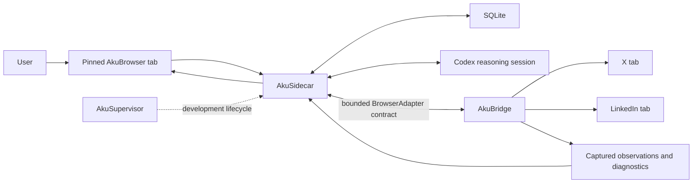
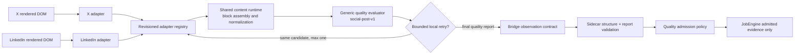
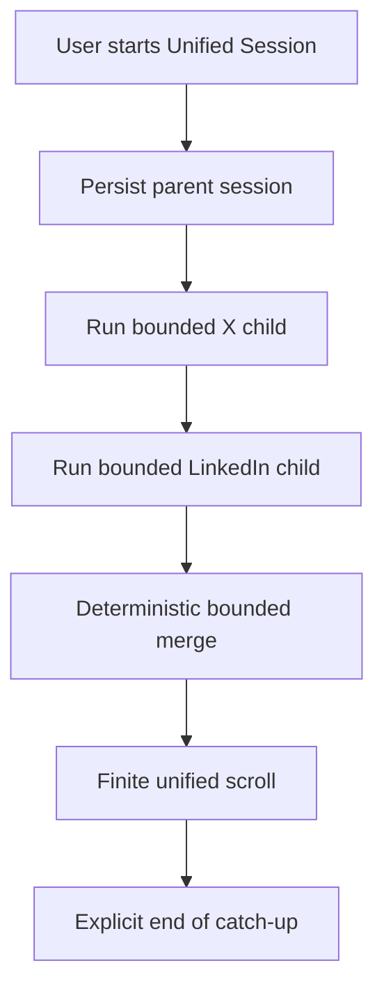
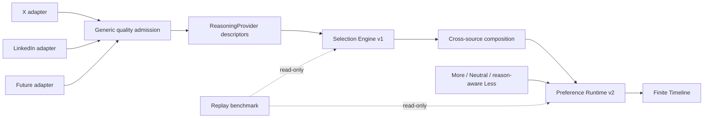
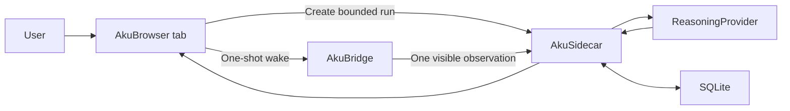

# AkuBrowser — Architecture Reference

> Status: **Source-faithful capture, Settings-first operation, and supervised lifecycle implemented**
> Version: **0.24**
> Last updated: **2026-07-15**
> Working name: **AkuBrowser**

## 1. Purpose of This Document

This document is the source of truth for the latest agreed architecture of AkuBrowser during product discovery. It records:

- decisions that are already agreed;
- the responsibility of each component;
- the intended information flow;
- the boundary of the initial version;
- capabilities deliberately deferred to future phases; and
- technical assumptions that still require feasibility testing.

Implementation is authorized. This document should be updated whenever a product, repository, contract, or architecture decision changes.

## 2. Product Premise

AkuBrowser is intended to give control of internet information consumption back to the user.

Information providers such as X and LinkedIn still determine what information they present and how it appears on their websites. AkuBrowser does not try to replace those providers or build a large general-purpose browser. Instead, it consumes what is presented to the user through the user's browser session, then helps the user evaluate, compress, prioritize, and finish consuming it.

The desired experience is:

> In a bounded amount of time, show what materially changed, why it matters, and the sources—then let the user feel finished.

The primary unit is therefore not a website or individual post. It is a meaningful **event, claim, knowledge update, or artifact** supported by source posts.

## 3. Confirmed Architecture Principles

1. **One primary surface**  
   The user interacts with a pinned local web page called the AkuBrowser tab.

2. **Result-tab-driven interaction**  
   The user selects a mode or action from the AkuBrowser tab. The default workflow does not require the user to write a prompt to Codex.

3. **Browser-presented information**  
   X and LinkedIn are consumed through the user's signed-in Chrome experience. The initial approach does not depend on undocumented platform APIs, hidden data access, or bypassing the website presentation layer.

4. **Read-only operation**  
   The initial system must not like, reply, repost, follow, unfollow, send messages, edit profiles, or perform other account mutations.

5. **Codex as a replaceable reasoning engine**
   Codex evaluates validated observations and may return one bounded acquisition decision. AkuSidecar policy—not the model—issues capture commands to AkuBridge and owns every browser parameter.

6. **The sidecar owns operational state**  
   The local sidecar owns jobs, checkpoints, SQLite transactions, validation, policy execution, and communication between the AkuBrowser tab, Codex, and AkuBridge.

7. **Codex does not directly render the AkuBrowser tab**  
   Codex returns structured observations or results. The sidecar validates and stores them; the AkuBrowser tab renders them.

8. **Finite result instead of another infinite feed**  
   Catch-up results must have a defined end. The gateway must not become a new compulsive feed.

9. **Source-backed and auditable**  
   Each important result must retain source links, observation time, and enough reasoning context to explain why it appeared.

10. **Normal operation is simple, the process remains inspectable**  
    The user normally interacts only with the AkuBrowser tab. Intermediate details may stay out of the way, but coverage, sources, and reasons must be inspectable when needed.

## 4. Terminology and Component Responsibilities

The word `plugin` is ambiguous and should not be used by itself for the Chrome component.

| Component | Runtime location | Primary responsibility |
|---|---|---|
| **AkuBrowser tab** | Pinned local web page | User controls, selected mode, progress, finite results, source links, and coverage statement |
| **AkuSidecar** | Logical role; initially a local process outside Chrome | Job orchestration, state storage, checkpoints, deterministic policy, validation, and coordination |
| **Codex** | Reasoning session | Understand validated source observations, identify claims/events, classify relevance, return structured output, and optionally request one policy-bounded follow-up |
| **AkuBridge** | Inside Chrome | Browser access such as locating/opening tabs, selecting a tab, observing the presented page, scrolling, and executing approved read-only actions |
| **AkuSupervisor** | Visible local development process | Own registered development process trees, health, restart, bounded logs, lifecycle audit, and cooperative AkuBridge reload |
| **BrowserAdapter** | AkuSidecar integration boundary | Provider-neutral capture contract called by JobEngine; AkuBridge is the current native implementation |
| **SQLite** | Local storage managed by sidecar | Seen-state, checkpoints, observations, results, policies, run metadata, and future knowledge history |
| **MCP** | Protocol/integration layer | One possible way to expose sidecar or browser capabilities to Codex; it is not a replacement for the sidecar or extension |

In shorthand:

- the AkuBridge is the **eyes and hands in Chrome**;
- Codex is the **reasoning engine**;
- the AkuSidecar is the **coordinator and state owner**;
- AkuSupervisor is the **development lifecycle owner**;
- MCP can be the **communication protocol**; and
- the AkuBrowser tab is the **user-facing control and result surface**.

### Repository ownership

The implementation uses a neutral parent workspace containing four independent sibling repositories:

- `AkuBrowser` is the primary product/integration repository. It owns architecture, canonical contracts, contract-drift checks, and aggregate development commands;
- `AkuBridge` owns the Chrome extension, source-tab observation, and transport into the local bridge contract; and
- `AkuSidecar` owns the pinned AkuBrowser tab, job engine, SQLite state, reasoning providers, validation, and runtime result contract; and
- `AkuSupervisor` owns generic local-development process lifecycle, health, logs, audit, MCP inspection, and cooperative AkuBridge reload. It does not own product settings.

The parent workspace is not a repository and does not own dependencies. Each project has its own Git history, package manifest, lockfile, tests, and README. AkuBridge and AkuSidecar must not import each other's implementation source. They communicate only through the versioned HTTP/message contract so either side can later be replaced, released, or bundled independently.

During local development, AkuSidecar remains one service on
`127.0.0.1:47821`, normally owned by the visible AkuSupervisor process. Vite is
mounted as frontend middleware on the existing Sidecar HTTP server rather than
exposed through a second proxy port. Vite owns HMR for UI assets; Node's
built-in watcher is intentionally not used because a persisted reasoning run
must not be interrupted by filesystem activity from Codex SDK execution.
Backend-module changes use an explicit AkuSupervisor restart, which retains
ownership of the complete process tree and allows persisted run recovery.
Production-style `npm start` keeps the static file path and does not require
Vite at runtime.

The pinned UI treats a short local transport interruption as recoverable rather
than as proof that the run failed. Status polling uses a finite reconnect
schedule and resumes the same persisted session after AkuSidecar returns. If
that budget is exhausted, the failure action is explicitly `Reconnect to
session`; terminal source or reasoning failures instead offer `Return to
timeline`. Neither action creates a replacement session implicitly.

## 5. Logical Architecture



The browser boundary is intentionally abstract. AkuBridge is the current
`BrowserAdapter`: it owns source-specific DOM discovery, bounded capture,
bounded scrolling, scroll restoration, and auditable coverage. Computer Use is
not an active or implicit fallback. Any future fallback requires a separate
policy decision and must be reported in run coverage.

Keeping these capabilities behind `BrowserAdapter` means the
`ReasoningProvider` does not need to supply a proprietary Computer Use
implementation. Codex and a future open-source provider receive the same
validated observation contract and the same narrow acquisition-decision
schema; JobEngine remains browser authority.

### 5.1 Source-adapter and capture-quality pipeline

AkuBridge loads separate X and LinkedIn parser adapters behind a revisioned
registry. The shared content runtime builds canonical evidence blocks and a
trusted generic quality evaluator checks every adapter output before Sidecar
admission. The separation is a source-parser boundary, not dynamic third-party
plugin installation.



| Boundary | Current owner |
|---|---|
| Source selectors, candidate discovery, source-native extraction | X or LinkedIn adapter |
| Wake semantics, pending-control allowlist, freshness capability version | X or LinkedIn adapter |
| Wake/reveal/proof state machine and freshness audit | Shared AkuBridge freshness recovery |
| Canonical block assembly, media discovery, URL/date normalization | Shared AkuBridge content runtime |
| Capture limits, media allowlists, platform identity normalization | Shared bounded-capture policy |
| Required/conditional field expectations, issues, verdicts | Shared trusted quality policy |
| Tab readiness, leases, command guard, bounded recovery | AkuBridge service worker |
| Structural sanitization, movement validation, report consistency, candidate admission | AkuSidecar |
| Final evidence evaluation and selection | ReasoningProvider under JobEngine validation |

Every adapter declares a trusted profile id and source detection selectors.
AkuBridge emits candidate, snapshot, and coverage-level quality reports with
`complete`, `usable_degraded`, `retryable`, or `invalid` verdicts. AkuSidecar
pre-authorizes at most one same-candidate retry, rejects inconsistent reports,
removes invalid candidates, and fails the source when no usable evidence
remains. A final `retryable` report cannot reach persistence or reasoning.

The normative design, field profile, recovery budget, admission matrix, and
third-source requirements are recorded in
[`Source Adapter and Capture Quality Design`](source-adapter-quality-design.md).
The current runtime baseline is AkuBridge 0.5.37 / source-fidelity-v39 with
`x-dom-v15`, `linkedin-dom-v13`, `x-freshness-v1`,
`linkedin-freshness-v2`, `x-media-recovery-v1`, and
`linkedin-media-recovery-v1`, plus AkuSidecar 0.5.21. The freshness seam is
normatively defined in
[`Source Freshness Recovery v1`](../contracts/source-freshness-recovery-v1.md),
and bounded media fallback is defined in
[`Media Recovery v1`](../contracts/media-recovery-v1.md).

## 6. End-to-End Runtime Flow

1. The user opens the pinned AkuBrowser tab.
2. The user selects an information-consumption mode, such as Catch Up or Manual Live.
3. The AkuBrowser tab sends a bounded job request to the AkuSidecar.
4. The sidecar creates a run and loads policy and prior checkpoints from SQLite.
5. JobEngine issues a deterministic bounded capture command to AkuBridge.
6. AkuBridge locates or opens an eligible source tab according to policy,
   captures the rendered source, performs only the allowed movement, restores
   position, and returns auditable coverage.
7. The sidecar validates and persists browser content as untrusted evidence,
   not instruction.
8. When the sparse acquisition gate permits it, Codex may return only `finish`
   or `request_follow_up`; JobEngine owns the follow-up source, anchor, action,
   movement, and deadline.
9. Codex evaluates the final validated candidate set into structured claims,
   events, deltas, sources, timestamps, confidence, and assessments.
10. The sidecar validates the provider output, applies deterministic rules, and
    writes checkpoints and results to SQLite.
11. The AkuBrowser tab refreshes from the sidecar and displays a finite, source-backed result.
12. The user can open a source when deeper context is needed without being required to consume the raw feed.

### Daily-use Unified Session target

The Gate 0 UI used one source and one promoted item to isolate technical risks. The accepted daily-use target is now a `UnifiedSession`: one parent request creates sequential X and LinkedIn child runs, preserves their source-specific checkpoints and evidence, then renders one finite result list containing at most five items per source and ten total. Five is a ceiling rather than a quota, and the browser-acquisition budget does not increase merely because the presentation budget increases.



The child runs remain the execution and audit units. A partial session keeps a completed source result visible when the other source fails. The onboarding transition retires P1-P4; until a new ranking-composition contract is approved, unseen evidence retains platform order within each source and sources are interleaved deterministically inside the finite attention boundary. Semantic cross-source deduplication remains deferred. Single-source operation remains available through Settings rather than the default daily-use surface.

### Daily-use home surfaces

The default home presentation is now **Timeline**: a rolling buffer of the newest evaluated items across completed or partial Unified Sessions, rendered with source-backed cards and an explicit finish line. Capacity defaults to 12 and is configurable up to 50. New session items enter first; older items fill only the remaining slots. For example, ten new items retain two older items, while eight new items retain four.

`Check for updates` directly starts Unified Catch Up from engine defaults and the active Source Registry. Mode, source scope, and free-form intent are no longer routine homepage controls. Onboarding v0 only selects active sources; it does not restate interests or import historical pilot feedback. Finishing first-time onboarding automatically starts the first update, followed by a bounded forced-label calibration session. Daily `More like this` and `Less like this` remain contextual signals collected outside that calibration lane.

Source controls and BrowserAdapter health are part of Settings rather than a separate Overview destination.

The initial Source Registry contains X and LinkedIn as active, user-triggered, authenticated-browser stream sources. Registry membership is durable product configuration; whether a tab is open is transient BrowserAdapter state. Future `periodic`, `static`, and `push` behavior classes require different acquisition policies and do not imply that background scheduling is implemented. The normative boundary is recorded in [`Home Surface Contract v0`](../contracts/home-surface-v0.md).

### Borrowed prior and calibration

AkuBrowser is an information-consumption layer over websites, not a replacement social network. Stream sources such as X and LinkedIn already contain a valuable behavioral prior learned from long-term user interaction. Their visible order should therefore be preserved as evidence rather than discarded in favor of a new cold-start FYP.

The retired interest screen remains recoverable from Git history, but it is not part of the default product flow. The preferred learning sequence is:

1. choose active source adapters;
2. acquire each source feed in its existing order as a borrowed behavioral prior;
3. collect explicit `More like this`, `Neutral`, and `Less like this` decisions on a bounded first-run sample;
4. collect optional contextual feedback during ordinary use;
5. automatically fit a local snapshot once mixed directional evidence exists;
6. let the generic Selection Engine own materiality admission and the finite display budget;
7. apply only bounded selected-item reranking while retaining source/platform order as fallback; and
8. keep preference unable to change eligibility, source shares, or acquisition budgets.

For non-stream websites, source order may have little or no behavioral meaning. Their future acquisition and prioritization contracts must be defined by source behavior class rather than inheriting the social-stream onboarding model.

### 6.1 Current engine composition

Source-specific knowledge ends at the adapter. Generic quality admission checks
the canonical candidate contract. The ReasoningProvider describes every bounded
candidate using canonical facets and independent evidence scores. Selection
Engine v1 then owns generic materiality admission and the finite per-source
budget. Preference Runtime v2 can only reorder selected entries.



Source is never a learned preference feature. Source diversity is enforced as a
composition constraint. Stable canonical topic facets prevent raw topic-tag
vocabulary from growing into unsupported one-off weights. The active preference
champion remains live while a newer snapshot is evaluated as a challenger.

Manual fit is an advanced diagnostic, not onboarding or production ceremony.
Reset is durable suspension: even a forced before-session fit must respect it.
The replay benchmark performs no model calls and exposes selection, polarity,
source-sliced bias, latency, token, model, and effort metrics.

Normative details live in
[`Selection Engine v1`](../contracts/selection-engine-v1.md),
[`Preference Runtime v2`](../contracts/preference-runtime-v2.md), and
[`Engine Replay Benchmark v1`](../contracts/engine-replay-benchmark-v1.md).

### 6.2 Gate 0A implementation topology

The first technical vertical slice deliberately uses a simpler topology than the full target architecture:



For Gate 0A, the sidecar defines the bounded capture command and the AkuBridge observes one already-open, rendered source tab. Codex classifies the validated observation but does not yet direct browser navigation. The source tab is not focused, scrolled, clicked, or silently opened when absent. Catch Up requires the canonical feed page (`https://x.com/home` or `https://www.linkedin.com/feed/`); Manual Live may use the currently active page for the selected source.

This isolates transport, authenticated browser-state access, provider invocation, structured output, provenance, persistence, and result rendering from the separate risk of agent-directed browser control.

Gate 0B, only after Gate 0A passes, introduces provider-directed acquisition
without provider-owned browser control. The ReasoningProvider returns a narrow
decision; JobEngine invokes the `BrowserAdapter` with deterministic parameters.
Scrolling is implemented by AkuBridge source adapters. Computer Use is not an
implemented fallback and requires a separate future policy approval.

### 6.2 Gate 0B implementation sequence

Gate 0B is split into three evidence gates so browser movement and feed mutation are proven independently from model judgment:

1. **Gate 0B.1 — native bounded acquisition.** AkuSidecar issues a deterministic capture plan and AkuBridge performs `capture -> scroll -> capture -> restore` inside the source adapter. The plan has fixed budgets for scroll count, scroll distance, elapsed time, snapshots, and blocks. Coverage reports requested versus performed scrolls, stop reason, adapter identity, fallback use, and whether the original position was restored.
2. **Gate 0B.2 — stale-tab wake and same-tab fresh-content reveal.** A generic AkuBridge state machine activates a background tab, observes the adapter-declared wake window, and handles either an automatically changed feed or one allowlisted platform control such as `New posts` or `Show posts`. A reveal must prove that a changed, non-empty visible feed is ready before bounded capture begins. Feed mutation and the post-reveal restoration baseline remain explicit in coverage.
3. **Gate 0B.3 — provider-directed acquisition.** After native movement and same-tab reveal are proven reliable on X and LinkedIn, a `ReasoningProvider` may decide whether another bounded observation is warranted. JobEngine—not the provider—calls the provider-neutral `BrowserAdapter` and remains the authority for budgets and allowed actions.

Gate 0B.1 does not silently become an infinite feed reader: the initial experiment permits at most two native scrolls, three snapshots, one promoted result, and 45 seconds of browser acquisition. The current runtime fails explicitly when the native adapter cannot complete. Any future Computer Use fallback requires policy approval and must appear in coverage.

Source adapters declare platform-owned fresh-content knowledge such as LinkedIn's `New posts` banner or X's `Show posts` control, but they do not implement orchestration. The generic recovery engine owns bounded activation, polling, one-reveal authorization, proof, and terminal outcomes. If activated, the platform may replace or reorder the rendered feed; AkuBridge therefore waits for a changed, non-empty visible-feed fingerprint, establishes that revealed feed as a new capture baseline, restores scrolling only to that post-reveal baseline, and records that the pre-run feed view was intentionally changed. Signal removal alone is not readiness evidence. Failure stops at `source_freshness` and is never retried as a stale detect-only capture. A dedicated managed tab remains a possible later isolation strategy rather than a v1 requirement.

Gate 0B.3 gives the ReasoningProvider one narrow acquisition decision after the first validated observation: `finish` or `request_follow_up`. The provider cannot choose a source, URL, browser action, scroll count, position, timeout, or mutation policy. If a follow-up is requested, JobEngine may issue exactly one additional one-scroll command, locked to the same source and anchored to the final viewport of round one. AkuBridge must find at least one supplied frontier anchor before moving, cannot reveal pending content again, and restores the source tab to its pre-follow-up position. Both observations are persisted and merged for final reasoning. A missing or shifted anchor fails explicitly rather than turning the follow-up into an unbounded search.

### 6.2.1 Proposed capture-visibility modes

The current source-fidelity path may briefly make X or LinkedIn the active tab
inside the user's working Chrome window. This is sometimes necessary to wake a
stale feed, reveal pending content, or hydrate rendered media. The prior tab is
restored and the Chrome window is not intentionally focused, but replacing the
visible tab even momentarily is still intrusive and must not be described as a
fully non-disruptive user experience.

The preferred next design has two user-facing policies:

1. **Quiet capture** — the default authority ceiling. AkuBridge must not make a
   source tab active in the user's working window. It may use background-safe
   DOM capture or a dedicated non-focused managed capture window. If freshness
   or quality cannot be proven inside that boundary, the run reports an
   explicit degraded or `visible_recovery_required` outcome; it does not switch
   the user's tab silently.
2. **Adaptive fidelity** — an opt-in authority ceiling. The generic capture
   runtime tries the quiet path first. Only when adapter-declared freshness or
   generic quality evaluation proves that visual hydration/recovery is needed
   may it use today's bounded activate/capture/restore behavior.

The user setting owns the maximum visual authority. The engine may choose a
less intrusive strategy inside that ceiling, but it may never promote Quiet
capture into visible activation by itself. Source adapters remain limited to
platform knowledge: wake signals, pending-content controls, hydration
requirements, and quality evidence. A generic visibility orchestrator owns the
state transition, retry budget, focus restoration, and terminal outcome.

When Quiet capture ends with `visible_recovery_required`, AkuBrowser may offer
an explicit one-run **Retry with full fidelity** action. That consent applies
only to the persisted run being retried and does not silently change the user's
default capture policy.

A dedicated managed capture window is the strongest near-term alternative
because it can reuse the signed-in Chrome profile and AkuBridge while keeping
the user's working window stable. It still requires live validation of Chrome
render throttling, window focus guarantees, taskbar behavior, geometry,
lifecycle ownership, and authentication prompts. Offscreen documents,
headless/container browsers, and direct social APIs are not equivalent
fallbacks: they either cannot host the authenticated third-party page with the
same rendering semantics or replace the source-fidelity contract entirely.

### 6.3 Gate 0 closure status

Gate 0 is technically passed. The personal Chrome pilot has completed the full path on X and LinkedIn through AkuBridge, bounded native movement, restoration, Codex SDK structured reasoning, SQLite persistence, and the AkuBrowser result tab. Live runs on both sources have now exercised provider-directed, frontier-anchored follow-up. X also exercised post-fix `Show posts` activation with a changed-feed readiness proof and restoration to the post-reveal baseline. Repeat runs on both sources demonstrated intent-scoped negative knowledge suppression; a fully known LinkedIn initial sample completed in one round without provider planning.

| Gate 0 question | Evidence | Status |
|---|---|---|
| Browser access under deterministic Sidecar policy | Native authenticated AkuBridge `BrowserAdapter` contract | Passed |
| Signed-in X and LinkedIn consumption | Canonical feeds captured from the development Chrome profile | Passed |
| Structured observations and results | Provider-neutral schemas validated in unit, HTTP, SDK smoke, and live runs | Passed |
| Source identity and timestamps | Provenance lanes, evidence keys, observed time, and source URLs persist in SQLite | Passed |
| Focus-safe bounded operation | Native bounded scrolling, fixed budgets, and restoration coverage verified; same-window tab activation remains visually intrusive | Passed technically; Quiet capture remains proposed |
| Finite completion and truthful coverage | Runs stop with explicit result, failure, cancellation, or bounded follow-up state | Passed |

### 6.4 Pilot Review evaluation surface

After technical feasibility, the next question is whether AkuBrowser's bounded results are trustworthy enough to change the user's information-consumption behavior. The pinned local page therefore has a `Pilot Review` view alongside `Session`. It is an evaluation surface, not a third interaction mode and not a replacement feed.

The review cohort begins with the first run that receives explicit feedback. The current implementation summarizes at most the latest 500 cohort runs and discloses both the cohort start and any truncation. A source filter changes the metric population; a verdict filter changes only the displayed review queue, so selecting `Needs review` does not make the headline quality rates silently describe only unreviewed runs.

The initial product evidence is deliberately small and inspectable:

- completed, failed, and reviewed-run counts;
- empty-result trust, calculated only from empty runs explicitly marked `Correctly empty` or `Missed something`;
- positive reviewed-item rate, calculated from items explicitly marked `Useful` or `Correct lane`;
- median completion time, acquisition rounds, follow-up use, and restoration failures; and
- exact-evidence suppression split between previously delivered evidence and intent-scoped confirmed exclusions.

Every displayed ratio includes its numerator and denominator. A zero denominator is shown as unrated rather than 0% or 100%. `Correctly empty` and `Missed something` are mutually exclusive verdicts for completed empty runs, and a missed verdict requires a note describing the absent information. Item-level feedback is accepted only for an item in that completed result. Duplicate submissions are idempotent. Raw browser observations remain in SQLite and are not returned by the review endpoint.

## 7. Initial Interaction Modes

### 7.1 Catch Up — initial mode

A user-triggered, finite summary of material changes since the relevant checkpoint. It is not restricted to one or two fixed windows per day; the user may run it repeatedly during rapid development.

The output should prioritize new knowledge rather than merely recent posts.

### 7.2 Manual Live — initial mode

A user-triggered mode for repeatedly checking material changes during a fast-moving situation. It remains bounded and does not reproduce the raw infinite feed.

### 7.3 Focus — limited initial behavior

In the initial version, Focus can be stored as user intent or UI state, but it does not imply reliable background monitoring. True P0 interruptions require a later watcher or scheduler capability.

### 7.4 Situation Watch — future

Focused monitoring of a named event such as an earthquake, unrest, a product launch, or another rapidly evolving situation.

### 7.5 Explore — future

Controlled discovery outside the user's primary topics, governed by an explicit discovery budget.

### 7.6 Behavioral personalization — implemented within a bounded authority

AkuBrowser builds a local, inspectable preference model from explicit More/Less calibration and contextual feedback. Explicit session intent remains higher authority. Passive actions, source opening, scrolling, and account engagement are not preference labels.

The platform feed itself is also a useful upstream prior. X and LinkedIn already order content using behavior learned within their own products; AkuBrowser can benefit from the presented ordering without scraping private platform profiles or pretending that platform rank equals user value. The source algorithm answers "what this platform predicts may engage the user," while AkuBrowser must still answer "what materially advances this user's current intent and knowledge frontier."

Behavioral signals must therefore obey these constraints:

- explicit user intent and safety policy override inferred preference;
- inferred preferences are stored separately from explicit rules and can be inspected, corrected, reset, or disabled;
- negative feedback and retention of the complete provider-selected set prevent the first live version from collapsing eligibility into a filter bubble;
- platform ordering is recorded as contextual evidence, not ground truth;
- passive behavior is not treated as consent for account-changing actions or broader data collection; and
- personalization changes ranking, not provenance or evidence requirements.

Preference Runtime v1 fits deterministically on-device and may move an already-selected item by at most two positions. It records the baseline index, final index, snapshot, and probability. It cannot promote excluded candidates, hide selected candidates, or change acquisition and attention budgets. Manual replay and holdout analysis remain optional diagnostics.

## 8. Ranking composition

The original P1-P4 catch-up lanes are retired. AkuBrowser first preserves platform order within each source and interleaves active sources deterministically. When a compatible personal snapshot is active, Preference Runtime may perform neighboring swaps among those selected items, with a maximum displacement of two positions and a minimum score difference of `0.03`. The baseline remains available whenever personalization is disabled, insufficient, stale, or invalid. Emergency interruption and preference-driven eligibility remain future, separately governed capabilities; ordinary importance never implies a notification.

<!-- Retired pilot lane reference

| Lane | Intended behavior | Example |
|---|---|---|
| **P0 — Interrupt** | Direct notification only when delay may cause safety impact or lost opportunity | Credible emergency or genuinely time-limited action |
| **P1 — Top of Catch Up** | Appears at the top of the next user-triggered result | GPT-5.6 Sol release, upcoming bankable Codex reset announcement, materially new creative Codex use |
| **P2 — Ready Later** | Valuable but can wait | Opinions and analysis about Codex or Sol |
| **P3 — Discovery** | Controlled exposure outside the core focus | Fable, Grok, Meta AI, Google AI, and adjacent systems |
| **P4 — Collapse or Ignore** | Hidden unless relevance changes | Generic technology information with no current material value |

P0 is deliberately separate from P1. Important information is not automatically interruption-worthy. -->

## 9. Initial Scope Boundary

### In scope for the first implementation phase

- one local user;
- a pinned local AkuBrowser tab;
- X and LinkedIn;
- source selection supplied through onboarding, without a hard-coded domain focus;
- read-only browser consumption;
- user-triggered Catch Up and Manual Live;
- Codex-driven observation and classification;
- a local sidecar and SQLite state;
- structured, finite, source-backed results; and
- a minimal custom AkuBridge if existing Chrome integration cannot be called from the selected Codex surface.

### Explicitly out of scope for the first implementation phase

- building a full or general-purpose browser;
- replacing Chrome's New Tab page;
- multi-user or cloud synchronization;
- account mutations on X or LinkedIn;
- access to DMs or private messaging workflows;
- automatic engagement or social participation;
- reliable background P0 monitoring and system notifications;
- broad support for YouTube, Facebook, Instagram, or arbitrary websites;
- temporal history reconstruction and supersession logic;
- a polished autonomous agent platform; and
- bypassing website presentation, permissions, or platform protections.

## 10. Future Capability: Temporal Supersession and History

### Problem

X and other feeds may show a post that is topically relevant but older than information the user has already consumed. The post may still be within 24 hours—or older—yet no longer add useful knowledge because a later update has superseded it. Repeated exposure to these informationally stale posts contributes to doom scrolling.

The relevant measure is therefore not only post age. It is whether the post advances the user's **knowledge frontier** for that event or topic.

### Desired future behavior

- Default views show only a material delta beyond the latest event state already known to the user.
- Superseded posts are collapsed under earlier context.
- An older post may still surface when it contains the original source, unique evidence, a contradiction, causal context, or another material addition.
- A deliberate History Mode can reconstruct the chronology when the user wants to understand how an event developed.

### Implemented continuity foundation

The initial continuity layer now preserves and uses:

- stable source/platform identity;
- source URL or post identifier;
- `published_at` when available;
- `observed_at` and first-seen time;
- a deterministic `evidenceKey` for each validated post block;
- a checkpoint scoped by source and interaction mode;
- exact suppression after evidence has been delivered to the user, or after the user explicitly confirms that an empty result correctly excluded the observed evidence for the same source, mode, and intent;
- a provider-assigned stable `eventKey` bound to observed evidence;
- `new_event`, `material_update`, `context`, or `contradiction` delta semantics; and
- append-only event versions so a new update never destructively overwrites history.

Delivered knowledge remains source-and-mode scoped. User-confirmed negative knowledge is additionally scoped by a normalized intent fingerprint so changing intent makes the evidence eligible again. Cross-source event merging, semantic supersession calibration, retention policy, and the History Mode UI remain deferred until pilot data demonstrates the required behavior.

## 11. Trust and Security Boundaries

1. Page content is untrusted data and must never be treated as a Codex or sidecar instruction.
2. Browser actions are constrained to an allowlist of read-only capabilities and approved domains.
3. The sidecar, not page content, owns job policy and tool permissions.
4. Model output is schema-validated before it affects SQLite or the AkuBrowser tab.
5. Account-changing actions are unavailable in the initial tool surface, not merely discouraged by prompts.
6. Every result should retain provenance sufficient for the user to inspect its source.
7. Failures or incomplete scans must produce a coverage statement rather than a false sense of completeness.

## 12. Feasibility Gate 0

Implementation, when authorized, should begin with the smallest end-to-end proof:

```text
AkuBrowser tab
  -> AkuSidecar
  -> AkuBridge
  -> one signed-in Chrome source tab
  -> one structured observation
  -> AkuSidecar validation
  -> Codex
  -> SQLite
  -> AkuBrowser tab result
```

The gate should answer these questions before the full classification system is built:

1. Can a sidecar-started Codex session call an existing Chrome integration?
2. If not, can the minimal custom AkuBridge provide the required read-only operations?
3. Can it consume the user's signed-in X or LinkedIn view without bypassing the website presentation layer?
4. Can browser content be converted into schema-valid structured observations?
5. Can the complete flow retain source identity and timestamps?
6. Does browser operation steal focus or otherwise disrupt the user's simultaneous work?
7. Can the run report bounded coverage and stop cleanly?

Gate 0 selected the minimal authenticated AkuBridge as the native
`BrowserAdapter`; direct Codex-to-browser control is not the current runtime
path. This is a resolved product decision, not a blocker.

## 13. Technical Decisions After Gate 0

Gate 0 resolved the immediate implementation choices:

- Codex SDK is the initial replaceable ReasoningProvider;
- the accepted browser path is the minimal authenticated AkuBridge;
- extension-to-sidecar transport is the versioned constrained localhost contract;
- AkuSidecar uses Node, SQLite, and Vite middleware on one visible process and port;
- browser acquisition uses fixed native budgets and reports restoration/fallback coverage; and
- observation, acquisition-plan, and reasoning-result schemas are canonical contracts owned by AkuBrowser.

Still unresolved by design:

- storage retention and compaction after representative pilot volume;
- semantic event-key calibration and cross-source event merging;
- thresholds and notification policy for P0;
- the first open-source ReasoningProvider that passes the pilot evaluation set; and
- the eventual consumer packaging choice between hosted single-extension and local-first installer.

## 14. Deployment and Packaging Roadmap

### 14.1 Sidecar is a logical boundary, not permanently a separate executable

The AkuSidecar describes a set of responsibilities. In the initial architecture those responsibilities live in a separate local process with SQLite, but they do not have to stay there forever.

For user-triggered Catch Up and Manual Live, much of the sidecar can technically move into a Chrome extension:

- the pinned AkuBrowser tab can become a `chrome-extension://` page;
- an extension service worker can receive browser events and coordinate bounded jobs;
- IndexedDB can hold structured observations, checkpoints, results, and event history;
- `chrome.storage` can hold small settings and policy values; and
- content scripts and extension messaging can connect the source tabs, job engine, and AkuBrowser tab.

This extension-hosted form is called **Sidecar Lite**. It is not a complete equivalent of a native sidecar because Manifest V3 service workers are event-driven and may be terminated when idle or during long operations. Jobs must therefore be resumable from persisted state. A pinned extension page can coordinate work while it is open, but reliable long-running background monitoring should not depend on that page remaining open.

Codex is also a separate concern. A Chrome extension cannot assume it can embed or start a native Codex runtime by itself. The initial Codex App Server or SDK route remains a local-runtime integration unless it is packaged by a native installer or replaced by a remote reasoning service.

### 14.2 Packaging phases

#### Phase 0 — research architecture: three installed components

```text
AkuBridge
  + AkuSidecar
  + existing Codex installation
```

Purpose: prove the product behavior and classification contract with the least architectural guesswork. This is acceptable for the initial personal pilot but is not the intended consumer distribution model.

#### Phase 1 — extension-hosted Sidecar Lite: two components

```text
AkuBrowser Chrome Extension
  - AkuBrowser tab
  - AkuBridge
  - bounded job engine
  - IndexedDB / chrome.storage

+ local Codex installation
```

Purpose: prove that state, UI, and browser orchestration can be combined without relying on a separate sidecar process. This is suitable for user-triggered modes. Background P0 monitoring remains limited.

The current SQLite schema should first be treated as a logical data contract so it can later map to IndexedDB without changing the meaning of observations, events, checkpoints, or results.

#### Phase 2A — consumer-first single extension

```text
AkuBrowser Chrome Extension
  -> authenticated AkuBrowser service
  -> remote reasoning/model runtime
```

User installation count: **one extension**.

Advantages:

- lowest friction for ordinary users;
- no separate Codex or sidecar installation;
- centralized model and policy upgrades; and
- easier support and diagnostics.

Costs:

- requires a hosted backend, authentication, and operating cost;
- selected information leaves the local machine for reasoning;
- privacy and retention guarantees become product-critical; and
- offline operation is limited.

This is the most direct intermediate route to broad consumer adoption before building a browser.

#### Phase 2B — local-first single installer

```text
One AkuBrowser desktop installer
  - installs/registers the Chrome extension
  - bundles the native sidecar
  - bundles or provisions the reasoning runtime
  - connects them through Native Messaging or another constrained local channel
```

User installation count: **one installer**, although multiple internal processes still exist.

Advantages:

- preserves local SQLite and stronger local-first behavior;
- supports long-running jobs better than extension-only execution;
- reduces dependence on a hosted orchestration backend; and
- provides a migration path toward an embedded browser.

Costs:

- platform-specific installers, signing, updates, and support;
- Chrome extension registration and permissions remain visible;
- a larger download and more complex release pipeline; and
- bundling or provisioning Codex must follow the supported distribution and authentication model available at that time.

Phase 2A and Phase 2B are alternative packaging strategies. The product may eventually support both, but the choice should be made after the initial pilot provides evidence about privacy expectations, operating cost, and background-monitoring needs.

#### Phase 3 — ultimate browser distribution

```text
AkuBrowser installer
  - browser shell and signed-in sessions
  - native AkuBrowser tab
  - browser observation/control layer
  - local state and knowledge frontier
  - reasoning provider
  - updater and permission system
```

The user experiences one browser product and one installation. Internally, the browser will still use multiple components and processes. The ultimate goal is therefore a **single product and distribution boundary**, not a single process or a collapse of all architectural responsibilities into one module.

### 14.3 Migration seams that must remain stable

To avoid rewriting the product at every packaging phase, implementation should preserve these logical interfaces:

| Interface | Initial provider | Possible later provider |
|---|---|---|
| **BrowserAdapter** | AkuBridge | Native AkuBrowser capability |
| **StateStore** | SQLite in local sidecar | IndexedDB in extension, browser-native database, or synchronized store |
| **ReasoningProvider** | Local Codex CLI/SDK session | Hosted agent/model service, local open-source model runtime, or browser-bundled runtime |
| **JobEngine** | AkuSidecar | Extension Sidecar Lite, hosted orchestrator, or native browser service |
| **ResultContract** | Sidecar-to-AkuBrowser-tab schema | Same schema across all deployment forms |

Codex should be treated as the initial reasoning and experimentation provider, not as a permanent consumer installation requirement baked into the domain model. The product contract is with `ReasoningProvider`; Codex is its first implementation.

### 14.4 Reasoning-provider portability

AkuBrowser must remain replaceable with an open-source reasoning solution in the future. Therefore:

- domain objects and SQLite records must use AkuBrowser vocabulary, not Codex-specific thread or item types;
- the `ReasoningProvider` input is a bounded run contract plus validated browser observations;
- the `ReasoningProvider` output is the provider-neutral `ResultContract`;
- authentication, model names, prompts, SDK objects, and provider-specific errors remain inside their adapter;
- deterministic policy and schema validation remain outside the model provider;
- provider adapters are loaded independently so removing one provider does not break another; and
- bounded navigation and scrolling are exposed through the provider-neutral `BrowserAdapter`, not assumed to be built into Codex or another reasoning provider;
- Computer Use remains an optional fallback capability rather than a prerequisite for an open-source `ReasoningProvider`; and
- evaluation fixtures must be runnable against Codex and a future local/open-source provider using the same expected contract.

Potential future providers include a local OpenAI-compatible inference server, an Ollama-style local runtime, or another tool-capable open-source agent. Choosing one is deferred until the pilot produces a representative evaluation set; no open-source model is assumed equivalent before it passes that same set.

### 14.5 Current recommendation

Gate 0 and the initial knowledge-continuity proof have passed. Unified Session v0 is implemented, and its live Chrome pilot has verified sequential X and LinkedIn orchestration, bounded pending-content recovery, UI restoration after reload, and finite completion. A source capture with zero visible evidence is now reported as acquisition-unavailable and excluded from empty-result trust metrics instead of being presented as a correctly empty feed.

Operate the current development stack through the visible AkuSupervisor and
configure AkuSidecar through AkuBrowser Settings. Environment overrides are
compatibility/recovery tools, not install instructions. After the one-time
unpacked-extension bootstrap, load AkuBridge changes through cooperative
Supervisor reload/validation. Component package versions advance independently;
the live compatibility tuple is the release boundary.

As of July 14, 2026, Preference Runtime v1 replaces manual shadow fitting as the product path. Source/platform order is the cold-start baseline. First-run calibration and routine More/Less feedback feed one local append-only ledger; AkuSidecar fits deterministic personal snapshots automatically without a reasoning invocation. The active snapshot may reorder only provider-selected items, requires a neighboring score difference, and limits every item to two positions of displacement. It cannot promote excluded candidates, hide selected candidates, or change source and attention budgets. Disabling personalization restores the baseline on the next run.

The hard-coded AI/technical-engineering context, provider-assigned intent relevance, and P1-P4 lanes remain removed. Replay gates, holdout metrics, feature explanations, and eligibility-boundary comparison are retained under Advanced preference diagnostics. Manual refitting is optional and idempotent rather than an onboarding or daily-use step.

The next product-calibration sequence is:

1. observe bounded live displacement, fallback use, and user corrections without changing eligibility;
2. collect explicit labels on currently excluded candidates to reduce selection bias;
3. evaluate whether source balance and the maximum two-position movement remain understandable and useful;
4. define exploration, comeback, and rollback before any eligibility-changing preference authority;
5. calibrate semantic event keys, stale/superseded handling, cross-source event merging, and retention/compaction; and
6. only after behavioral proof, test Sidecar Lite as the next packaging experiment.

During calibration:

1. keep orchestration logic portable and independent of Node-, Python-, or OS-only APIs where practical;
2. keep persistence behind `StateStore` rather than allowing business rules to depend directly on SQLite queries;
3. keep Codex behind `ReasoningProvider`;
4. keep Chrome operations behind `BrowserAdapter`; and
5. make every child run and parent session resumable from persisted checkpoints; and
6. keep attention-budget changes separate from browser-acquisition-budget changes.

After behavioral proof and retention evidence, test Sidecar Lite as a packaging experiment. That sequence reduces consumer-installation complexity without allowing packaging concerns to distort the first product experiment.

## 15. Active Decision Log

This table contains decisions that still govern the current product. Superseded
pilot sequencing and retired compatibility vocabulary are removed instead of
remaining mixed with active rules.

| ID | Decision | Status |
|---|---|---|
| D-001 | Use one pinned local web page as the AkuBrowser tab | Confirmed |
| D-002 | Do not replace Chrome New Tab in the initial phase | Confirmed |
| D-003 | User selects modes from the AkuBrowser tab; prompting Codex is not the default interaction | Confirmed |
| D-004 | Use X and LinkedIn as the initial source platforms | Confirmed |
| D-005 | Keep initial browser access read-only | Confirmed |
| D-006 | Codex returns structured observations; sidecar validates/stores; AkuBrowser tab renders | Confirmed |
| D-007 | Sidecar owns SQLite, job state, checkpoints, and deterministic policy | Confirmed |
| D-008 | Accept a minimal custom AkuBridge if existing Chrome integration is unavailable | Confirmed |
| D-009 | Start with Catch Up and Manual Live; no fixed daily catch-up limit | Confirmed |
| D-010 | Reserve direct P0 notifications for emergency or opportunity-loss cases | Confirmed, future runtime capability |
| D-011 | Treat old-but-superseded information through a future knowledge-frontier/history model | Deferred, compatibility noted |
| D-012 | Do not build a large browser | Confirmed |
| D-014 | Treat the sidecar as a logical responsibility boundary, not permanently a separate executable | Confirmed |
| D-016 | Preserve a roadmap toward one consumer installation while keeping internal component boundaries | Confirmed |
| D-017 | Choose between consumer-first cloud reasoning and local-first native packaging after pilot evidence | Deferred |
| D-018 | Keep ReasoningProvider vendor-neutral and replaceable by a future open-source/local runtime | Confirmed |
| D-019 | Keep AkuBridge and AkuSidecar as separate projects within one workspace | Confirmed |
| D-021 | Require a canonical source feed for Catch Up; allow the active source page for Manual Live | Confirmed after first Chrome pilot |
| D-022 | Use an Option C polyrepo workspace with AkuBrowser, AkuBridge, and AkuSidecar as sibling repositories | Confirmed |
| D-023 | Use AkuBrowser as the primary product brand; do not use Signal as the product brand | Confirmed |
| D-024 | Implement bounded scrolling natively in AkuBridge source adapters; any Computer Use fallback must be explicit | Native path implemented; fallback remains unimplemented pending separate approval |
| D-025 | Keep browser acquisition independent of ReasoningProvider so a future open-source provider does not require proprietary Computer Use | Confirmed |
| D-026 | Preserve provenance lanes explicitly as native post, canonical source page, or external reference; never label one lane as another | Confirmed after LinkedIn Gate 0A pilot |
| D-027 | Evolve ranking from explicit intent toward an inspectable local preference model while retaining each platform's feed order as the cold-start baseline | Implemented within the bounded authority of D-130 |
| D-029 | Detect platform fresh-content banners in Gate 0B.1, but defer activation to an explicit auditable BrowserAdapter action that does not silently rewrite the user's feed view | Confirmed after LinkedIn live test |
| D-030 | For the Gate 0B.2 personal pilot, activate allowlisted fresh-content controls in the same source tab and restore only the post-reveal baseline; reconsider a dedicated managed tab for consumer use | Confirmed |
| D-031 | Use one-port AkuSidecar development: Vite middleware handles frontend HMR and Node watch restarts backend changes in the same visible process | Confirmed |
| D-033 | Limit Gate 0B.3 provider authority to `finish` or one same-source, one-scroll, frontier-anchored follow-up; keep all browser parameters under deterministic JobEngine policy | Confirmed |
| D-035 | Advance checkpoints only after completed runs; suppress previously delivered exact evidence by default; preserve semantic updates as append-only event versions | Confirmed |
| D-036 | Treat `Correctly empty` as explicit, intent-scoped negative knowledge; suppress the confirmed evidence only for the same source, mode, and normalized intent | Confirmed after repeat-run pilot |
| D-037 | Stop after the initial bounded acquisition without provider planning when every observed evidence block was already evaluated for the same intent | Confirmed after LinkedIn repeat-run pilot |
| D-038 | Keep Pilot Review separate from consumption modes; scope metrics to a disclosed feedback-bearing cohort and require contextual, idempotent feedback with a note for missed empty results | Confirmed |
| D-040 | Model a Unified Session as a persisted parent with sequential X then LinkedIn child runs; preserve source-specific checkpoints, feedback, coverage, and partial results | Confirmed for experiment v0 |
| D-041 | Allow at most five promoted items per source and ten per Unified Session as ceilings, not quotas; do not increase browser acquisition budgets without evidence | Confirmed for experiment v0 |
| D-042 | Use deterministic source-interleaved merging without a second reasoning pass; defer semantic cross-source deduplication | Confirmed; presentation composition refined by D-130 |
| D-043 | Preserve scrolling as a finite, known result list with an explicit end and no automatic continuation or infinite loading | Confirmed |
| D-044 | Turn Pilot Review into a bounded Review Inbox plus separate aggregate analytics; open the newest run by default and require corrections rather than exhaustive labeling | Confirmed for Learning Loop v0 |
| D-045 | Persist every evaluated candidate decision and append-only contextual-interest signals so preference snapshots remain rebuildable and auditable | Confirmed for Learning Loop v0; signal vocabulary amended by D-062 |
| D-046 | Keep hard eligibility and selection policy in AkuSidecar while using Codex initially for provider-neutral feature extraction and evaluation | Confirmed for Learning Loop v0 |
| D-047 | Make Codex model and reasoning effort explicit, configurable, and visible; record provider-reported token usage per reasoning phase | Confirmed for Learning Loop v0 |
| D-049 | Preserve content outside learned habits when preference authority expands | Provider-selected eligibility remains fully retained in v1; a separate exploration lane is deferred until eligibility may change |
| D-050 | Add a future inspectable engine dashboard for thresholds, preference tendencies, exploration budget, comeback triggers, policy version, quality, and token economics | Confirmed as future operator surface |
| D-051 | Route candidate evaluation to Terra High and the narrow acquisition-planning fallback to Luna High; reserve XHigh for repeated capability failure after precise correction | Confirmed for Learning Loop calibration |
| D-052 | Gate provider acquisition planning deterministically: call it only for a sparse one-or-two-candidate sample that exhausted movement and can still perform one anchored follow-up | Confirmed to reduce planning-token waste |
| D-054 | Have Terra High emit structured candidate features in the existing evaluation invocation, without adding a second model call | Confirmed for engine-ready observations |
| D-055 | Report token usage separately for Candidate Evaluation and Acquisition Planning | Confirmed for quality/economic tuning |
| D-056 | Default initial acquisition to opening one inactive canonical source tab when missing; retain configurable `fail_fast`, and never replace a tab during anchored follow-up | Confirmed for daily-use resilience |
| D-057 | Add an allowlisted dashboard configuration layer persisted in SQLite, with legacy/recovery environment override, dashboard value, and built-in default precedence; begin with `missingSourceTabPolicy` | Implemented; Settings is the normal configuration surface |
| D-058 | Expose existing provider, phase model, phase effort, planning policy, and timeout configuration as persisted startup settings; never restart or hot-swap the active reasoning provider invisibly | Confirmed for transparent operations |
| D-059 | Treat LinkedIn page completion and feed readiness as separate states; permit bounded temporary activation with focus restoration and exactly one zero-evidence retry before failing at `source_readiness` | Confirmed for LinkedIn reliability |
| D-062 | Use symmetric `More like this` and `Less like this` as routine contextual-interest signals; route incorrect presentation to bug/error feedback | Confirmed for Learning Loop v0 |
| D-063 | Offer `Brief` and captured `Source layout` as alternate presentations of the same bounded evidence; do not re-fetch or claim an exact live-DOM reproduction | Confirmed; presentation control refined by D-066 |
| D-064 | During single-user development, delete retired preference rows and remove their API/profile/replay compatibility paths instead of carrying legacy behavior | Confirmed until external compatibility is required |
| D-065 | Progressively append Review Inbox history in batches of 10 as the user approaches the bottom, with an explicit maximum browsing window of 50; keep aggregate cohort metrics separate from the currently rendered history | Confirmed for bounded calibration UX |
| D-066 | Default each item to configurable `Source layout`, replace page-level presentation tabs with an item-local switch, and reuse the same presentation component in Unified View and Review Inbox | Confirmed for daily-use reading UX |
| D-068 | Capture at most four rendered, allowlisted source images or video posters per evidence block; persist them with candidate evidence and lazy-render them only in Source layout without sending media URLs to text reasoning | Confirmed for source-faithful reading UX |
| D-069 | Present X above LinkedIn inside every Review Inbox Unified Session group, including groups reconstructed across progressive-loading batch boundaries | Confirmed for consistent unified review UX |
| D-070 | Constrain Session and Review Inbox to a configurable reading width, defaulting to a 640 px social-feed column while keeping Settings at full application width | Confirmed for lower-effort daily reading |
| D-071 | Keep the Unified Session review stream centered and move aggregate metrics, preference readiness, and token economics into an independent right telemetry rail that collapses below the stream on narrow screens | Confirmed for separation of reading and calibration surfaces |
| D-072 | Retry source-tab discovery exactly once after an explicit stale-tab error in acquisition round one, preserve the configured missing-tab policy, report recovery in coverage, and never rebind a frontier-anchored follow-up | Confirmed for bounded Chrome race recovery |
| D-073 | Report deterministic rolling health over the latest 20 terminal source runs separately from historical pilot totals, with stable failure categories and diagnostic-only healthy/degraded/unstable labels | Confirmed for current reliability visibility |
| D-075 | Require every ReasoningProvider to pass a vendor-neutral conformance harness and publish a capability manifest; structural conformance remains separate from pilot-quality equivalence | Confirmed for replaceable reasoning runtimes |
| D-076 | Provide explicit local-only SQLite health, verified non-overwriting backup, raw-observation-free analysis export, and preview-only retention tooling; expose no autonomous deletion path | Confirmed for reversible pilot-data operability |
| D-078 | Maintain executable trust regressions for prompt delimiting, bounded/deduplicated reasoning evidence, presentation-media exclusion, diagnostic non-disclosure, SQLite path escaping, extension permissions, and provenance validation | Confirmed for defense-in-depth verification |
| D-079 | Make every source adapter report bounded selector strategy, field completeness, and non-content DOM signatures so platform drift is diagnosable before total failure | Confirmed and implemented |
| D-080 | Extract source-native content kind and repost/quote/reply relationships as contextual evidence for Source Layout and future temporal supersession | Confirmed and implemented as additive observation metadata |
| D-081 | Report a bounded acquisition frontier and conservative remaining-candidate signal while keeping every follow-up decision and scroll budget under JobEngine authority | Confirmed and implemented |
| D-082 | Distinguish shared user tabs from tabs opened by AkuBridge; preserve by default and permit closure only for an explicitly managed, successfully captured tab | Confirmed and implemented as a dormant policy capability |
| D-083 | Report passive source-state events without enabling background P0 monitoring, notifications, or account mutations | Confirmed and implemented as observation-only metadata |
| D-084 | Require synthetic DOM conformance fixtures for every source adapter version while retaining live health data as operational truth | Confirmed and implemented |
| D-085 | Integrate AkuBridge with AkuDoctor through an in-memory sanitized capability heartbeat and aggregate per-source observation health; expose no captured content or browser credentials, and use a declared runtime revision to detect an unpacked extension awaiting reload | Confirmed and implemented |
| D-086 | Make the pilot telemetry rail behavior live-configurable: default to page-flow without an internal scrollbar, with sticky independently scrolling telemetry as an optional setting | Confirmed and implemented |
| D-088 | Make finite Timeline the default home presentation, keep Overview as a configurable source control plane, and retain both in primary navigation | Confirmed and implemented |
| D-089 | Introduce a Source Registry that separates durable registered/active source state from transient open-tab lifecycle; register X and LinkedIn as active user-triggered stream sources | Confirmed and implemented for the pilot |
| D-090 | Model stream, periodic, static, and push acquisition behavior separately; do not imply background polling, scheduling, or P0 delivery merely by exposing the future behavior classes | Confirmed architecture seam; only stream is implemented |
| D-091 | Make `Check for updates` directly start Unified Catch Up from engine defaults and active registered sources; remove mode, source-scope, and free-form intent controls from the routine homepage experience | Confirmed and implemented |
| D-092 | Render Timeline as a configurable rolling buffer, default capacity 12: newest evaluated session items enter first and oldest retained items leave only when the capacity is exceeded | Confirmed and implemented |
| D-094 | Keep the retained Timeline visible during `Check for updates`; represent the active runner only as a compact progress strip with current stage, progress, and Cancel | Confirmed and implemented |
| D-095 | Replace elapsed-time progress with deterministic acquisition steps; show the current source action and `step/total` (12 steps for the default two-source update), not an unreliable completion-time estimate | Confirmed and implemented |
| D-096 | Remove coverage/debug chrome from the routine Timeline while retaining diagnostics in Review Inbox and pilot surfaces | Confirmed and implemented |
| D-097 | Merge Overview into Settings and allow a non-empty ordered subset of installed source adapters to participate in the next update; arbitrary new websites still require an adapter contract | Confirmed and implemented for X and LinkedIn |
| D-098 | Report the latest completed check as `N additions`, including an explicit `0 additions`, instead of repeating rolling retention and capacity as the primary status | Confirmed and implemented |
| D-099 | Expose effective engine boundaries in Settings; allow safe next-run editing of per-source items, native scrolls, acquisition rounds, and knowledge-context events while keeping structural pilot caps visible and fixed | Confirmed and implemented |
| D-100 | Keep active update progress sticky within Timeline scrolling and visually distinguish genuine additions from the newest completed check with a subtle background | Confirmed and implemented |
| D-101 | Remove the hard-coded AI/technical-engineering user context and retire P1-P4 rather than redefining them before onboarding and preference composition are clear | Implemented in the neutral transition contracts and runtime |
| D-105 | Treat the social source's existing feed order as the cold-start baseline; a personal local model may only compose over it within explicit bounds | Confirmed and implemented |
| D-106 | Add bounded calibration batches that require More/Neutral/Less decisions on every sampled entry, and allow periodic or random repetition | First-run calibration implemented |
| D-107 | Keep calibration as its own interaction path while writing directional labels into the same append-only preference ledger as routine feedback | Implemented |
| D-108 | Treat source selection as primary onboarding and source-feed order as the borrowed initial prior; do not ask for interest categories by default | Implemented |
| D-109 | Run the Codex-backed AkuSidecar from a normal host process context; do not treat HTTP health alone as sufficient because a sandboxed server can capture successfully yet fail provider spawn with `EPERM` | Confirmed after first-run calibration pilot; operational runbook added |
| D-110 | Calibration uses explicit More / Neutral / Less labels, keeps its progress header sticky, and presents source-like cards with remote URL-only avatars and media; LinkedIn permalinks may be deterministically derived from an observed activity URN, but never invented without one | Implemented and validated against the live LinkedIn feed DOM |
| D-111 | When LinkedIn omits a permalink and activity attributes from its feed DOM, AkuBridge may transiently open only the post control menu, read the local Embed target URN, and close the menu; it must never invoke Save, Copy, Follow, Like, Comment, Repost, or Send | Implemented as bounded permalink recovery; feed fallback remains honestly labeled when recovery is unavailable |
| D-112 | Source-tab injection is revisioned rather than guarded by a permanent boolean, so a reloaded AkuBridge replaces its stale message listener in reused X or LinkedIn tabs; X GIF/video previews include the allowlisted `previewInterstitial` poster and remain URL-only | Implemented after the first neutral-calibration rerun exposed stale X capture |
| D-113 | Runtime generation applies to the adapter registry as well as the message listener; LinkedIn v3 extracts author identity from the post control label, body text from the expandable content element, and the matching profile image URL | Implemented after a clean rerun proved stale adapters survived listener replacement |
| D-114 | Every AkuBridge runtime change must advance the synchronized manifest/package version; its heartbeat must expose a derived build identity plus source-adapter versions, and production AkuSidecar must reject new runs until the loaded extension satisfies the declared compatibility contract | Implemented to prevent stale unpacked-extension code from silently producing misleading calibration data |
| D-115 | Merge repeated source snapshots by enriching incomplete evidence with later avatar/media fields; persist LinkedIn social context, headline, connection/time metadata, collaboration/promotion attribution, and URL-only author avatars as structured presentation data | Implemented in AkuBridge 0.5.4 / source-presentation-v6 and validated against live X and LinkedIn feed captures |
| D-116 | Source Fidelity v7 resolves LinkedIn native permalinks through the bounded Embed-URN menu path, expands post-local `Show more` before capture, persists content links, and distinguishes X video posters from zoomable images; stable allowlisted video URLs play inline while opaque/blob playback falls back to the exact native post. Duplicate LinkedIn snapshots are reconciled before reasoning so a recovered native permalink enriches the same post observed without one; promoted entries that expose neither a post anchor nor Embed target remain an explicit source-feed fallback | Implemented and live-verified in synchronized AkuBrowser 0.5.5 / AkuBridge source-fidelity-v7 against signed-in X and LinkedIn feeds |
| D-117 | X long posts must be expanded through the post-local `tweet-text-show-more-link` before evidence extraction. This control expands text inline without navigation or transmission but exposes no collapse control, so AkuBridge records `expanded_no_restore_control` and leaves only that read-only display state expanded while preserving the bounded scroll restoration | Implemented in synchronized AkuBrowser 0.5.6 / AkuBridge source-fidelity-v8 after live comparison of the truncated feed text with the exact native post |
| D-118 | X photo and avatar capture must tolerate lazy image hydration by reading the same allowlisted `pbs.twimg.com` URL from the rendered CSS background when the nested `img` is not yet usable. A `tweetPhoto` background remains `image`; only video-specific containers may produce `video` | Implemented in synchronized AkuBrowser 0.5.7 / AkuBridge source-fidelity-v9 after a background capture stored the Haider post with empty media and avatar fields |
| D-119 | Treat an X quoted post as nested structured evidence rather than flattening or dropping it. Preserve its author, avatar URL, text, permalink, timestamp, links, and bounded media separately through AkuBridge, AkuSidecar, SQLite, reasoning sanitization, calibration, and Source Layout | Implemented in synchronized AkuBrowser 0.5.8 / AkuBridge source-fidelity-v10 after live inspection proved X now exposes the quote as a role-link container without the legacy quote selector or href |
| D-120 | Preserve the source-readable structure of X posts through capture and validation, and classify X media from the rendered media root rather than text-only heuristics. Avatar, paragraph/list boundaries, emoji alt text, video poster, and video content kind are presentation evidence; reasoning may still receive a compact form | Implemented in synchronized AkuBrowser 0.5.9 / AkuBridge source-fidelity-v11 after a clean onboarding capture proved these fields were already absent in the raw bridge observation |
| D-121 | Resolve X avatar and video-poster backgrounds from computed styles only inside an already identified avatar or video root. This covers lazy-hydrated source elements without widening capture to unrelated page imagery | Implemented in synchronized AkuBrowser 0.5.10 / AkuBridge source-fidelity-v12 after live v11 evidence preserved text structure but still returned partial avatars and empty video media |
| D-122 | Evaluate every rendered image URL candidate (`currentSrc`, `src`, the source attribute, and all `srcset` entries) instead of stopping at a blob or placeholder URL. The same fallback applies to X avatar images and native video posters | Implemented in synchronized AkuBrowser 0.5.11 / AkuBridge source-fidelity-v13 after live v12 evidence showed source structure and video classification succeeded while most avatar and poster URLs remained empty |
| D-123 | X source fidelity requires visual hydration, not only a text-ready feed. When a canonical X tab is in the background, AkuBridge temporarily activates it without focusing the Chrome window, waits until the visible primary-avatar and media containers expose allowlisted rendered URLs, captures the bounded viewport, and restores the previously active tab. Avatar fallback remains scoped to the primary avatar root so repost attribution images cannot replace the post author | Implemented in synchronized AkuBrowser 0.5.12 / AkuBridge source-fidelity-v14 after live comparison proved the same posts exposed complete HTTPS avatar and media URLs only after the X tab became active |
| D-124 | X readiness treats semantic video containers, including `previewInterstitial` and rendered `aria-label` video roots, as hydration requirements before capture. Media inside a quoted post is persisted under `quotedPost.media`, excluded from the parent post media, and does not reclassify the parent as a video | Implemented in synchronized AkuBrowser 0.5.13 / AkuBridge source-fidelity-v15 after live v14 capture recovered every primary avatar and ordinary image but still raced two video posters and flattened quote-media semantics |
| D-125 | X link-preview cards are captured as bounded presentation images only when X exposes an allowlisted `pbs.twimg.com/card_img/` image or rendered CSS background. Link-card hydration participates in readiness, while decorative images and external page assets remain excluded | Implemented in synchronized AkuBrowser 0.5.14 / AkuBridge source-fidelity-v16 after live onboarding evidence showed the OpenAI Build Week preview was omitted because it was neither `tweetPhoto` nor video media |
| D-126 | Use visible AkuSupervisor ownership as the preferred AkuSidecar development lifecycle. Persist provider/model/effort/policy/timeout choices in AkuBrowser Settings; do not recommend environment variables or detached hidden Sidecar launch for normal installation and daily use | Implemented and MCP/CLI live-validated |
| D-127 | Estimate LinkedIn relative timestamps only when the source exposes a valid relative value, preserve its original text plus explicit estimate precision/source metadata, and leave promoted entries without time as `null`. Keep long-backgrounded capture waits service-worker-backed and expose content-free timeout progress | Implemented in AkuBridge 0.5.29 / source-fidelity-v31 with linkedin-dom-v8 and live background capture validation |
| D-128 | Version AkuBrowser, AkuSidecar, and AkuBridge independently. Cross-repository release gates validate Bridge package/manifest identity, minimum extension version, exact runtime revision, adapter versions, and required actions instead of lockstep package equality | Implemented in integration checks and AkuDoctor |
| D-129 | Keep source-specific DOM parsing in revisioned adapters, then evaluate canonical candidates with trusted `social-post-v1` field expectations. Sidecar pre-authorizes at most one same-candidate local retry, validates report consistency, admits complete/degraded evidence, removes invalid candidates, and never exposes final retryable or rejected evidence to reasoning. X still attempts bounded visual hydration, but semantic feed readiness proceeds to the evaluator when visual hydration remains incomplete | Implemented in AkuBridge 0.5.33 / source-fidelity-v35 (`x-dom-v13`, `linkedin-dom-v10`) and AkuSidecar 0.5.18 |
| D-130 | Make local preference fitting automatic, keep source/platform order as fallback, and move manual fitting into Advanced diagnostics | Confirmed; authority and activation details superseded by D-133 through D-136 |
| D-131 | Separate stale-tab freshness recovery from source parsing. A generic `wake -> observe -> reveal/prove -> capture` engine owns state, bounded polling, focus-safe restoration, outcomes, and failure taxonomy; each revisioned adapter supplies only wake semantics and its pending-control allowlist. Apply the same contract to X and LinkedIn, preserve round-two frontiers, and never retry `freshness_unavailable` as detect-only capture | Implemented in AkuBridge 0.5.36 / source-fidelity-v38 (`x-dom-v14`, `linkedin-dom-v12`) and AkuSidecar 0.5.20 |
| D-132 | When a rendered media root is empty, use one generic bounded recovery lifecycle: settle and rerun primary extraction, then call one versioned adapter-specific alternate DOM extractor. Normalize through existing CDN allowlists, transport explicit per-block/coverage outcomes, and admit exhausted media only as truthfully labeled degraded evidence. Do not navigate, download, screenshot, OCR, or invoke Computer Use implicitly | Implemented in AkuBridge 0.5.37 / source-fidelity-v39 (`x-dom-v15`, `linkedin-dom-v13`) and AkuSidecar 0.5.21 |
| D-133 | Make Selection Engine the generic owner of materiality admission and display budget after source-specific parsing and quality admission; require the ReasoningProvider to describe every bounded candidate | Implemented as Selection Engine v1 |
| D-134 | Remove source identity and unbounded raw tags from learned preference features; use canonical facets, reason-aware feedback, Neutral regularization, and hard source-diversity composition | Implemented as Preference Runtime v2 |
| D-135 | Keep an active champion live while evaluating a challenger, scale displacement authority by holdout quality, and make reset suspension inviolable except by explicit manual refit | Implemented as Preference Runtime v2 |
| D-136 | Maintain a read-only local replay benchmark with polarity, source-sliced, selection, latency, token, model, and effort metrics; never spend model tokens merely to open diagnostics | Implemented as Engine Replay Benchmark v1 |
| D-137 | Treat a Less click as complete reduced-weight feedback, keep the selected control visibly highlighted, and offer reason codes only as an optional non-blocking refinement. Lay out source navigation and feedback as balanced primary actions with the optional reason panel on its own row | Implemented in AkuSidecar 0.6.1 |
| D-138 | Do not run AkuSidecar's Codex-backed development service under an in-process Node file watcher. Keep Vite HMR for UI assets, restart backend changes explicitly through AkuSupervisor, and recover transient status-poll interruptions against the same persisted session. Recovery controls must never create a replacement run implicitly | Implemented in AkuSidecar 0.6.3 after a first post-onboarding check was interrupted during reasoning |
| D-139 | Introduce Quiet capture and Adaptive fidelity as user-visible capture authority ceilings. The engine may choose a less intrusive strategy within the selected ceiling but may not escalate Quiet capture into visible same-window activation. Keep platform knowledge in adapters and put focus/recovery orchestration in a generic runtime | Proposed; dedicated managed-window feasibility must be validated before implementation |

## 16. Change Discipline

When discussion changes an architectural assumption:

1. update the relevant section of this document;
2. add or amend an entry in the Decision Log;
3. distinguish confirmed product decisions from technical hypotheses;
4. keep deferred capabilities out of the initial scope unless explicitly promoted; and
5. increment the document version when the baseline materially changes.

## 17. Current Technical References

- [Chrome extension service-worker lifecycle](https://developer.chrome.com/docs/extensions/develop/concepts/service-workers/lifecycle)
- [Chrome extension storage and IndexedDB](https://developer.chrome.com/docs/extensions/develop/concepts/storage-and-cookies)
- [Chrome extension native messaging](https://developer.chrome.com/docs/extensions/develop/concepts/native-messaging)
- [Chrome extension message passing and trust boundaries](https://developer.chrome.com/docs/extensions/develop/concepts/messaging)
- [Codex App Server](https://developers.openai.com/codex/app-server)
- [Codex SDK](https://developers.openai.com/codex/sdk)
- [Codex MCP support](https://developers.openai.com/codex/mcp)
