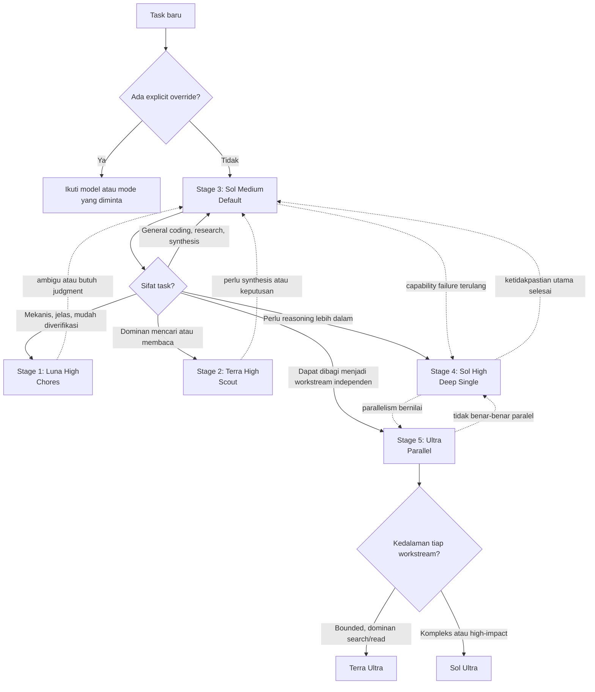

# GPT-5.6 Model Routing Guide

Panduan ini merangkum cara memilih model dan mode GPT-5.6 di Codex tanpa harus mempertimbangkan seluruh kombinasi model dan reasoning effort pada setiap prompt.

Tujuan utamanya adalah memperoleh hasil yang dapat diterima dengan biaya, token, dan waktu yang masuk akal. Guidance ini bukan klaim bahwa satu konfigurasi selalu terbaik untuk semua workload. Evaluasi ulang menggunakan task nyata tetap diperlukan.

## Prinsip utama

> Mulai dari Sol Medium. Turun model jika pekerjaannya lebih sederhana; naik ke Sol High jika reasoning satu agent belum cukup; gunakan Ultra hanya jika pekerjaan memang dapat diparalelkan.

Lima stage yang digunakan:

| Stage | Role | Konfigurasi | Fungsi utama |
|---|---|---|---|
| 1 | Chores | Luna High | Melakukan pekerjaan mekanis |
| 2 | Scout | Terra High | Mencari dan membaca konteks |
| 3 | Default | Sol Medium | Berpikir dan bekerja sehari-hari |
| 4 | Deep Single | Sol High | Reasoning mendalam oleh satu agent |
| 5 | Parallel | Terra Ultra atau Sol Ultra | Menjalankan beberapa workstream paralel |

Luna tidak memiliki pilihan Ultra.

## Diagram routing



Router tidak harus selalu memulai dari Stage 1. Sol Medium adalah titik tengah dan default. Router hanya turun ketika task cukup sederhana, atau naik ketika terdapat alasan yang dapat diamati.

---

## Stage 1 — Chores

### Konfigurasi

**Luna High**

### Definisi

Pekerjaan sederhana dan mekanis yang memiliki instruksi jelas serta hasil yang mudah diperiksa.

### Use case umum

- Memindahkan, mengelompokkan, atau mengganti nama file.
- Memformat ulang data atau teks.
- Membuat daftar dari sumber yang sudah tersedia.
- Menjalankan command yang sudah diketahui.
- Perubahan kode kecil dan sangat terlokalisasi.
- Chat dan tindakan komputer sederhana.

### Landasan ekonomi

Luna adalah model termurah dalam keluarga GPT-5.6. Tarif tokennya sekitar 20% dari Sol. High dipilih agar reasoning tetap memadai; penghematan dilakukan dengan menurunkan ukuran model, bukan dengan mengurangi effort secara agresif.

Biaya kegagalan pada stage ini juga relatif rendah karena hasilnya mudah diverifikasi dan diperbaiki.

### Naik ketika

- Instruksi ternyata ambigu.
- Perlu memahami banyak file atau sumber.
- Ada beberapa constraint yang harus direkonsiliasi.
- Hasil pertama kehilangan requirement penting.
- Pekerjaan membutuhkan judgment, bukan hanya transformasi.

### Turun atau tetap ketika

- Keputusan utama sudah dibuat oleh stage yang lebih tinggi.
- Sisanya berupa langkah mekanis.
- Tersedia validator objektif atau pemeriksaan sederhana.

---

## Stage 2 — Scout

### Konfigurasi

**Terra High**

### Definisi

Pekerjaan yang dominan membaca, mencari, dan mengumpulkan konteks untuk menghasilkan temuan awal. Scout belum menjadi pengambil keputusan akhir untuk persoalan kompleks.

### Use case umum

- Membaca codebase dan memetakan komponennya.
- Mencari implementasi, dependency, atau konfigurasi.
- Mengumpulkan sumber untuk riset.
- Membandingkan beberapa dokumen.
- Membuat inventaris fakta, evidence, dan gap.
- Reconnaissance sebelum planning atau analisis utama.
- Subagent pencari konteks.

### Landasan ekonomi

Terra memiliki tarif token sekitar 50% dari Sol. High memberi reasoning yang cukup untuk memilah relevansi informasi tanpa membayar biaya Sol untuk seluruh volume pencarian.

Konfigurasi ini cocok ketika volume konteks lebih dominan daripada kedalaman keputusan. Benchmark tertentu juga menunjukkan bahwa model lebih kecil dengan effort tinggi dapat lebih bernilai daripada model besar dengan effort rendah.

### Naik ketika

- Fakta perlu disintesis menjadi rekomendasi.
- Sumber saling bertentangan.
- Perlu memahami implikasi bisnis atau teknis.
- Kesalahan kesimpulan lebih mahal daripada kesalahan pencarian.
- Scout mulai bertindak sebagai analyst atau decision maker.

### Turun ketika

- Target informasi sudah diketahui dengan tepat.
- Pekerjaan hanya berupa ekstraksi, pemindahan, atau formatting.
- Tidak diperlukan judgment mengenai relevansi atau kredibilitas sumber.

---

## Stage 3 — Default

### Konfigurasi

**Sol Medium**

### Definisi

Titik awal untuk pekerjaan umum yang membutuhkan judgment, synthesis, coding, atau research, tetapi belum menunjukkan kebutuhan reasoning ekstrem atau multi-agent.

### Use case umum

- Coding sehari-hari.
- Analisis dan sintesis hasil riset.
- Membuat rencana implementasi normal.
- Menulis laporan atau rekomendasi.
- Memecahkan bug dengan ruang lingkup wajar.
- Membuat atau mengedit dokumen.
- General knowledge work.
- Menjadi Lead untuk task dengan kompleksitas sedang.

### Landasan ekonomi

Sol Medium adalah titik keseimbangan. Sol lebih mahal per token, tetapi dapat mengurangi retry, koreksi, steering, dan regenerasi. Karena itu target ekonominya bukan token termurah per respons, tetapi **accepted work per task**.

Medium membatasi penggunaan reasoning berlebih pada pekerjaan normal sambil mempertahankan kemampuan Sol untuk synthesis, judgment, coding, dan tool use.

### Naik ketika

Naik ke Stage 4 jika, setelah satu koreksi yang jelas, kegagalan reasoning yang sama masih terjadi:

- Constraint penting tetap hilang.
- Evidence tidak berhasil direkonsiliasi.
- Kesimpulan bertentangan dengan data.
- Strategi yang sama diulang tanpa hipotesis baru.
- Task high-impact tidak memiliki validator objektif.
- Masalah memerlukan eksplorasi mendalam tetapi tetap berupa satu reasoning chain.

Naik langsung ke Stage 5 hanya jika task memang memiliki beberapa workstream independen dan paralelisme memberi manfaat nyata.

### Turun ketika

- Turun ke Stage 2 jika pekerjaan berikutnya dominan mencari atau membaca.
- Turun ke Stage 1 jika plan sudah final dan sisanya mekanis.
- Tetap di Stage 3 jika acceptance criteria sudah terpenuhi secara konsisten.

---

## Stage 4 — Deep Single

### Konfigurasi

**Sol High**

### Definisi

Reasoning mendalam oleh satu agent. Stage ini digunakan ketika masalah sulit tetapi tidak mendapat manfaat berarti dari paralelisasi.

### Use case umum

- Debugging yang membutuhkan banyak hipotesis berurutan.
- Keputusan arsitektur dengan constraint saling terkait.
- Rekonsiliasi evidence yang kompleks.
- Planning high-impact.
- Review kritis terhadap hasil Stage 3.
- Analisis yang membutuhkan konsistensi end-to-end.
- Problem dengan shared state yang sulit dibagi antar-agent.

### Landasan ekonomi

Sol High memakai tarif model per token yang sama dengan Sol Medium. Perbedaan biaya berasal dari reasoning dan output token yang lebih banyak.

High lebih mahal daripada Medium, tetapi tidak membawa overhead koordinasi multi-agent. Oleh karena itu, Sol High adalah eskalasi pertama untuk masalah sulit yang tetap single-threaded. Jangan melompat otomatis dari Sol Medium ke Ultra.

### Naik ketika

- Masalah dapat dibagi menjadi beberapa workstream independen.
- Banyak alternatif perlu dieksplorasi secara paralel.
- Waktu penyelesaian lebih penting daripada biaya token minimum.
- Dibutuhkan validasi independen dari beberapa agent.
- Nilai keberhasilan cukup tinggi untuk membenarkan biaya koordinasi.

### Turun ketika

- Ketidakpastian utama sudah diselesaikan.
- Task kembali menjadi implementasi atau synthesis normal.
- High tidak menghasilkan peningkatan kualitas yang terlihat.
- Sol Medium kembali dapat memenuhi acceptance criteria.

---

## Stage 5 — Parallel

### Konfigurasi

**Terra Ultra atau Sol Ultra**

### Definisi

Mode multi-agent yang menjalankan beberapa workstream secara paralel dan menyatukan hasilnya. Ultra bukan sekadar reasoning effort di atas High; Ultra mengubah arsitektur eksekusi.

Ultra secara default mengoordinasikan empat agent. Total token dan estimasi biaya mencakup token seluruh agent, sedangkan pengurangan waktu penyelesaian diperoleh dari eksekusi paralel.

### Use case umum

- Riset luas dengan beberapa subtopik independen.
- Membandingkan banyak alternatif arsitektur.
- Audit besar dengan beberapa area pemeriksaan.
- Implementasi yang dapat dibagi per komponen.
- Planning yang berjalan bersama risk review dan validation.
- Eksplorasi beberapa hipotesis secara independen.
- Task high-value dengan biaya kegagalan tinggi.

### Memilih Terra Ultra

- Workload berupa parallel research atau evidence gathering.
- Perlu membaca banyak sumber atau area codebase.
- Masing-masing workstream cukup jelas dan bounded.
- Ingin menekan biaya dibandingkan Sol Ultra.

Terra Ultra masih perlu diperlakukan sebagai konfigurasi eksperimental karena benchmark publik mengenai token dan cost efficiency-nya masih terbatas.

### Memilih Sol Ultra

- Setiap workstream membutuhkan reasoning kompleks.
- Keputusan akhir bernilai tinggi.
- Hasil antar-agent harus direkonsiliasi secara mendalam.
- Kualitas maksimum dan time-to-result lebih penting daripada biaya token minimum.

### Landasan ekonomi

Ultra terutama mengoptimalkan:

- Probabilitas keberhasilan.
- Cakupan eksplorasi.
- Time-to-result melalui paralelisme.

Ultra belum terbukti sebagai pilihan paling hemat token atau biaya. Benchmark publik Sol menunjukkan kenaikan kualitas sekitar 1,8–3,1 poin pada beberapa evaluasi, tetapi dengan penggunaan token lebih tinggi. Belum ada benchmark publik yang cukup untuk menilai Terra Ultra secara kuat.

### Turun ketika

- Task sebenarnya memiliki satu critical reasoning chain.
- Semua workstream bergantung pada shared state yang sama.
- Koordinasi dan duplikasi lebih mahal daripada manfaat paralelisme.
- Masalah membutuhkan kedalaman, bukan keluasan.
- Sol High atau Sol Medium sudah dapat memenuhi acceptance criteria.

---

## Token economics

### Harga relatif model

Harga API per satu juta token:

| Model | Input | Cached input | Output | Relatif terhadap Sol |
|---|---:|---:|---:|---:|
| Luna | $1.00 | $0.10 | $6.00 | 20% |
| Terra | $2.50 | $0.25 | $15.00 | 50% |
| Sol | $5.00 | $0.50 | $30.00 | 100% |

Output token berharga sekitar enam kali uncached input token pada ketiga model. Cache read mendapat diskon besar, sedangkan cache write GPT-5.6 dikenakan 1,25 kali harga uncached input.

Harga tersebut adalah tarif per token, bukan biaya pasti per task. Model murah yang memerlukan banyak retry dapat lebih mahal daripada Sol Medium yang berhasil pada percobaan pertama.

### Tiga jenis efisiensi

1. **Token efficiency** — jumlah token yang digunakan untuk menyelesaikan task.
2. **Cost efficiency** — biaya untuk memperoleh hasil yang dapat diterima.
3. **Time efficiency** — waktu wall-clock sampai task selesai.

Ultra terutama ditujukan untuk kualitas dan time efficiency. Ultra belum tentu meningkatkan token atau cost efficiency.

### Accepted work per task

Metrik praktis yang digunakan router:

```text
Total effective cost = biaya run awal + retry + koreksi + regenerasi + waktu verifikasi
```

Karena itu, pilihan termurah per token belum tentu menjadi pilihan termurah per hasil yang diterima.

---

## Aturan eskalasi

Naik stage hanya jika terdapat **capability failure**, misalnya:

- Requirement wajib hilang.
- Reasoning kontradiktif.
- Evidence tidak dapat direkonsiliasi.
- Strategi gagal diulang tanpa hipotesis baru.
- Kegagalan mandatory yang sama tetap terjadi setelah satu koreksi presisi.

Jangan naik stage hanya karena:

- Data belum tersedia.
- Permission ditolak.
- Tool atau jaringan mengalami error.
- Sumber tidak dapat diakses.
- Scope atau acceptance criteria belum jelas.

Model yang lebih kuat tidak otomatis memperbaiki workflow failure.

## Override dan session stickiness

Explicit override dari pengguna selalu mengalahkan router, misalnya:

```text
Pakai Terra High.
Jangan gunakan Ultra.
Route sebagai Scout.
Routing off.
```

Setelah route dipilih, pertahankan route tersebut selama task masih memiliki karakter yang sama. Jangan menilai ulang model pada setiap prompt kecuali muncul capability failure, perubahan fase kerja, atau explicit override.

Router dapat menampilkan keputusan secara ringkas:

```text
Route: SCOUT -> Terra High; reason: read-heavy and bounded.
```

## Guidance satu kalimat

> Luna High untuk melakukan, Terra High untuk mencari, Sol Medium untuk berpikir sehari-hari, Sol High untuk berpikir mendalam, dan Ultra untuk bekerja paralel.

## Status evidence dan caveat

- Sol Medium sebagai default memiliki dukungan kuat dari positioning resmi dan pengalaman praktis komunitas.
- Terra High dan Luna High adalah simplifikasi role-based dan cost-based, bukan pemenang universal untuk semua benchmark.
- Sol High harus dipertahankan sebagai eskalasi single-agent sebelum mempertimbangkan Ultra.
- Ultra adalah multi-agent dan menggunakan total token dari seluruh agent.
- Benchmark publik Ultra saat ini terutama menggunakan Sol Ultra.
- Economics Terra Ultra belum cukup tervalidasi dan perlu diuji pada workload nyata.
- Guidance ini sebaiknya dievaluasi menggunakan ledger lokal berisi route, outcome, retry, eskalasi, dan usage delta tanpa menyimpan isi prompt secara default.

## Referensi

- [OpenAI — GPT-5.6: Frontier intelligence that scales with your ambition](https://openai.com/index/gpt-5-6/)
- [OpenAI — GPT-5.6 Luna model and pricing](https://developers.openai.com/api/docs/models/gpt-5.6-luna)
- [Artificial Analysis — GPT-5.6 benchmarks across intelligence, speed, and cost](https://artificialanalysis.ai/articles/gpt-5-6-has-landed)
- [OpenRouter — Auto Router design](https://openrouter.ai/docs/guides/routing/routers/auto-router)
- [OpenRouter — Model fallbacks](https://openrouter.ai/docs/guides/routing/model-fallbacks)

