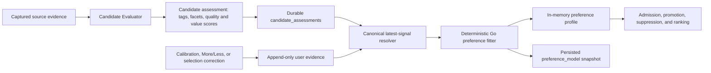

# AkuBrowser preference learning contract

Status: technical authority for the current Go implementation, 19 July 2026.

This document explains how direct user feedback becomes personalization, which data is authoritative, and where topic tags and facets enter or leave the system. It complements the product-level rules in `product-contract.md`.

## Terms

- A **candidate assessment** is the structured evaluation of one captured post. It contains evidence quality and value scores plus `topicTags` and `topicFacets`.
- A **preference signal** is the latest effective user decision for one canonical source/evidence identity. It may come from calibration, Timeline More/Less feedback, or `Should have selected`.
- The **preference profile** is the in-memory Go `preference.Profile` fitted from all current effective signals. It contains normalized feature weights and activation flags.
- The **preference model** is the JSON snapshot of that fitted profile stored in SQLite's singleton `preference_model` row. It is a materialized projection, not the canonical learning evidence.

## End-to-end flow

The candidate model describes the post. The user supplies the preference direction. Deterministic Go code resolves authority, fits weights, and applies them to selection. The model provider never directly chooses the final Timeline.

## 1. Where tags and facets originate

Candidate Evaluation emits one assessment for every accepted candidate after capture. The current release uses the configured Codex App Server provider, but the contract is provider-replaceable.

- `topicTags` are specific free-text descriptors: at most five values, each at most 80 characters. Examples are `Codex`, `Spring Data JPA`, or `remote work`.
- `topicFacets` are broad categories: at most three values chosen from the schema-controlled vocabulary such as `ai_models`, `developer_tools`, `career_hiring`, or `sports`.

The reasoning schema requires both fields. AkuSidecar binds the returned assessment back to the captured evidence identity by position, validates the complete result, and stores the assessment with its run. If the deterministic conformance provider is used instead, it emits the fallback tag `unclassified` and facet `other`.

Therefore responsibility is split deliberately:

1. the Candidate Evaluator proposes the semantic description;
2. JSON Schema limits its shape and the facet vocabulary;
3. AkuSidecar binds it to validated evidence and stores it;
4. the user decides whether those features are positive or negative preference evidence;
5. the Go preference fitter calculates the actual authority and weight.

There is currently no direct tag/facet correction UI. More and Less correct the preference direction, not the Candidate Evaluator's semantic description. A wrongly tagged assessment can therefore generalize a correct user decision through the wrong feature until later evidence counterbalances it. Direct semantic-feature correction or evaluator-consistency diagnostics are future hardening options, not current behavior.

## 2. How More and Less become canonical signals

Clicking a Timeline control appends a row to `feedback_events`:

- **More like this** records `direction=more` with no reason;
- **Less like this** records `direction=less` and `reason=not_interested`.

The event is tied to the Timeline item, run, session, and canonical evidence key. Earlier feedback is not overwritten. The Timeline and Update Inbox resolve the newest event for display, while profile fitting resolves one effective signal per canonical `(source, evidenceKey)` identity across three origins:

- routine Timeline feedback;
- calibration labels;
- an active `Should have selected` correction.

Newest evidence wins. If timestamps tie, routine feedback outranks a selection correction, which outranks calibration. This is why a later More or Less choice can correct the taste effect of `Should have selected` without deleting its separate selection audit.

Completed calibration labels remain visible on their original Timeline items and in the corresponding Update Inbox diagnostic: More and Less render as the active button state, while Neutral remains visually neutral and is omitted from the Inbox decision list. These are read projections of `calibration_samples`, not duplicate routine feedback events, so calibration keeps its higher fitting authority. A later Timeline or Inbox More/Less event replaces that visible state and becomes the newest canonical preference signal.

The current contribution before normalization is:

| Signal | Contribution to every attached tag and facet |
| --- | ---: |
| Routine More | `+1.00` |
| Routine Less / Not interested | `-1.00` |
| Calibration More | `+1.10` |
| Calibration Less | `-1.10` |
| `Should have selected` | `+1.25` |
| Calibration Neutral | `0` |

Legacy code can interpret a reasonless routine Less as `-0.75`, but the active API requires `not_interested`, so the current UI produces the full `-1.00` signal.

## 3. When tags and facets enter, change, or leave the profile

Tags and facets exist first on the durable candidate assessment. They enter the learned profile only when that candidate has an effective non-neutral preference signal.

For each fit, AkuSidecar:

1. collects the latest effective signal for every canonical source/evidence identity;
2. reads that candidate's stored tags and facets;
3. normalizes feature keys by trimming whitespace, collapsing internal whitespace, and lowercasing;
4. adds the signal contribution once per distinct feature;
5. divides the accumulated contribution by `max(3, number of observations for that feature)`;
6. clamps every weight to `[-1, +1]`.

More and Less do not literally insert or delete a tag from a global taxonomy. They add positive or negative evidence to the next fitted weight. Replacing Less with More changes the contribution's sign because only the latest signal for that evidence identity participates.

A feature disappears from a rebuilt profile when no current effective non-neutral signal contributes it. That can happen after:

- Reset learning removes calibration and routine feedback;
- a selection correction is undone and no other effective signal supplies the feature;
- full reset removes all learning data.

Knowledge/session retention no longer removes learned taste. Before terminal sessions or
large run payloads are trimmed, AkuSidecar projects their effective normalized evidence
into `preference_learning_ledger`. That ledger has no foreign key to a session or run and
retains only event identity, source/evidence identity, direction, origin, timestamp,
assessment features, and active undo/reset state.

## 4. How the profile affects a future Timeline

AkuSidecar rebuilds the profile from canonical signals immediately before deterministic selection for each source run that completes Candidate Evaluation. It also persists a snapshot after completed calibration and during evaluated update runs. Clicking More or Less updates canonical evidence immediately, but does not retroactively rerank the already-visible Timeline; it affects the next profile fit.

The base candidate score remains independent:

`0.40 materiality + 0.20 novelty + 0.15 actionability + 0.10 urgency + 0.15 evidence strength`

Preference alignment is calculated separately:

- when at least one specific tag matches, alignment is `75% tag alignment + 25% facet alignment`;
- when no tag matches, broad facets contribute only `30%` of facet alignment;
- the preference score added to ranking is `0.45 * alignment`.

This makes precise tags authoritative and broad facets a weak fallback. A Less decision about `Spring Data JPA` should not automatically suppress every `developer_tools` post.

Directional authority activates only after a small repeated pattern:

- promotion is ready after at least three effective signals including at least two positive signals;
- suppression is ready after at least three effective signals including at least two negative signals;
- either condition makes the profile authority-ready.

In the default `guarded_live` mode, the profile can promote, replace, demote, suppress, and reorder ordinary candidates. Promotion requires trusted evidence, a minimum generic base score, and alignment of at least `+0.25`. Suppression requires alignment of at most `-0.25` and cannot remove a protected contradiction, material update, highly urgent update, or highly novel update. A bounded neutral discovery lane remains available to reduce filter-bubble lock-in.

## 5. Why canonical evidence remains the source of truth

The compact learning ledger is canonical serving evidence after source runs become
eligible for retention. While source rows still exist, they are synchronized into that
ledger before every fit and before retention. The stored `preference_model` is a validated
cache: it is reused only when its algorithm version, source watermark, source digest, and
effective signal count exactly match the currently resolved ledger.

AI feedback is intentionally outside this contract. AI/not-AI/Unsure events and
Personal AI Policy are defined in [ai-feedback-contract.md](ai-feedback-contract.md);
they cannot add topic/facet weights or influence selection scoring.

Benefits of this evidence-first design:

- **User corrections remain explainable.** A weight can be traced back to specific direct decisions.
- **Authority conflicts are deterministic.** The newest canonical decision can supersede an older one without destructive rewriting.
- **Fitting logic can evolve.** New weights or thresholds can be applied to existing evidence without pretending an old snapshot used the new algorithm.
- **Stale or partially written snapshots cannot silently become truth.** Selection derives from the underlying decisions.
- **Audit and reset semantics stay precise.** Selection correction history can remain visible even when its learning influence is undone or reset.
- **Provider output does not own preference direction.** The model describes features, while direct user actions determine positive or negative authority.

Costs of this design:

- every fit must first resolve a compact signal signature before it may reuse the cache;
- provenance tables and conflict resolution are more complex;
- source mutation and retention paths must keep the compact ledger synchronized;
- the persisted snapshot may be stale after a More/Less click, but its digest mismatch
  makes that stale row ineligible and forces the next fit to rebuild it.

Making the persisted model the sole source of truth would make startup and scoring cheaper and bound storage more aggressively. It would also require every feedback, undo, reset, retention operation, and fitting-algorithm migration to update that model transactionally. A stale or corrupted aggregate could no longer be explained or corrected from user evidence, and changing the fitting rules would either preserve obsolete behavior or discard accumulated taste.

The implemented boundary is therefore:

- canonical user evidence and candidate features remain authoritative;
- `preference_model` is a validated cache and serving projection;
- a reusable snapshot must carry a fitting-algorithm version and a source-event watermark or digest;
- any mismatch must fall back to rebuilding from canonical evidence.

## Validated projection contract

Status: implemented.

The persisted model remains an optimization boundary, never independent authority. Its
stored envelope includes:

- `algorithmVersion`: identifies the exact normalization, weighting, and activation rules;
- `sourceWatermark`: identifies the newest canonical learning event included in the fit;
- `sourceDigest`: binds the projection to the resolved effective-signal set, including active undo/reset boundaries;
- `effectiveSignalCount`: supports a cheap consistency check without replacing the digest;
- `fittedAt`: distinguishes canonical event time from projection time;
- the fitted weights and authority flags already present in `preference.Profile`.

The serving rule should be deterministic:

1. resolve the current canonical learning watermark and digest;
2. load the stored projection only when its algorithm version, watermark, digest, and signal count all match;
3. otherwise rebuild from canonical evidence and atomically replace the projection;
4. never repair canonical feedback from the projection.

More, Less, calibration changes, selection-correction create/undo, and retention change
the resolved ledger signature. Reset learning deletes both ledger and projection. A stale
projection therefore fails validation automatically; a persisted fit atomically replaces
it with the current envelope.

One lifecycle boundary remains separate:

- **Semantic feature correction is separate from preference-direction correction.** More/Less must continue to mean user taste. If tag/facet correction is added, it should be an inspectable correction to the candidate description or evaluator-consistency layer, not another hidden meaning attached to Less.

## Current code authority

- `AkuSidecar/internal/reasoning/prompts.go`: Candidate Evaluator boundary.
- `AkuSidecar/schemas/reasoning-result.schema.json`: tag and facet shape.
- `AkuSidecar/internal/store/store.go`: append-only feedback.
- `AkuSidecar/internal/store/preference_learning.go`: compact retained learning ledger,
  effective-signal resolution, and projection loading.
- `AkuSidecar/internal/preference/preference.go`: deterministic fitting and alignment.
- `AkuSidecar/internal/selection/selection.go`: Timeline admission and ranking effects.
- `AkuSidecar/internal/engine/calibration.go`: signature validation, cache reuse, profile
  rebuild, and snapshot persistence.
- `AkuSidecar/internal/store/calibration.go`: persisted `preference_model` projection.
