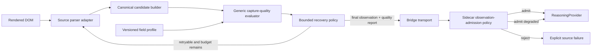

# Source Adapter and Capture Quality Design

> Status: **Brainstorming proposal — documented, not implemented or accepted**
> Date: **2026-07-14**
> Scope: **AkuBridge source parsers, generic capture-quality evaluation, and AkuSidecar admission**

## 1. Why this note exists

AkuBridge already separates X and LinkedIn DOM knowledge into source adapters,
but the architecture does not yet contain a generic decision layer that asks
whether an adapter output is complete enough to use. Recent X failures showed
why candidate discovery alone is insufficient: text may be present while a
detected image or video container has not exposed a usable media value.

This note records the current implementation accurately and proposes a seam
for additional social sources. It deliberately does not authorize code changes
or settle the remaining policy choices.

## 2. Current implementation

```mermaid
flowchart LR
    DOM["Rendered DOM"] --> A["Source adapter<br/>X or LinkedIn"]
    A --> CR["Shared content runtime<br/>canonical block assembly"]
    CR --> BP["Bounded capture policy<br/>normalization and limits"]
    BP --> AH["adapterHealth<br/>field presence diagnostics"]
    AH --> T["Bridge transport"]
    T --> SV["Sidecar structural validation"]
    SV --> J["JobEngine"]
    J --> R["ReasoningProvider"]
```



### 2.1 Source-adapter responsibility

The revisioned AkuBridge registry currently loads `x-adapter.js` and
`linkedin-adapter.js`. Each adapter owns source-specific DOM knowledge:

- page and login-state matching;
- feed-root and candidate discovery;
- author, avatar, body, presentation, and relationship extraction;
- source-specific media selectors and exclusions; and
- pending-content labels.

The registry checks the presence of the common `matchesPage`,
`discoverCandidates`, `findAuthor`, and `extractSemantics` hooks. Synthetic DOM
fixtures exercise representative happy paths for each adapter version.

### 2.2 Shared AkuBridge responsibility

`content-script.js` is more than a dispatcher. It currently owns canonical
block assembly, media discovery, URL and timestamp normalization, bounded
snapshot capture, movement/restoration, and `fieldCoverage` calculation.
`bounded-capture-policy.js` applies common size, count, identity, and CDN
allowlist rules. The service worker owns tab selection, visual readiness,
leases, command guards, and bounded source recovery.

### 2.3 Current validation and its gap

Validation is distributed across several layers:

| Layer | What it proves today | What it does not prove |
|---|---|---|
| Adapter registry | Required parser hooks exist | Extracted values are complete or coherent |
| Synthetic conformance | Known fixtures produce expected values | Current live DOM still matches the fixture |
| Shared capture policy | Values are bounded and media URLs are allowlisted | A detected source field produced a value |
| `adapterHealth` | Candidate counts, selector strategy, field-presence counts, DOM signature | Whether the observation should retry, continue degraded, or fail |
| Sidecar contract validation | Source/page/snapshot structure is safe; invalid optional values are normalized or dropped | Source fidelity is sufficient for reasoning |
| Native capture outcome | Movement, restoration, frontier, and mutation claims match the command | Candidate-level semantic completeness |

Today, `adapterHealth.state` is `healthy` when the capture found at least one
unique candidate. An empty author, permalink, avatar, or media value can still
reach AkuSidecar. Empty text blocks are filtered, while many other invalid or
missing values become `null`, an empty collection, or a default. Known failure
modes have source-specific recovery, but there is no generic admission verdict.

Therefore the answer to “is validation still inside the adapter?” is nuanced:

- source extraction and some source-specific detection remain in the adapter;
- normalization and field-presence measurement are already shared;
- structural validation exists again in AkuSidecar; but
- the generic quality evaluator and deterministic admission decision do not yet
  exist.

## 3. Proposed target architecture



The parser should describe what the source exposed. It should not make the
final policy decision. A generic evaluator should compare the canonical output
and source-detection facts with a versioned field profile. AkuSidecar remains
the authority that decides whether evidence is admitted to reasoning.

## 4. Quality facts instead of empty-value guessing

The evaluator needs more information than the final value. Every evaluated
field should be able to distinguish these states:

| Observed state | Meaning | Default quality effect |
|---|---|---|
| `present` | A normalized usable value exists | Positive |
| `detected_empty` | The source container/attribute was detected but yielded no usable value | Negative; often retryable |
| `missing` | Neither a value nor source evidence was found | Depends on field profile |
| `invalid` | A value existed but failed normalization or allowlist rules | Negative; sometimes retryable |
| `not_exposed` | The platform explicitly does not expose the value in this context | No automatic penalty when allowed |
| `not_applicable` | The field does not apply to this content kind | No penalty |
| `pending_hydration` | The source element exists but is not rendered sufficiently yet | Negative and retryable |

This distinction solves the recurring media case. If no media container is
present, `media` is `not_applicable`. If a `tweetPhoto` or video root is present
but the normalized media list is empty, it is `detected_empty` or
`pending_hydration`, which can trigger bounded recovery.

## 5. Versioned field profiles

The evaluator should be generic, but expectations cannot be identical for
every source and content kind. It should consume a declarative profile rather
than embed X/LinkedIn conditions in its decision code.

A candidate profile could classify fields as:

- **required** — unusable evidence when absent;
- **one-of required** — at least one identity path must exist;
- **conditional** — required only when detection facts or content kind make it
  applicable; and
- **optional** — preserved when present but never sufficient alone to reject a
  candidate.

An initial social-post baseline for discussion—not a final contract—is:

| Field | Candidate expectation |
|---|---|
| `text` | Required for the current text-reasoning path |
| `source` and source page URL | Required at observation level |
| `platformId`, native permalink, or stable content identity | One-of required |
| `author` | Normally required; exceptions must be explicit in the profile |
| `media` | Conditional when a source media root was detected |
| `avatarUrl` | Conditional when a primary-author avatar root was detected |
| `publishedAt` | Optional when the platform does not expose it; invalid timestamps are signaled |
| engagement, links, presentation metadata | Optional unless a content-kind profile says otherwise |

Security rules such as accepted protocols and media CDN allowlists should stay
in trusted shared policy. A source adapter must not be able to weaken them by
declaring a broader profile.

## 6. Quality report and verdict

The bridge should preserve reason codes rather than exposing only one opaque
score. A possible additive report is:

```json
{
  "verdict": "usable_degraded",
  "score": 0.82,
  "profile": "social-post-v1",
  "issues": [
    {
      "field": "media",
      "code": "detected_empty",
      "severity": "high",
      "recoverable": true,
      "attempt": 0
    }
  ]
}
```

Candidate verdicts should be categorical:

- `complete` — all applicable required/conditional expectations pass;
- `usable_degraded` — safe and useful, with non-critical limitations;
- `retryable` — a bounded same-source recovery may improve fidelity; and
- `invalid` — required evidence or provenance is unusable.

A numeric score can help telemetry and threshold experiments, but it must not
replace explicit issues or become the sole source of a reject decision.

## 7. Recovery and admission authority

Recommended authority split for discussion:

1. AkuSidecar supplies a deterministic `qualityRetryBudget` in the capture
   command. The adapter cannot increase it.
2. AkuBridge evaluates every captured candidate generically.
3. A DOM-local transient issue may consume one pre-authorized retry in the same
   tab and viewport. It cannot add scrolls, reveal content, change source, or
   extend the command deadline.
4. AkuBridge returns the final observation, every quality issue, and recovery
   attempts.
5. AkuSidecar revalidates the report and makes the authoritative admission
   decision: continue, continue degraded with limitations, or fail the source.
6. The ReasoningProvider receives only admitted evidence. It must not be asked
   to infer whether a parser silently failed.

Suggested deterministic policy matrix:

| Final condition | Bridge action | Sidecar admission |
|---|---|---|
| Required field invalid | Do not retry unless explicitly recoverable | Reject candidate/source according to bounded policy |
| Conditional field detected but empty and retry budget remains | Retry same candidate/snapshot | Wait for final report |
| Same issue after retry | Return degraded/invalid with reason | Decide degraded handoff or explicit source failure |
| Optional field missing or explicitly not exposed | No retry | Admit; retain limitation only when user-relevant |
| Quality report inconsistent with captured values | Fail closed | Reject bridge result |

This keeps retry execution close to the DOM while preserving JobEngine policy
authority. An alternative is a second explicit Sidecar command for every retry;
it is more auditable but adds transport/state complexity and should be compared
before implementation.

## 8. Preparing for additional social sources

A future source package should be a trusted, versioned extension component,
not a dynamically installed third-party script. Its declarative manifest could
identify:

- source id and parser version;
- supported page kinds and canonical feed URL;
- parser hooks and recovery capabilities;
- field-profile id and supported content kinds;
- synthetic conformance fixtures; and
- bounded diagnostic capabilities.

Adding a source is not yet plug-and-play. AkuSidecar still hard-codes X and
LinkedIn in source enums, unified ordering, evidence-key validation,
configuration, diagnostics, and UI ordering. Those product seams must later be
driven by one trusted source catalog before the term “plugin architecture” is
fully accurate.

## 9. Safe implementation sequence after design approval

1. Add quality reports in shadow/report-only mode; do not change capture or
   admission decisions.
2. Compare generic reports with live X/LinkedIn failures and build regression
   fixtures for `detected_empty`, `not_exposed`, and conditional media.
3. Make Sidecar validate report consistency and surface diagnostics.
4. Enable bounded retry only for agreed transient reason codes.
5. Enable degraded/reject admission rules only after shadow evidence proves
   thresholds and field profiles do not discard valid platform cases.
6. Generalize the trusted source catalog before adding a third source.

## 10. Open decisions

- Which identity combination is the minimum safe candidate contract?
- Is author universally required, or required only for selected page/content
  kinds?
- Should a final media hydration failure reject only that candidate, degrade the
  source run, or fail the complete source?
- Should the field profile live in AkuBridge, the canonical AkuBrowser
  contract, or be compiled into both Bridge and Sidecar?
- Is one local Bridge retry sufficient, or should Sidecar issue every recovery
  command explicitly?
- Which quality facts should be user-visible versus diagnostic-only?
- Should a numeric score exist at all, or are categorical verdicts plus reason
  codes sufficient?

Until these are decided, the proposal remains documentation only.
