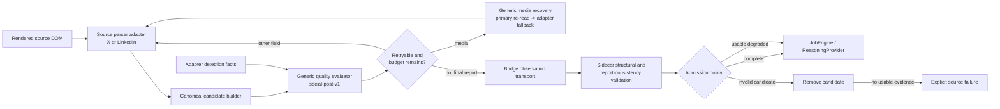

# Source Adapter and Capture Quality Architecture

> Status: **AkuBridge v47 implemented; Go-side admission reset to the fresh v1 structural boundary**
> Date: **2026-07-15**
> Runtime baseline: **AkuBridge 0.6.0 / source-fidelity-v47; AkuSidecar 1.0.0-dev.4**
> Scope: **AkuBridge source parsers, generic capture-quality evaluation, bounded recovery, and AkuSidecar admission**

The detailed Node-side report-consistency and migration behavior described
below is historical design evidence. The Go rewrite deliberately did not port
that implementation or its compatibility aliases. Go v1 currently requires a
valid source, at least one snapshot, unique non-empty evidence keys, and a
coverage object before persistence or reasoning. Any richer admission policy
must be reintroduced as an explicit Go-native contract with new tests.

## 1. Purpose

AkuBridge keeps source DOM knowledge in separate X and LinkedIn adapters. A
shared quality layer now verifies that their canonical output is usable before
it can become reasoning evidence. This prevents a text-bearing post from being
treated as complete when the rendered DOM also exposes an author, avatar,
image, or video root whose normalized value is empty.

The quality layer is deliberately outside the source parser. Adapters report
source-specific extraction and detection facts; trusted shared policy owns the
field expectations and verdict; AkuSidecar owns final admission.

## 2. Implemented pipeline



### Ownership

| Boundary | Owner |
|---|---|
| Page matching, selectors, candidate discovery, source-native extraction | X or LinkedIn adapter |
| Canonical block assembly and URL/date/media normalization | Shared AkuBridge content runtime |
| Trusted field profile, issue codes, categorical verdict, numeric diagnostic score | `capture-quality-policy.js` |
| Media retry lifecycle, generic DOM helpers, outcomes, and aggregation | `media-recovery-runtime.js` |
| Source-owned alternate media-root selection and classification | X or LinkedIn adapter |
| Retry count, settling ceiling, scroll/deadline limits | Sidecar command plus Bridge bounded-capture policy |
| Report schema, consistency checks, candidate admission, fail-closed behavior | AkuSidecar |
| Final semantic evaluation of admitted evidence only | ReasoningProvider under JobEngine |

The adapter registry requires every adapter to declare a parser version,
`qualityProfile`, `qualitySelectors`, freshness strategy, and media-recovery
strategy. Current versions are `x-dom-v16` and `linkedin-dom-v13`, both using
`social-post-v1`. Freshness is documented in
`../contracts/source-freshness-recovery-v1.md`; media fallback is documented in
`../contracts/media-recovery-v1.md`. Neither changes the quality evaluator's
ownership.

## 3. Trusted field profile

`social-post-v1` is compiled into AkuBridge trusted policy; an adapter selects
the profile but cannot weaken it or broaden security allowlists.

| Field | Enforced expectation |
|---|---|
| `text` | Required |
| `author` | Required |
| `platformId`, native `permalink`, or stable text identity | At least one required |
| `media` | Conditional when a source media root is detected |
| `avatarUrl` | Conditional presentation field; missing hydration is recorded but does not degrade evidence or consume retry budget |
| `publishedAt` | Optional; checked when a timestamp signal exists, except explicitly not-exposed promoted content |
| engagement, links, relationship, presentation metadata | Optional under this profile |

Protocol, URL-normalization, media-CDN, size, and count rules remain in trusted
shared capture policy. Quality evaluation does not expand browser authority.

## 4. Field states and issues

Reports preserve an explicit state and reason instead of treating every empty
value alike:

| State | Meaning |
|---|---|
| `present` | A normalized usable value exists |
| `detected_empty` | A source signal exists but extraction yielded no usable value |
| `missing` | A required value and its source evidence are absent |
| `invalid` | A detected value fails trusted normalization or allowlist policy |
| `not_exposed` | The platform explicitly does not expose the field in this context |
| `not_applicable` | The field does not apply to this content kind |
| `pending_hydration` | The source element exists but has not exposed a usable rendered value |

The current evaluator emits candidate reports of this shape:

```json
{
  "profile": "social-post-v1",
  "candidateKey": "x:status:123",
  "verdict": "usable_degraded",
  "score": 0.8,
  "attempt": 1,
  "issues": [
    {
      "field": "media",
      "code": "pending_hydration",
      "observedState": "pending_hydration",
      "severity": "high",
      "recoverable": true,
      "impact": "evidence",
      "attempt": 1
    }
  ]
}
```

The score is diagnostic only. Categorical verdicts and explicit issue codes
are authoritative:

- `complete`: all applicable expectations pass;
- `usable_degraded`: safe evidence remains but a non-critical limitation is
  present after recovery;
- `retryable`: a recoverable issue remains and the pre-authorized local retry
  budget is not exhausted; and
- `invalid`: required evidence or identity is unusable.

Every issue also declares `impact`: `identity`, `evidence`, or
`presentation`. Presentation-only warnings, currently an unhydrated author
avatar, may coexist with a `complete` verdict. They remain inspectable through
issue counts and `qualityAdmission.presentationWarningCount`, but do not
trigger retry or source-wide degradation. Missing detected media remains an
evidence-impact issue and therefore retains the retry/degrade lifecycle.

`candidateKey` is always populated by AkuBridge. It prefers platform identity
or a native permalink, then a stable text fingerprint, and finally a bounded
snapshot/container key. Invalid shells that never become admitted blocks are
therefore still traceable in snapshot quality diagnostics.

## 5. Bounded recovery

AkuSidecar sends `qualityReportRequired: true`, `qualityRetryBudget: 1`, and a
profile-derived `qualityRetrySettleMs` (300 or 1,000 ms for the built-in load
profiles). AkuBridge clamps the retry budget to one and settle time to at most
1,000 ms. The generic media recovery runtime consumes this value directly;
adapter `settleMs` remains only a fallback when the caller omits the budget.

For non-media fields, the retry settles and reruns the same primary parser. For
media, `media-recovery-v1` first reruns the primary extraction after settling,
then invokes one adapter-specific alternate DOM extraction. The generic runtime
normalizes every returned URL through the existing source-CDN allowlist.

Every retry:

- re-extracts only the same candidate in the same tab and viewport;
- performs no extra scroll, navigation, reveal action, or tab replacement;
- cannot extend the capture deadline;
- returns a final degraded or invalid report if the issue remains; and
- never transports a final `retryable` candidate.

Media outcomes are recorded per block and in coverage as `not_applicable`,
`primary_complete`, `recovered`, or `unavailable`. Exhausted media remains
usable-degraded only when the rest of the candidate is trustworthy; Source
layout states the limitation and links to the native post.
Each media audit carries a finite `trace`, and coverage aggregates
`stageCounts`, distinguishing primary absence, detected roots, hydration,
adapter alternate-DOM extraction, unavailable budget, and deadline exhaustion.

For X, a status-photo permalink (`/status/.../photo/...`) is a semantic media
root even before its nested `pbs.twimg.com` image becomes usable. The X adapter
owns that source-specific signal. The shared readiness and recovery layers use
the adapter-declared media selector, so this shape cannot be mislabeled as
`not_applicable`: it must complete normally, recover within the single bounded
attempt, or end as explicit `unavailable` degraded evidence.

X still receives its bounded active-tab visual-hydration wait. If the semantic
feed is ready but one visual root remains unhydrated at that deadline, readiness
continues into capture and lets this candidate policy decide retry/degrade. A
visual timeout therefore cannot bypass the evaluator by failing the complete
source before candidate reports exist.

This places transient DOM recovery close to the DOM while keeping authority in
the Sidecar-issued command.

## 6. Sidecar validation and admission

AkuSidecar first validates the observation structure and native movement
contract, then validates quality reports before persistence or reasoning. It
fails closed when:

- a required report or summary is absent;
- report counts, profiles, verdict totals, or retry totals disagree;
- a `complete` report contains any identity/evidence-impact issue;
- an `invalid` report has no critical issue;
- a `retryable` report has no recoverable issue or crosses the final boundary;
- a reported missing author is omitted; or
- a media/avatar issue contradicts a present admitted value.
- media recovery outcome counts disagree with blocks or `fallbackUsed`;
- recovered media is empty; or unavailable media is non-empty.

Invalid candidates are removed. Complete and usable-degraded candidates are
admitted, with `coverage.qualityAdmission` recording admitted, degraded, and
rejected counts plus issue totals. If no usable candidate remains, the source
fails explicitly. JobEngine sends only the admitted observation to acquisition
planning and final reasoning. Multi-round coverage aggregates quality and
admission totals across every capture round.

## 7. Operational diagnostics

Each block carries `captureQuality` and `mediaRecovery`; every snapshot carries
`qualityReports`; coverage carries `captureQuality` and aggregate
`mediaRecovery`; and admitted observations add `qualityAdmission`.
`adapterHealth` is healthy only when candidates exist
and the aggregate capture-quality verdict is complete. Diagnostics retain
field coverage and DOM signatures without exposing captured post content in
the health endpoint.

The deterministic acquisition planner receives only admitted blocks. A sparse
sample whose admitted candidates are complete does not spend provider tokens
merely because rejected shells or presentation warnings exist. A substantive
evidence limitation, such as unavailable detected media, may still justify the
single policy-bounded follow-up.

Bridge capabilities `report_capture_quality` and `recover_missing_media` are required by AkuSidecar. The
Sidecar rejects an older Bridge runtime, parser version, or capability set
before starting a new capture.

## 8. Adding another social source

The parser seam is reusable, but adding a source is intentionally a trusted
product change rather than dynamic third-party plugin installation. A new
source must provide:

1. a registered parser adapter with a unique source and parser version;
2. page matching, candidate discovery, extraction hooks, quality selectors,
   and a trusted profile id;
3. synthetic DOM conformance fixtures including complete, detected-empty,
   pending-hydration, recovered-media, exhausted-media, not-exposed, and invalid cases;
4. canonical URL, identity, media-CDN, and tab-lifecycle policy; and
5. registration in Sidecar source configuration, ordering, diagnostics, and UI.

X/LinkedIn enums and product ordering are still explicit. Before a third
source, those seams should be consolidated behind one trusted source catalog;
this quality architecture supplies the generic parser-output boundary but does
not pretend arbitrary sources are already plug-and-play.

## 9. Verification requirements

Any change to an adapter, field profile, or admission rule must pass:

- evaluator unit tests for every verdict and issue state;
- adapter registry and synthetic DOM conformance tests;
- Sidecar contract and admission-policy tests;
- a JobEngine integration test proving invalid evidence never reaches
  reasoning;
- cross-repository compatibility checks; and
- live signed-in X and LinkedIn capture validation after cooperative Bridge
  reload, including one real reasoning invocation.

The current runtime advertises `aku-bridge-0.6.0-source-fidelity-v47`,
`x-dom-v16`, `linkedin-dom-v13`, `report_capture_quality`,
`recover_missing_media`, `probe_freshness`, and `recover_source_freshness`.

## 10. Live acceptance evidence

The following is historical v35 acceptance evidence for the quality layer.
After cooperative reload request `quality-architecture-20260714-2121`,
AkuSupervisor observed the exact v35 build. Signed-in unified session
`6342098f-55a2-429b-a5a2-6e1cb7806479` then completed X and LinkedIn and
restored both source positions. Its evidence had already been evaluated in the
immediately preceding acceptance run, so knowledge continuity correctly
suppressed duplicate reasoning and produced zero additions.

- X used `x-dom-v13`, admitted eight blocks as `usable_degraded`, and reported
  eight avatar plus three media `pending_hydration` issues after one retry per
  affected candidate.
- LinkedIn used `linkedin-dom-v10`, admitted five blocks as `complete`,
  preserved five media records, and reported no issue or retry. Its scoped
  actor-avatar selector no longer mistakes a profile image mentioned in the
  body for the primary-author avatar root.
- Neither source transported a final `retryable` report or admitted an
  `invalid` block.
- A separate final-build Manual Live session,
  `493079e1-d79c-4c0e-822d-14fbc9864d3c`, forced a fresh LinkedIn evaluation.
  It completed with five blocks, five media records, `complete` admission, one
  real `candidate_evaluation` invocation, three result items, and restored
  scrolling.

This acceptance is intentionally evidence of truthful degraded handling, not a
claim that every source image hydrated. The quality contract makes that
remaining weakness explicit so a future fallback decision can use stable
reason codes instead of rediscovering silent media loss.
